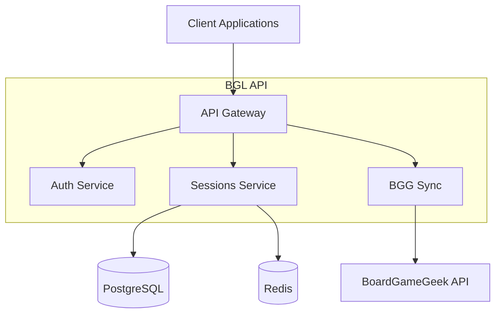

# Vision

**Document Version:** 1.0
**Status:** Active

---

## 1. Project Overview

**BoardGameLog** is an API platform for tracking and managing board game sessions. The project provides structured data
processing for recording game sessions, player statistics, and integration with external systems such as BoardGameGeek (
BGG).

### 1.1 Mission

Build a reliable, scalable platform that enables board game enthusiasts to:

- Easily record their game sessions with minimal effort
- Gain valuable analytics about their gaming habits and achievements
- Share statistics and achievements with friends
- Synchronize data with the global BoardGameGeek community

### 1.2 Core Product Values

**Ease of Use** — minimal barrier to entry for session logging. Users can record a game in just a few seconds.

**Deep Analytics** — transforming raw data into meaningful insights: win statistics, favorite games, activity over time.

**Social Features** — ability to share achievements and compete with friends within gaming groups.

**Integration** — seamless interaction with the BoardGameGeek ecosystem, the largest board game community.

---

## 2. Target Audience

**Board Game Enthusiasts** — people who regularly play board games and want to track their progress, view statistics,
and share achievements.

**Game Night Organizers** — those who coordinate player groups, track results, and want to understand participant
preferences.

**Collectors** — owners of large game collections who want to understand which games are actually being played versus
gathering dust on the shelf.

---

## 3. Roadmap

### Phase 1: MVP

Goal: Create a minimum viable product to validate the concept.

| Feature         | Description                                              |
|-----------------|----------------------------------------------------------|
| Authentication  | JWT-based registration and authorization                 |
| Game Search     | Integration with BGG API for board game search           |
| Session Logging | Creating game records: date, game, participants, results |
| Session History | Viewing and filtering game history                       |
| Basic Analytics | Top games by number of plays                             |

### Phase 2: Expansion

Goal: Extend analytics functionality and add social features.

| Feature             | Description                                             |
|---------------------|---------------------------------------------------------|
| Advanced Analytics  | Win percentage, player statistics, trends               |
| Friends System      | Adding co-players for shared viewing                    |
| Notifications       | Push notifications for achievements and friend activity |
| BGG Synchronization | Two-way session synchronization with BoardGameGeek      |

### Phase 3: Scaling

Goal: Full-featured platform with advanced analytics and recommendations.

| Feature        | Description                                                             |
|----------------|-------------------------------------------------------------------------|
| Social Feed    | Friend and community activity                                           |
| Annual Reports | Automated period reports                                                |
| Public API     | API for third-party applications and integrations                       |
| Async Runtime  | Migration to async PHP for improved performance and resource efficiency |

---

## 4. BoardGameGeek Integration

BoardGameGeek is the largest online board game database and community. BGG integration gives users access to a catalog
of hundreds of thousands of games and the ability to synchronize sessions with their global profile.

**Integration Capabilities:**

- Game search by name with autocomplete
- Game information retrieval: description, images, ratings
- Session export to BGG profile
- Session history import from BGG

---

## 5. System Architecture

The system is designed for horizontal scaling. Each service can be deployed independently and scaled according to load.

---

## 6. Architectural Patterns

The project is built on Clean Architecture principles with Domain-Driven Design. This ensures clear separation of
business logic from infrastructure and allows independent development and testing of system components.

Key patterns: Command Query Separation (CQS), Ports & Adapters, Mediator Pattern, Aspect-Oriented Programming (AOP).

---

## 7. Technical Advantages

**Modern Stack** — current versions of language and database with full typing and support for modern features.

**Clean Architecture** — strict layer separation with automated dependency control. Domain Layer is independent of
framework and infrastructure, simplifying testing and refactoring.

**Code Quality** — static analysis at maximum level, automated refactoring, mutation testing. Tools are isolated to
avoid dependency conflicts.

**Testing Strategy** — Testing Trophy approach with emphasis on integration tests and unified API for all test types.

**Extensibility** — Ports & Adapters for external integrations. Adding a new data provider requires no changes to domain
logic.
