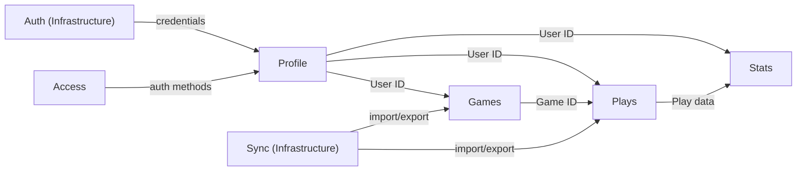
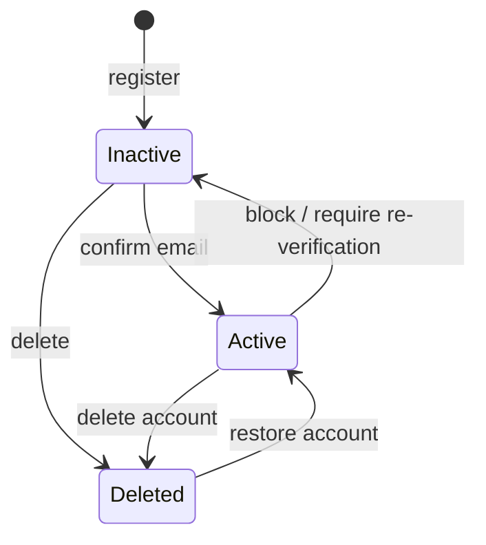
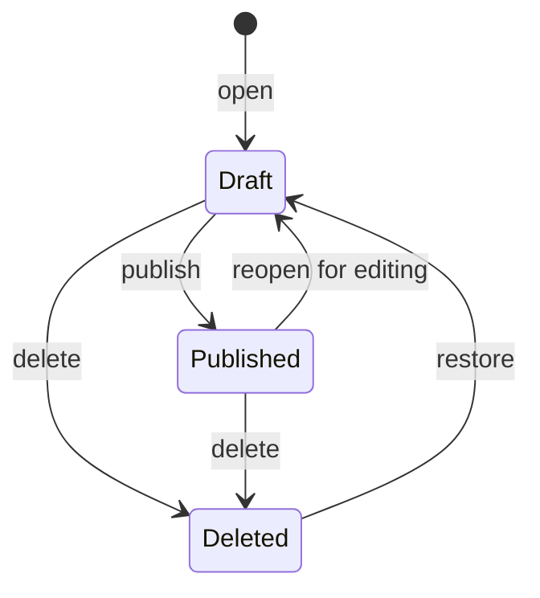
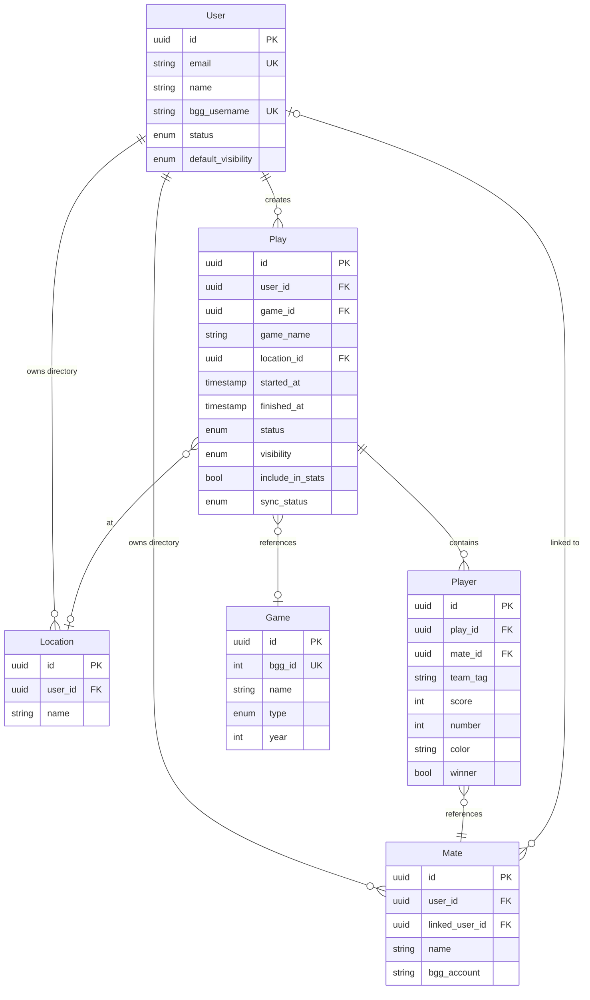

# Business Domain

**Document Version:** 2.0
**Status:** Draft (under discussion)

---

## 1. Business Domain Overview

BoardGameLog operates in the **game activity tracking** domain. The system allows users to record, analyze, and share
information about their board game sessions.

---

## 2. Bounded Contexts

| Context | Responsibility                    | Phase | Domain Layer      |
|---------|-----------------------------------|-------|-------------------|
| Profile | User identity, profile, settings  | 1+    | `Domain/Profile/` |
| Plays   | Play logging, players, mates      | 1     | `Domain/Plays/`   |
| Games   | Game catalog (BGG import)         | 1     | `Domain/Games/`   |
| Stats   | Analytics and reporting           | 1+    | `Domain/Stats/`   |
| Access  | Auth methods, device session mgmt | 4     | `Domain/Access/`  |

**Not a bounded context:**

- **Sync** -- external integration ports (`Core/Sync/`) and adapters (`Infrastructure/Sync/`). No domain logic.
- **Auth** -- authentication/authorization infrastructure. Contracts in `Core/Auth/`, implementations in
  `Infrastructure/Auth/`.

### Context Map

### Cross-Context References

Contexts reference each other only by ID (Uuid). No entity references across boundaries.

| From  | To      | Reference      | Purpose                                |
|-------|---------|----------------|----------------------------------------|
| Plays | Profile | User ID (Uuid) | Play owner, Mate owner, Location owner |
| Plays | Games   | Game ID (Uuid) | Game reference in Play                 |
| Plays | Plays   | Mate ID (Uuid) | Player -> Mate reference               |
| Stats | Profile | User ID (Uuid) | Statistics subject                     |
| Stats | Plays   | Play data      | Source data for analytics              |
| Stats | Games   | Game ID (Uuid) | Game statistics                        |

---

## 3. Profile Context

Manages user identity, profile information, and personal settings.

### 3.1 User (Aggregate Root)

| Attribute         | Type              | Required | Constraint                      |
|-------------------|-------------------|----------|---------------------------------|
| id                | Uuid              | yes      | Unique                          |
| email             | Email             | yes      | Unique, valid format            |
| passwordHash      | string            | yes      | Source password min 8 chars     |
| name              | string            | yes      | Auto-generated if not provided  |
| status            | UserStatus        | yes      | See state machine below         |
| bggUsername       | string            | no       | Unique if set                   |
| defaultVisibility | Visibility        | no       | Default for new plays           |
| avatar            | string            | no       | Future                          |
| tokenVersion      | int               | yes      | Incremented on token revocation |
| createdAt         | DateTimeImmutable | yes      |                                 |

**Invariants:**

- Email is unique across the system
- Email must be valid format
- Name is required (auto-generated if not provided at registration)
- BGG username is unique across the system if set
- Password minimum 8 characters (validated at creation/change)

**State Machine (UserStatus):**

Forbidden transition: `Deleted -> Inactive`.

---

## 4. Plays Context

Manages play logging, player tracking, mate directory, and location directory.

### 4.1 Play (Aggregate Root)

The central entity of the system. Represents one board game play.

| Attribute      | Type              | Required      | Constraint                               |
|----------------|-------------------|---------------|------------------------------------------|
| id             | Uuid              | yes           | Unique                                   |
| userId         | Uuid              | yes           | Owner (Profile context)                  |
| game           | Uuid              | for Published | Reference to Games context               |
| gameName       | string            | no            | Custom name when Game not selected       |
| startedAt      | DateTimeImmutable | yes           |                                          |
| finishedAt     | DateTimeImmutable | no            | Must be >= startedAt if set              |
| location       | Uuid              | no            | Reference to user's Location             |
| visibility     | Visibility        | yes           | Default: Authenticated (or from profile) |
| includeInStats | bool              | yes           | Default: true                            |
| status         | PlayStatus        | yes           | See state machine below                  |
| syncStatus     | SyncStatus        | yes           | Default: not_synced                      |
| players        | Player[]          | for Published | At least one for Published               |

**Invariants:**

- Owner (User ID) is required
- Start date is required
- End date must be >= start date (if set)
- Game or gameName must be set for Published status
- At least one Player required for Published status
- Visibility default: Authenticated, overridden by profile setting, then per-play setting

**State Machine (PlayStatus):**

Forbidden transition: `Deleted -> Published` (must go through Draft first).

**Sync Status (SyncStatus):**

| Status       | Description               |
|--------------|---------------------------|
| `not_synced` | Not synchronized with BGG |
| `pending`    | Awaiting synchronization  |
| `synced`     | Successfully synchronized |
| `failed`     | Synchronization error     |

On sync conflict: user is notified and resolves manually in Play.

### 4.2 Player (Entity, child of Play)

Represents a participant in a specific play.

| Attribute | Type   | Required | Constraint                                  |
|-----------|--------|----------|---------------------------------------------|
| id        | Uuid   | yes      | Unique within Play                          |
| mateId    | Uuid   | yes      | Reference to Mate                           |
| teamTag   | string | no       | Same value = same team, null = free-for-all |
| score     | int    | no       | Non-negative                                |
| number    | int    | no       | Player number (1 = first player)            |
| color     | string | no       | Color or faction                            |
| winner    | bool   | no       | Winner flag                                 |

**Invariants:**

- Mate reference is required
- Score is non-negative (if set)

### 4.3 Mate (Aggregate Root)

Personal directory of co-players. Each user maintains their own directory.

| Attribute  | Type              | Required | Constraint                   |
|------------|-------------------|----------|------------------------------|
| id         | Uuid              | yes      | Unique                       |
| userId     | Uuid              | yes      | Owner of the directory       |
| name       | string            | yes      |                              |
| linkedUser | Uuid              | no       | Reference to registered User |
| bggAccount | string            | no       | Reference to BGG account     |
| createdAt  | DateTimeImmutable | yes      |                              |

**Invariants:**

- Name is required
- Owner (User ID) is required
- One User cannot be linked to multiple Mates of the same owner
- One BGG account cannot be linked to multiple Mates of the same owner

**System Mates (global, not owned by any user):**

- **Anonymous** -- unknown/random player
- **Automa** -- NPC / solo mode opponent

### 4.4 Location (Aggregate Root)

Personal directory of places where plays happen.

| Attribute | Type              | Required | Constraint |
|-----------|-------------------|----------|------------|
| id        | Uuid              | yes      | Unique     |
| userId    | Uuid              | yes      | Owner      |
| name      | string            | yes      |            |
| createdAt | DateTimeImmutable | yes      |            |
| icon      | string            | no       | Future     |

**Invariants:**

- Name is required
- Owner (User ID) is required

### 4.5 Visibility (Enum)

| Level         | Description                                        |
|---------------|----------------------------------------------------|
| Private       | Only the author                                    |
| Participants  | Author + Users linked to Mates in this Play        |
| Link          | Anyone with a direct link (unlisted)               |
| Authenticated | All authenticated users                            |
| Public        | Everyone, including unauthenticated internet users |

Priority: system default (Authenticated) -> profile setting -> per-play setting.

---

## 5. Games Context

Global game catalog. Games are imported from BGG, not created manually by users.
When a user searches and is connected to BGG, their games are prioritized in results.

### 5.1 Game (Aggregate Root)

| Attribute        | Type     | Required | Constraint                                      |
|------------------|----------|----------|-------------------------------------------------|
| id               | Uuid     | yes      | Unique                                          |
| name             | string   | yes      | Primary name                                    |
| alternativeNames | string[] | no       | From BGG                                        |
| bggId            | int      | yes      | Unique                                          |
| year             | int      | no       | Release year                                    |
| type             | GameType | yes      | base/expansion/standalone_expansion             |
| minPlayers       | int      | no       |                                                 |
| maxPlayers       | int      | no       |                                                 |
| minPlayTime      | int      | no       | Minutes                                         |
| maxPlayTime      | int      | no       | Minutes                                         |
| image            | string   | no       | URL                                             |
| family           | string   | no       | Informational only, community-maintained in BGG |

**Invariants:**

- BGG ID is unique in the system
- Name is required
- Games are imported from BGG only, users do not create Game entities manually

**Game Type (Enum):**

| Type                   | Description            |
|------------------------|------------------------|
| `base`                 | Base game              |
| `expansion`            | Expansion to base game |
| `standalone_expansion` | Standalone expansion   |

---

## 6. Stats Context

Analytics and reporting. Structured as a full bounded context for future extensibility (achievements, ratings), but
currently operates as a read model over Plays data.

**Characteristics:**

- Read-only: Stats does not modify data in other contexts
- Eventually consistent (caches, materialized views)
- References other contexts by ID (User ID, Mate ID, Game ID)
- Play's `includeInStats` flag determines whether a play is counted

**Statistics Types:**

| Type           | Description                    | Phase |
|----------------|--------------------------------|-------|
| Personal Stats | User's personal statistics     | 1     |
| Game Stats     | Statistics for a specific game | 1     |
| Group Stats    | Co-player group statistics     | 2     |
| Period Stats   | Statistics for a period        | 2     |
| Annual Reports | Automated period reports       | 3     |

**Future invariants (when achievements/ratings are added):**

- Achievement is granted once
- Rating cannot be negative

---

## 7. Access Context (Phase 4)

Authentication methods management and device session control.

**Planned functionality:**

- Passkey support
- Multiple authentication methods per user
- Device session management (view, revoke)
- Authorization moderation across devices

**Not designed in detail yet.** Will be defined when Phase 4 planning begins.

---

## 8. Infrastructure: Auth

Authentication and authorization mechanics. Not a bounded context.

**Core contracts:**

- `Authenticator` -- login, refresh, revoke, verify
- `Tokenizer` -- generate and verify tokens
- `PasswordHasher` -- hash, verify, needsRehash

**Infrastructure implementations:**

- JWT token generation
- Bcrypt password hashing
- Email confirmation tokens (infrastructure mechanism, not domain entity)

---

## 9. Infrastructure: Sync

External system integration. Not a bounded context.

**Core ports:**

- `GameCatalogProvider` -- search and retrieve game information
- `PlayExporter` -- export plays to external system
- `PlayImporter` -- import plays from external system

**Infrastructure adapters:**

- BGG (BoardGameGeek) implementations

**Conflict resolution:** on import conflict, user is notified and resolves manually in Play.

---

## 10. Domain Events

### 10.1 Profile Events

| Event          | Description         | Payload                  |
|----------------|---------------------|--------------------------|
| UserRegistered | New user registered | userId, email, createdAt |
| UserConfirmed  | Email confirmed     | userId, confirmedAt      |
| UserDeleted    | Account deleted     | userId, deletedAt        |
| UserRestored   | Account restored    | userId, restoredAt       |

### 10.2 Plays Events

| Event         | Description          | Payload                 |
|---------------|----------------------|-------------------------|
| PlayCreated   | New play created     | playId, userId, date    |
| PlayPublished | Play published       | playId, gameId, players |
| PlayUpdated   | Play edited          | playId, changes         |
| PlayDeleted   | Play deleted         | playId, deletedAt       |
| PlayRestored  | Play restored        | playId                  |
| PlayerAdded   | Player added to play | playId, mateId          |
| PlayerRemoved | Player removed       | playId, mateId          |

### 10.3 Games Events

| Event        | Description            | Payload       |
|--------------|------------------------|---------------|
| GameImported | Game imported from BGG | gameId, bggId |

### 10.4 Sync Events

| Event         | Description                 | Payload                 |
|---------------|-----------------------------|-------------------------|
| SyncRequested | Synchronization requested   | userId, provider, scope |
| PlayExported  | Play exported to provider   | playId, providerId      |
| PlayImported  | Play imported from provider | providerId, playId      |
| SyncFailed    | Synchronization error       | error, retryAt          |
| SyncConflict  | Conflict detected on import | playId, providerId      |

---

## 11. Data Schema

---

## 12. Shared Value Objects (Core)

| Value Object | Location            | Validation                     |
|--------------|---------------------|--------------------------------|
| Uuid         | `Core/ValueObjects` | Non-empty string or null       |
| Email        | `Core/ValueObjects` | PHP FILTER_VALIDATE_EMAIL      |
| Password     | `Core/ValueObjects` | Minimum 8 characters           |
| DateTime     | `Core/ValueObjects` | Flexible input (string/int/DT) |
| Date         | `Core/ValueObjects` | Date only, time zeroed         |
| DateInterval | `Core/ValueObjects` | ISO-8601 duration              |

---

## 13. Non-Functional Domain Requirements

### 13.1 Data Consistency

- All play operations are atomic
- Statistics can be eventually consistent
- BGG synchronization is asynchronous

### 13.2 Audit

- Play changes trigger domain events for reactive updates (statistics, notifications)
- Events are processed within transactions but not persisted in MVP (see ADR-006)
- Full event history with state reconstruction planned for later phases if needed
- Storing metadata about time and author of changes in entity fields

### 13.3 Scalability

- Separate storage for analytical data
- Game search result caching
- Materialized views for tops

---

## 14. Naming Decisions

| Decision               | Chosen      | Rationale                                          |
|------------------------|-------------|----------------------------------------------------|
| Session vs Play        | **Play**    | BGG standard, matches Plays context name           |
| Auth vs Profile        | **Profile** | Auth is infrastructure, Profile is domain          |
| Mate location          | **Plays**   | Mate is a co-player, exists in gaming context      |
| User across contexts   | **By ID**   | No entity duplication, reference by Uuid           |
| EmailConfirmationToken | **Infra**   | Infrastructure mechanism, not domain entity        |
| Stats as context       | **Yes**     | Future-proof for achievements/ratings/microservice |
| Sync as context        | **No**      | No domain logic, just ports and adapters           |

---

## 15. Migration Notes

Current code uses names and structures that differ from this model:

| Current (code)    | Target (this document) | Action                |
|-------------------|------------------------|-----------------------|
| `Domain/Auth/`    | `Domain/Profile/`      | Rename context        |
| `Session`         | `Play`                 | Rename entity         |
| `SessionStatus`   | `PlayStatus`           | Rename enum           |
| `Session::open()` | `Play::open()`         | Rename factory method |
| `Sessions` (repo) | `Plays` (repo)         | Rename repository     |
| Missing           | `Player`               | Create entity         |
| Missing           | `Mate`                 | Create aggregate      |
| Missing           | `Location`             | Create aggregate      |
| Missing           | `Game`                 | Create aggregate      |
| Missing           | `Visibility`           | Create enum           |
| Missing           | `GameType`             | Create enum           |
| Missing           | `SyncStatus`           | Create enum           |
