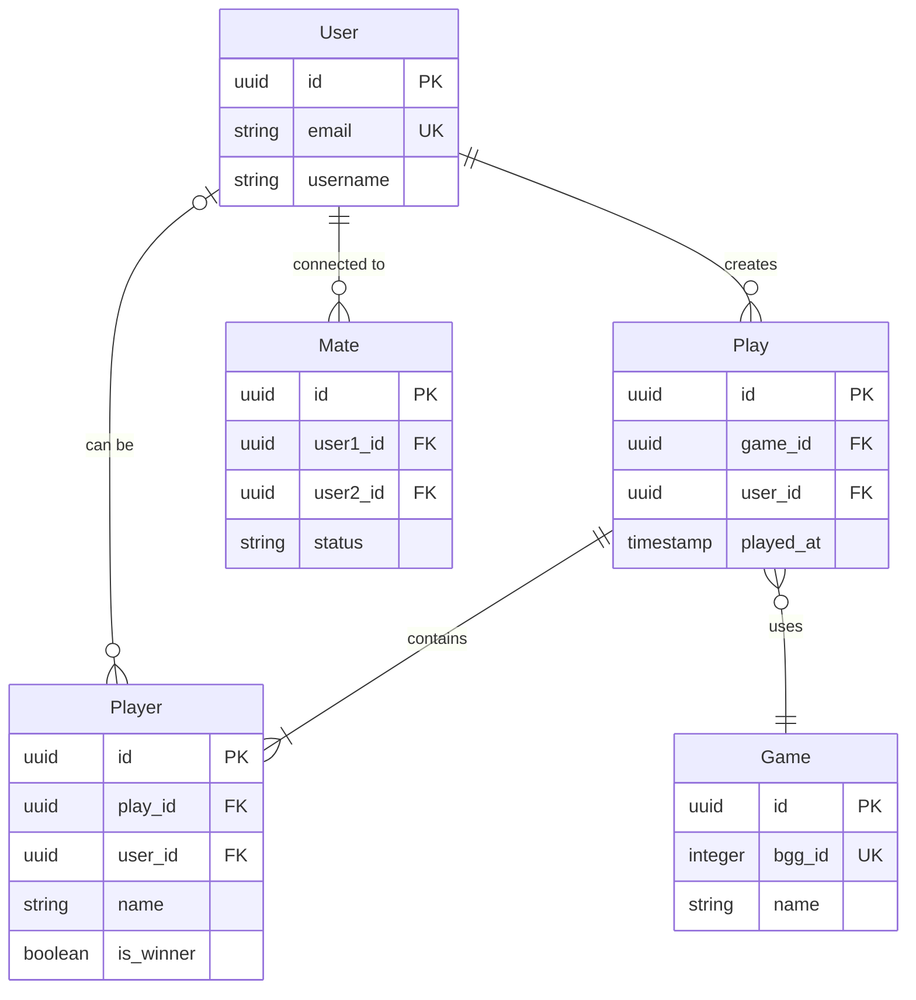

# Business Domain

**Document Version:** 1.0

---

## 1. Business Domain Overview

BoardGameLog operates in the **game activity tracking** domain. The system allows users to record, analyze, and share
information about their board game sessions.

---

## 2. Core Business Entities

### 2.1 Play (Session)

The central entity of the system. Represents one completed board game session.

**Attributes:**

- Session identifier
- Game reference
- Start date and time
- End date and time
- Location
- List of players with results
- Session notes
- BGG synchronization status

**Business Rules:**

- A session must contain at least one player
- End date cannot be earlier than start date
- Location is optional
- Results are determined by game type (winner/score/cooperative)

### 2.2 Game (Board Game)

Represents a specific board game from the catalog.

**Attributes:**

- Game identifier
- BGG ID (BoardGameGeek external identifier)
- Name
- Release year
- Type (base game/expansion)
- Minimum/maximum player count
- Play time (min/max)
- Image

**Business Rules:**

- A game can be linked to one BGG record
- Expansions are linked to base games
- Game information is cached after retrieval from BGG

### 2.3 Player

Represents a participant in a specific session.

**Attributes:**

- Player record identifier
- User reference (if registered)
- Player name (for unregistered participants)
- Result (win/loss/place)
- Score earned
- Color/faction (optional)
- First player (yes/no)

**Business Rules:**

- A player can be linked to a User or exist as a guest
- Result is determined by specific game rules
- One User can be a Player in multiple sessions

### 2.4 User

A registered system user.

**Attributes:**

- User identifier
- Email
- Username
- Registration date
- BGG Username (for synchronization)
- Profile settings
- Status (active/blocked)

**Business Rules:**

- Email is unique in the system
- BGG Username is optional but must be unique if specified
- User can delete account (soft delete)

### 2.5 Mate (Co-player)

A connection between users for shared statistics access.

**Attributes:**

- Connection identifier
- User 1 (initiator)
- User 2 (acceptor)
- Status (pending/confirmed/rejected)
- Connection creation date

**Business Rules:**

- Connection is bidirectional after confirmation
- Co-players can see shared session statistics
- Connection can be broken at any time

### 2.6 Stats (Statistics)

Aggregated data from sessions.

**Statistics Types:**

- Session count by game
- Win percentage by game/player
- Most played games for period
- Win leaderboards
- Average session duration
- Play frequency by day of week
- Period tops (month/quarter/year)

---

## 3. Domain Contexts (Bounded Contexts)

### 3.1 Auth Context

**Responsibility:** User authentication and authorization.

**Entities:**

- User
- Token
- RefreshToken

**Operations:**

- New user registration
- System login
- System logout
- Password reset
- Token refresh

### 3.2 Games Context

**Responsibility:** Game catalog management.

**Entities:**

- Game
- GameExpansion
- GameImage

**Operations:**

- Game search by name (via BGG)
- Adding game to local catalog
- Getting game details
- Linking expansions to base game

### 3.3 Plays Context

**Responsibility:** Game session logging and management.

**Entities:**

- Play
- Player
- PlayComment

**Operations:**

- Creating new session
- Editing session
- Deleting session
- Adding players to session
- Recording results

### 3.4 Stats Context

**Responsibility:** Analytics and reporting.

**Aggregates:**

- GameStats
- PlayerStats
- PeriodReport

**Operations:**

- Calculating game statistics
- Calculating player statistics
- Generating period reports
- Updating leaderboards

### 3.5 Sync Context

**Responsibility:** Data synchronization abstraction with external sources. Defines interfaces (ports) for data
import/export without binding to a specific provider.

**Interfaces (Ports):**

- GameCatalogProvider — game search and information retrieval
- PlayExporter — session export to external system
- PlayImporter — session import from external system

**Operations:**

- Searching game in external catalog
- Importing game information
- Exporting session
- Importing user sessions

**Note:** Specific implementations (e.g., BoardGameGeek) are located in Infrastructure Layer as adapters. This allows
adding other data sources without changing domain logic.

---

## 4. Domain Events

### 4.1 Auth Events

| Event          | Description         | Payload                  |
|----------------|---------------------|--------------------------|
| UserRegistered | New user registered | userId, email, createdAt |
| UserLoggedIn   | User logged in      | userId, loginAt          |
| UserLoggedOut  | User logged out     | userId, logoutAt         |
| PasswordReset  | Password was reset  | userId, resetAt          |

### 4.2 Plays Events

| Event          | Description             | Payload                       |
|----------------|-------------------------|-------------------------------|
| PlayCreated    | New session created     | playId, gameId, date, players |
| PlayUpdated    | Session edited          | playId, changes               |
| PlayDeleted    | Session deleted         | playId, deletedAt             |
| PlayerAdded    | Player added to session | playId, playerId              |
| ResultRecorded | Result recorded         | playId, playerId, result      |

### 4.3 Sync Events

| Event         | Description                  | Payload                 |
|---------------|------------------------------|-------------------------|
| SyncRequested | Synchronization requested    | userId, provider, scope |
| GameImported  | Game imported from source    | gameId, providerId      |
| PlayExported  | Session exported to source   | playId, providerId      |
| PlayImported  | Session imported from source | providerId, playId      |
| SyncFailed    | Synchronization error        | error, retryAt          |

---

## 5. Business Rules and Invariants

### 5.1 Session Creation Rules

1. Session must be linked to an existing game
2. At least one player is required
3. Player count must not exceed game maximum
4. Session date cannot be in the future
5. Duration is calculated automatically

### 5.2 Result Rules

1. Cooperative games have shared result (win/loss)
2. Competitive games require winner or score specification
3. Ties are possible for certain game types
4. Scores must be non-negative

### 5.3 External Source Synchronization Rules

1. Synchronization requires linked provider account
2. Rate limit is determined by specific provider
3. On error, retry with exponential backoff
4. Conflicts are resolved in favor of newer data
5. Provider is determined through interface — specific implementation in Infrastructure

---

## 6. Data Schema

---

## 7. Integration Points

### 7.1 External Data Providers (Ports & Adapters)

The system uses the Ports & Adapters pattern for integration with external data sources. Domain Layer defines
interfaces (ports), Infrastructure Layer contains specific implementations (adapters).

**Ports (Domain/Sync/):**

- `GameCatalogProvider` — game search and information retrieval
- `PlayExporter` — session export to external system
- `PlayImporter` — session import from external system

Specific adapter implementations (e.g., for BoardGameGeek) are located in Infrastructure Layer. This allows adding new
data sources without changing domain logic.

### 7.2 Internal Events (Event Bus)

The system uses event-driven architecture for:

- Updating statistics after session recording
- Triggering background BGG synchronization
- Sending user notifications
- Action audit logging

---

## 8. Non-Functional Domain Requirements

### 8.1 Data Consistency

- All session operations are atomic
- Statistics can be eventually consistent
- BGG synchronization is asynchronous

### 8.2 Audit

- Session changes trigger domain events for reactive updates (statistics, notifications)
- Events are processed within transactions but not persisted in MVP (see ADR-006)
- Full event history with state reconstruction planned for later phases if needed
- Storing metadata about time and author of changes in entity fields

### 8.3 Scalability

- Separate storage for analytical data
- Game search result caching
- Materialized views for tops
