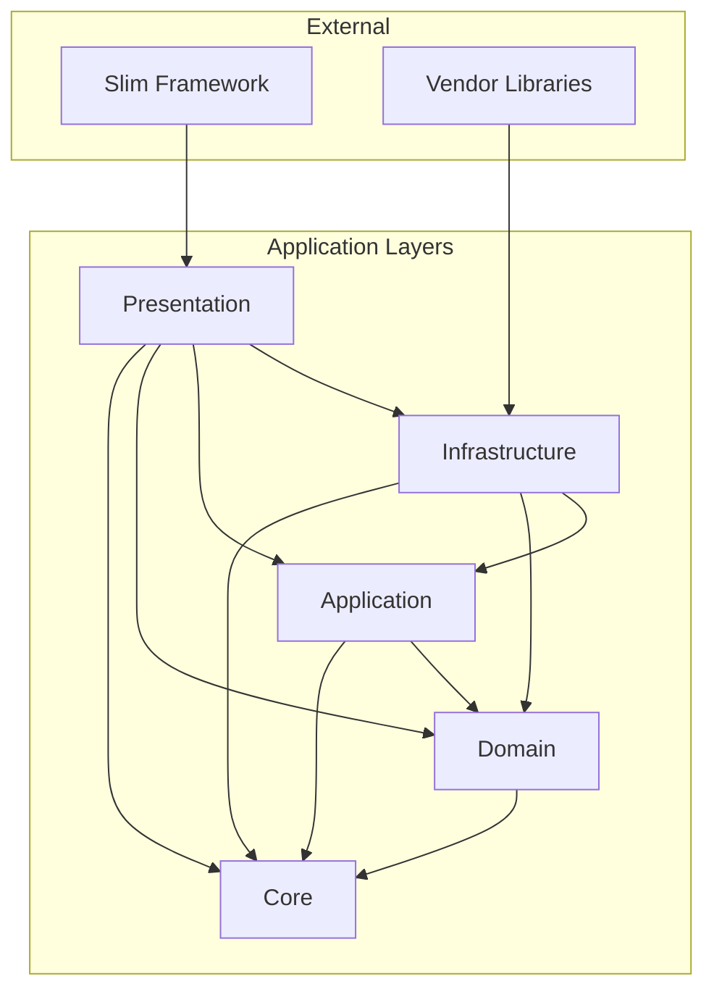

# Project Structure

BoardGameLog is built on **Clean Architecture** with a combined approach to code organization. See the decision
details: [ADR-001](../03-decisions/001-clean-architecture.md), [ADR-007](../03-decisions/007-combined-code-organization.md).

---

## Dependency Principle

Dependencies point **inward**. Inner layers (`Core`, `Domain`) never depend on outer layers (`Infrastructure`,
`Presentation`).

```
Infrastructure → Application → Domain → Core
Presentation  ↗
```

This rule is automatically verified via `composer dt` (Deptrac).

---

## Directory Structure

```
src/
├── Core/                           # Contracts and shared components
│   ├── Auth/                       # Authentication contracts (Authentificator, Identity)
│   ├── Collections/                # Collection interfaces
│   ├── Http/                       # HTTP contracts (SchemaMapper)
│   ├── Listing/                    # Search contracts (Filter, Searchable)
│   ├── Messages/                   # Bus contracts (Message, Command, Query, Event)
│   ├── Security/                   # Security contracts (PasswordHasher)
│   └── ValueObjects/               # Shared Value Objects
│
├── Domain/                         # Business logic (grouped by contexts)
│   ├── Games/                      # Game catalog (Game, Games)
│   ├── Mates/                      # Co-player directory (Mate, Mates)
│   ├── Plays/                      # Play logging (Play, Plays, PlayStatus, Visibility)
│   │   └── Player/                 # Child entity (Player, Players, PlayersFactory, EmptyPlayers)
│   ├── Profile/                    # User identity & profile (User, Users, UserId, UserStatus)
│   │   └── Passkey/                # Child entity (Passkey, Passkeys, PasskeyChallenge, PasskeyChallenges)
│   ├── Stats/                      # Analytics and reporting
│   └── Access/                     # Auth methods, device sessions (Phase 4)
│
├── Application/                    # Use cases
│   ├── Aspects/                    # AOP aspects (transactions, logging)
│   └── Handlers/                   # Handlers (by contexts and use cases)
│       ├── Auth/
│       │   ├── IssueToken/
│       │   │   ├── Command.php
│       │   │   └── Handler.php
│       │   └── RevokeToken/
│       └── Plays/
│           ├── CreatePlay/
│           └── GetPlayHistory/
│
├── Infrastructure/                 # External services and adapters
│   ├── Authentification/
│   │   └── OpenAuth/               # OAuth2 server adapter (league/oauth2-server)
│   ├── Database/
│   │   └── Migrations/             # Doctrine database migrations
│   ├── Persistence/
│   │   ├── Doctrine/               # Doctrine repository implementations
│   │   └── InMemory/               # InMemory for tests
│   ├── MessageBus/
│   │   └── Tactician/              # MessageBus implementation
│   ├── Http/                       # HTTP adapters (OpenApiSchemaMapper)
│   ├── Security/                   # Security adapters (BcryptPasswordHasher)
│   └── Sync/
│       └── Bgg/                    # BoardGameGeek adapter
│
└── Presentation/                   # Entry points
    ├── Api/                        # HTTP API (Slim)
    │   ├── Interceptors/           # Request interceptor contracts
    │   ├── ApiAction.php           # Single entry point for all API routes
    │   ├── RouteMap.php            # OpenAPI config to route matching
    │   ├── InterceptorPipeline.php # Interceptor chain executor
    │   └── MatchedOperation.php    # Matched route value object
    └── Console/                    # CLI commands
```

---

## Layers and Their Responsibilities

### Core

Contracts, interfaces, and shared Value Objects without business logic. Depends on nothing except PHP.

Examples: `Message`, `Command`, `Query`, `Event`, `Filter`, `Searchable`, `Email`, `Id`, `Authentificator`, `Identity`,
`GrantType`.

### Domain

Business logic grouped by **Bounded Contexts** (Profile, Games, Plays, Stats, Access). Contains entities, domain
services, repository interfaces, and domain events. Auth and Sync are infrastructure, not bounded contexts.

Depends only on `Core`.

### Application

System use cases. Each Handler implements one usage scenario. Coordinates Domain entities and Infrastructure services.

Depends on `Core` and `Domain`.

### Infrastructure

External dependency implementations: databases (Doctrine), external APIs, message bus (Tactician). Contains adapters for
ports defined in Domain Layer.

Depends on `Core`, `Domain`, `Application`, and external libraries.

Ports & Adapters examples:

- `PlaySynchronizer` interface in `Core/Sync/` -> `BggPlaySynchronizer` in `Infrastructure/Sync/Bgg/`
- `Authenticator` interface in `Core/Auth/` -> JWT implementation in `Infrastructure/Auth/`
- `PasswordHasher` interface in `Core/Security/` -> `BcryptPasswordHasher` in `Infrastructure/Security/`
- `SchemaMapper` interface in `Core/Http/` -> `OpenApiSchemaMapper` in `Infrastructure/Http/`

### Presentation

Thin layer for HTTP and CLI. Receives request, forms Message, sends to MessageBus, returns response.

Depends on all layers and framework (Slim).

---

## Dependency Diagram



**Reading the diagram:** Arrow `A --> B` means "A depends on B". All dependencies point inward toward Core.

---

## Implementation Rules

### Entities (`Domain/{Context}/`)

Rich domain objects with identity and business logic. Aggregate roots and their VOs/enums live at context root
(`Domain/{Context}/`), child entities in subdirectories (`Domain/{Context}/{ChildEntity}/`). Depend only on
`Core\ValueObjects` and Enums. Properties are private, modified through methods. Avoid `null` — use nullable Value
Objects or Null-object pattern.

```php
final class Play
{
    private function __construct(
        private PlayId $id,
        private GameId $gameId,
        private DateTimeImmutable $playedAt,
    ) {}

    public static function create(GameId $gameId, DateTimeImmutable $date): self
    {
        return new self(PlayId::generate(), $gameId, $date);
    }
}
```

### Value Objects (`Core/ValueObjects/` or `Domain/*/ValueObjects/`)

Immutable objects that validate and wrap primitives. Validation in constructor. Methods return new instances.

```php
final readonly class Email
{
    public function __construct(
        public string $value,
    ) {
        if (!filter_var($value, FILTER_VALIDATE_EMAIL)) {
            throw new InvalidArgumentException('Invalid email');
        }
    }
}
```

### Repositories

Interface in `Domain/{Context}/`. Implementation only in `Infrastructure/Persistence/`. Return Entities, Value
Objects, or scalars. No business logic.

```php
// Domain/Plays/Repositories/Plays.php
interface Plays extends Repository
{
    public function findById(PlayId $id): ?Play;
}

// Infrastructure/Persistence/Doctrine/Plays.php
final class Plays extends DoctrineRepository implements Domain\Plays\Repositories\Plays
{
    // ...
}
```

### Handlers (`Application/Handlers/`)

One Handler = one use case. Implements contract from `Core\Messages`. Coordinates repositories, entities, and services.
Manages transactions.

```php
// Application/Handlers/Plays/CreatePlay/Handler.php
final readonly class Handler implements CommandHandler
{
    public function __construct(
        private Plays $plays,
        private Games $games,
    ) {}

    public function handle(Command $command): PlayId
    {
        $game = $this->games->findById($command->gameId)
            ?? throw new GameNotFoundException();

        $play = Play::create($game->id(), $command->date);
        $this->plays->add($play);

        return $play->id();
    }
}
```

### Messages (`Application/Handlers/{UseCase}/`)

Pure DTOs without logic. Implement `Command`, `Query`, or `Event` contracts.

```php
// Application/Handlers/Plays/CreatePlay/Command.php
final readonly class Command implements \Bgl\Core\Messages\Command
{
    public function __construct(
        public GameId $gameId,
        public DateTimeImmutable $date,
    ) {}
}
```

### Presentation (`Presentation/Api/` or `/Console/`)

Thin layer. Extracts and validates input data. Creates Message. Calls MessageBus. Formats response.

```php
final class CreatePlayAction
{
    public function __construct(
        private MessageBus $bus,
    ) {}

    public function __invoke(Request $request, Response $response): Response
    {
        $command = new CreatePlayCommand(
            gameId: GameId::fromString($request->getParsedBody()['game_id']),
            date: new DateTimeImmutable($request->getParsedBody()['date']),
        );

        $playId = $this->bus->handle($command);

        return $response->withJson(['id' => (string) $playId], 201);
    }
}
```

---

## Code Style

Standard **PSR-12**. In every file: `declare(strict_types=1);`.

Naming: `PascalCase` for classes, `camelCase` for methods and variables, `UPPER_SNAKE_CASE` for constants.

Automatically verified via `composer cs`.
