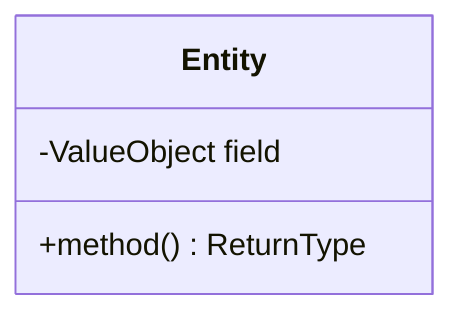
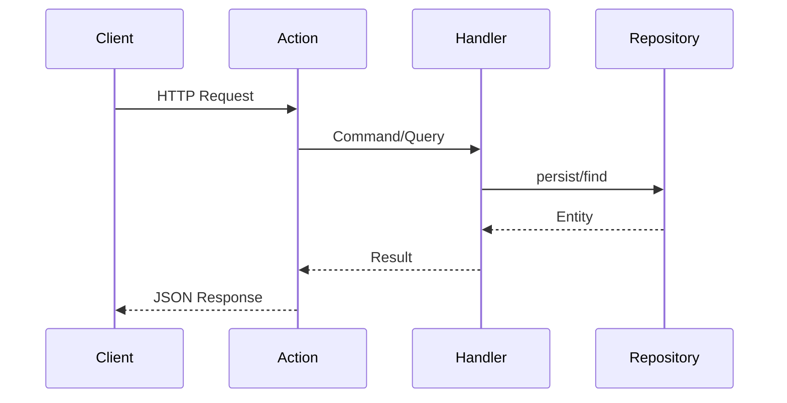

# Feature Request Template

> Task: {TASK-ID}
> Created: {DATE}

## 1. Feature Overview

### Description

{Clear description of what we're building}

### User Story

> {User story description}

### Business Value

- {Benefit 1}
- {Benefit 2}

### Target Users

- {User type 1}
- {User type 2}

---

## 2. Technical Architecture

### Approach

{High-level architectural approach, referencing ADRs where applicable}

### Integration Points

{How it integrates with existing codebase}

### Dependencies

- {Dependency 1}
- {Dependency 2}

---

## 3. Class Diagram



---

## 4. Sequence Diagram



---

## 5. API Specification

### Endpoints

| Method | Path      | Auth     | Description |
|--------|-----------|----------|-------------|
| POST   | `/v1/...` | Required | Description |

### Request/Response Examples

**Request:**

```json
{
    "field": "value"
}
```

**Response (200):**

```json
{
    "id": "uuid",
    "field": "value"
}
```

**Errors:**

- 400 Bad Request - validation errors
- 401 Unauthorized - missing/invalid token
- 403 Forbidden - insufficient permissions
- 404 Not Found - resource not found
- 409 Conflict - duplicate resource

---

## 6. Directory Structure

```
src/
├── Domain/{Context}/
│   ├── Entities/
│   │   └── {Entity}.php
│   ├── ValueObjects/
│   │   └── {ValueObject}.php
│   ├── Events/
│   │   └── {Event}.php
│   └── Repositories/
│       └── {Repository}.php
├── Application/Handlers/{Context}/{UseCase}/
│   ├── Command.php (or Query.php)
│   └── Handler.php
├── Infrastructure/
│   └── Persistence/Doctrine/
│       └── {Repository}.php
└── Presentation/Api/
    └── ... (if custom action needed)
```

---

## 7. Code References

> Files to read before implementation:

| File                   | Lines | Relevance              |
|------------------------|-------|------------------------|
| `src/Path/File.php`    | 45-67 | Pattern to follow      |
| `src/Path/Similar.php` | all   | Similar implementation |

---

## 8. Implementation Considerations

### Challenges

- {Challenge 1}
- {Challenge 2}

### Edge Cases

- {Edge case 1}
- {Edge case 2}

### Performance

- {Consideration 1}

### Security

- {Consideration 1}

---

## 9. Testing Strategy

> Per Testing Trophy (AGENTS.md Section 8)

### Integration Tests (Main Focus)

- {Test scenario 1}
- {Test scenario 2}

### Functional Tests

- {Test scenario 1}

### Unit Tests (Complex Logic Only)

- {Test for complex calculation/validation}

### Acceptance Tests (if API endpoint)

- {Feature file scenario}

---

## 10. Acceptance Criteria

> Acceptance criteria

- [ ] Criterion 1
- [ ] Criterion 2
- [ ] Criterion 3

---

## Next Steps

Create implementation plan (master-checklist.md + stage files).
