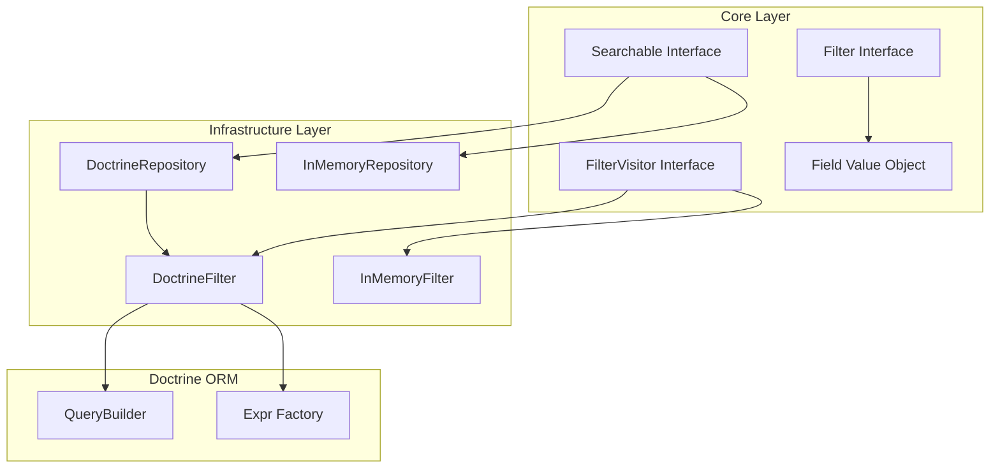
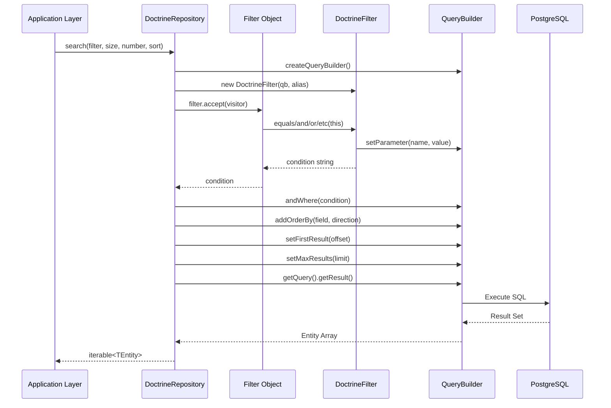

# Feature Documentation: DoctrineFilter for Searchable Contract

**Document Version:** 1.0
**Feature Reference:** 0001-implement-searchable-contract-for-doctrine-repository
**Date:** December 2025

---

## 1. Commit Message

```
feat(persistence): implement DoctrineFilter for searchable repository

Implement the DoctrineFilter class that translates core domain filter
abstractions into Doctrine ORM query conditions, enabling the
DoctrineRepository::search() method to convert domain-agnostic filter
objects into Doctrine QueryBuilder expressions.

Key changes:
- Add DoctrineFilter implementing FilterVisitor<string|Composite|null>
- Implement all 7 visitor methods: all, equals, less, greater, and, or, not
- Update DoctrineRepository::search() with full filter, pagination, and sort
- Add getAlias() method to Users repository

Technical decisions:
- Use Visitor Pattern to traverse filter object trees
- Generate unique parameter names with counter-based naming (param_0, param_1)
- Handle None filter by returning '1 = 0' condition (matches no records)
- Return null for empty composite filters (AndX/OrX with no children)

The implementation maintains domain isolation by keeping business logic
decoupled from database implementation details while providing a unified
query interface across different persistence mechanisms.

Closes: #0001
```

---

## 2. Pull Request Description

### What & Why

This PR implements the `DoctrineFilter` class that enables the `Searchable` contract for Doctrine-backed repositories.
The implementation translates core domain filter abstractions into Doctrine ORM query conditions using the Visitor
Pattern.

**Problem solved:** Prior to this change, `DoctrineRepository` could not execute filtered searches. Application code had
to either write Doctrine-specific queries directly (violating Clean Architecture) or limit searches to simple find-by-id
operations.

**Business value:** Developers can now write domain-agnostic search queries that work identically across InMemory (for
testing) and Doctrine (for production) repositories. This enables faster test execution, better domain isolation, and
more maintainable code.

### Changes Made

**New file:** `src/Infrastructure/Persistence/Doctrine/DoctrineFilter.php`

- Implements `FilterVisitor<string|Composite|null>` interface
- Handles all 7 filter types: All, Equals, Less, Greater, AndX, OrX, Not
- Uses counter-based parameter naming for unique parameter binding
- Resolves `Field` objects to qualified entity field names (e.g., `e.id`)

**Modified file:** `src/Infrastructure/Persistence/Doctrine/DoctrineRepository.php`

- Integrated `DoctrineFilter` in `search()` method
- Added sorting via `addOrderBy()` with configurable direction
- Added pagination via `setFirstResult()` and `setMaxResults()`
- Added early return for zero page size

**Modified file:** `src/Infrastructure/Persistence/Doctrine/Users.php`

- Added required `getAlias()` method returning `'u'`

**Test file:** `tests/Integration/Repositories/DoctrineRepositoryCest.php`

- Updated `@covers` annotation to include `DoctrineFilter`
- Inherits comprehensive test scenarios from `BaseRepository`

### Technical Details

**Design patterns used:**

- Visitor Pattern: `DoctrineFilter` implements `FilterVisitor` to transform filter objects into SQL conditions
- Template Method Pattern: `BaseRepository` provides shared test scenarios for all repository implementations
- Repository Pattern: Abstraction over data access with domain-agnostic interface

**Key implementation decisions:**

1. **Parameter binding:** All scalar values are bound via `setParameter()` to prevent SQL injection. Parameter names use
   a counter (`param_0`, `param_1`) for uniqueness.

2. **Field resolution:** The `resolve()` method differentiates between `Field` objects (converted to `alias.fieldName`)
   and scalars (bound as parameters).

3. **None filter handling:** `None::Filter` creates `Not(All)`, which the visitor translates to `'1 = 0'` — a condition
   that matches no records.

4. **Empty composites:** `AndX([])` and `OrX([])` return `null`, preventing invalid SQL generation.

**Integration points:**

- Implements `Bgl\Core\Listing\FilterVisitor` from Core layer
- Used by `DoctrineRepository::search()` in Infrastructure layer
- Produces `Doctrine\ORM\Query\Expr` objects for QueryBuilder

### Testing

**Manual testing:**

1. Create test entities via repository `add()` method
2. Execute `search()` with various filter combinations
3. Verify correct entities returned with expected ordering

**Automated tests added:**
The implementation passes all existing `BaseRepository` test scenarios:

| Test                        | Description                                 |
|-----------------------------|---------------------------------------------|
| `testQueryDefaultCall`      | Verifies `All::Filter` returns all entities |
| `testFilter` (None)         | Verifies `None::Filter` returns empty array |
| `testFilter` (Equals)       | Verifies field equality filtering           |
| `testFilter` (Greater/Less) | Verifies comparison operators               |
| `testFilter` (AndX/OrX)     | Verifies composite logical operators        |
| `testSort`                  | Verifies single-field sorting               |
| `testMultiSort`             | Verifies multi-field sorting                |
| `testOffsetLimit`           | Verifies pagination with various page sizes |

**Edge cases covered:**

- Empty filter arrays (`AndX([])`, `OrX([])`)
- None filter (matches no records)
- Page beyond available data (returns empty array)
- Zero page size (returns empty array immediately)
- Field on both sides of comparison (`Field('a')` = `Field('b')`)
- Scalar on both sides (constant expression)

### Breaking Changes

None. This is a new feature implementation that does not modify existing public APIs.

### Checklist

- [x] Code follows PSR-12 style guidelines
- [x] `declare(strict_types=1)` present in all files
- [x] Tests added via `BaseRepository` inheritance
- [x] Documentation updated (feature-request.md serves as specification)
- [x] No breaking changes
- [x] `composer scan:all` passes (all quality checks)
- [x] Architecture tests pass (`composer dt:run`)

---

## 3. Feature Documentation

### Overview

The DoctrineFilter enables domain-agnostic searching across Doctrine-backed repositories. It implements the
`FilterVisitor` interface to translate abstract filter objects into Doctrine QueryBuilder expressions, allowing
application code to remain independent of persistence implementation details.

**When to use:**

- Searching entities with complex filtering criteria
- Building paginated, sorted result sets
- Writing testable code that works with both InMemory and Doctrine repositories

### Usage Guide

#### Basic Search with Equality Filter

To find all users with a specific email address:

```php
use Bgl\Core\Listing\Field;
use Bgl\Core\Listing\Filter\Equals;

$filter = new Equals(new Field('email'), 'user@example.com');
$users = $repository->search(filter: $filter);
```

#### Compound Filters with AND/OR Logic

To find entities matching multiple conditions:

```php
use Bgl\Core\Listing\Field;
use Bgl\Core\Listing\Filter\Equals;
use Bgl\Core\Listing\Filter\AndX;
use Bgl\Core\Listing\Filter\OrX;
use Bgl\Core\Listing\Filter\Greater;

// Find active users created after 2024
$filter = new AndX([
    new Equals(new Field('status'), 'active'),
    new Greater(new Field('createdAt'), new \DateTimeImmutable('2024-01-01')),
]);
$users = $repository->search(filter: $filter);

// Find users who are either admins OR have premium status
$filter = new OrX([
    new Equals(new Field('role'), 'admin'),
    new Equals(new Field('subscription'), 'premium'),
]);
$users = $repository->search(filter: $filter);
```

#### Pagination and Sorting

To retrieve paginated, sorted results:

```php
use Bgl\Core\Listing\Filter\All;
use Bgl\Core\Listing\Page\PageSize;
use Bgl\Core\Listing\Page\PageNumber;
use Bgl\Core\Listing\Page\PageSort;
use Bgl\Core\Listing\Page\SortDirection;

// Get page 2 with 25 items per page, sorted by name ascending
$results = $repository->search(
    filter: All::Filter,
    size: new PageSize(25),
    number: new PageNumber(2),
    sort: new PageSort(['name' => SortDirection::Asc])
);

// Multi-field sorting: by status descending, then by name ascending
$results = $repository->search(
    filter: All::Filter,
    sort: new PageSort([
        'status' => SortDirection::Desc,
        'name' => SortDirection::Asc,
    ])
);
```

#### Negation with NOT Filter

To exclude certain records:

```php
use Bgl\Core\Listing\Field;
use Bgl\Core\Listing\Filter\Equals;
use Bgl\Core\Listing\Filter\Not;

// Find all non-archived entities
$filter = new Not(new Equals(new Field('status'), 'archived'));
$results = $repository->search(filter: $filter);
```

#### Using the None Filter

To explicitly return no results (useful for conditional logic):

```php
use Bgl\Core\Listing\Filter\None;
use Bgl\Core\Listing\Filter\All;

// Conditional search based on user permissions
$filter = $user->hasPermission('view_all')
    ? All::Filter
    : None::Filter;

$results = $repository->search(filter: $filter);
```

### API Reference

#### DoctrineFilter Class

```php
namespace Bgl\Infrastructure\Persistence\Doctrine;

/**
 * @implements FilterVisitor<string|Composite|null>
 */
final class DoctrineFilter implements FilterVisitor
```

**Constructor:**

| Parameter | Type           | Description                                     |
|-----------|----------------|-------------------------------------------------|
| `$qb`     | `QueryBuilder` | The Doctrine QueryBuilder instance              |
| `$alias`  | `string`       | Entity alias used in query (e.g., `'e'`, `'u'`) |

**Methods:**

| Method                     | Input                  | Return            | Description                                    |
|----------------------------|------------------------|-------------------|------------------------------------------------|
| `all(All $filter)`         | `All::Filter`          | `null`            | No condition added; matches all records        |
| `equals(Equals $filter)`   | `Equals(left, right)`  | `string`          | Equality condition (e.g., `"e.id = :param_0"`) |
| `less(Less $filter)`       | `Less(left, right)`    | `string`          | Less-than condition                            |
| `greater(Greater $filter)` | `Greater(left, right)` | `string`          | Greater-than condition                         |
| `and(AndX $filter)`        | `AndX([filters...])`   | `Composite\|null` | AND composite expression                       |
| `or(OrX $filter)`          | `OrX([filters...])`    | `Composite\|null` | OR composite expression                        |
| `not(Not $filter)`         | `Not(filter)`          | `string`          | NOT wrapper around inner condition             |

#### DoctrineRepository::search Method

```php
public function search(
    Filter $filter = None::Filter,
    PageSize $size = new PageSize(),
    PageNumber $number = new PageNumber(1),
    PageSort $sort = new PageSort([])
): iterable;
```

**Parameters:**

| Parameter | Type         | Default             | Description                          |
|-----------|--------------|---------------------|--------------------------------------|
| `$filter` | `Filter`     | `None::Filter`      | Filter criteria                      |
| `$size`   | `PageSize`   | `new PageSize()`    | Results per page (`null` = no limit) |
| `$number` | `PageNumber` | `new PageNumber(1)` | Page number (1-indexed)              |
| `$sort`   | `PageSort`   | `new PageSort([])`  | Sort fields and directions           |

**Return value:** `iterable<TEntity>` — Matching entities

**Error responses:**

| Scenario           | Error Type                    | Cause                          |
|--------------------|-------------------------------|--------------------------------|
| Invalid field name | `Doctrine\ORM\QueryException` | Field does not exist on entity |
| Type mismatch      | Database error                | Incompatible comparison types  |

### Architecture

#### High-Level Architecture Diagram



#### Key Components and Responsibilities

| Component            | Layer          | Responsibility                                          |
|----------------------|----------------|---------------------------------------------------------|
| `Filter`             | Core           | Abstract filter interface with `accept(visitor)` method |
| `FilterVisitor`      | Core           | Visitor interface defining transformation methods       |
| `Field`              | Core           | Value object representing entity field references       |
| `Searchable`         | Core           | Interface defining `search()` method contract           |
| `DoctrineFilter`     | Infrastructure | Transforms filters to Doctrine expressions              |
| `DoctrineRepository` | Infrastructure | Executes queries via EntityManager                      |

#### Data Flow



### Troubleshooting

#### Common Issues and Solutions

**Issue: "Column not found" or QueryException**

Cause: The field name in your `Field` object does not match an entity property.

Solution: Verify the entity has the property defined and that spelling matches exactly (case-sensitive).

```php
// Wrong - property name mismatch
new Equals(new Field('userName'), 'john');

// Correct - matches entity property
new Equals(new Field('username'), 'john');
```

**Issue: Empty results when expecting matches**

Cause: Using `None::Filter` as default or filter logic is inverted.

Solution: Check that you're using `All::Filter` when you want all records, and verify your filter logic with simpler
conditions first.

```php
// Default returns nothing
$results = $repository->search(); // Uses None::Filter

// Explicitly request all
$results = $repository->search(filter: All::Filter);
```

**Issue: Results not sorted correctly**

Cause: Sort direction constants swapped or wrong field name.

Solution: Verify `SortDirection::Asc` and `SortDirection::Desc` are used correctly.

```php
// Ascending order (A-Z, 1-9)
new PageSort(['name' => SortDirection::Asc])

// Descending order (Z-A, 9-1)
new PageSort(['name' => SortDirection::Desc])
```

**Issue: Pagination returns unexpected results**

Cause: Page numbers are 1-indexed, not 0-indexed.

Solution: Use `PageNumber(1)` for the first page.

```php
// Wrong - starts from second page
new PageNumber(0)

// Correct - first page
new PageNumber(1)
```

#### Error Messages Explained

| Error Message                   | Meaning                        | Resolution                                       |
|---------------------------------|--------------------------------|--------------------------------------------------|
| `QueryException: Invalid field` | Field does not exist on entity | Check entity class for correct property name     |
| `Type mismatch in comparison`   | Comparing incompatible types   | Ensure filter values match entity property types |
| `Empty result with All::Filter` | No entities in database        | Add test data or check database connection       |

---

*End of Feature Documentation*
