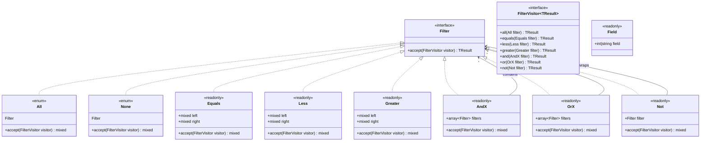
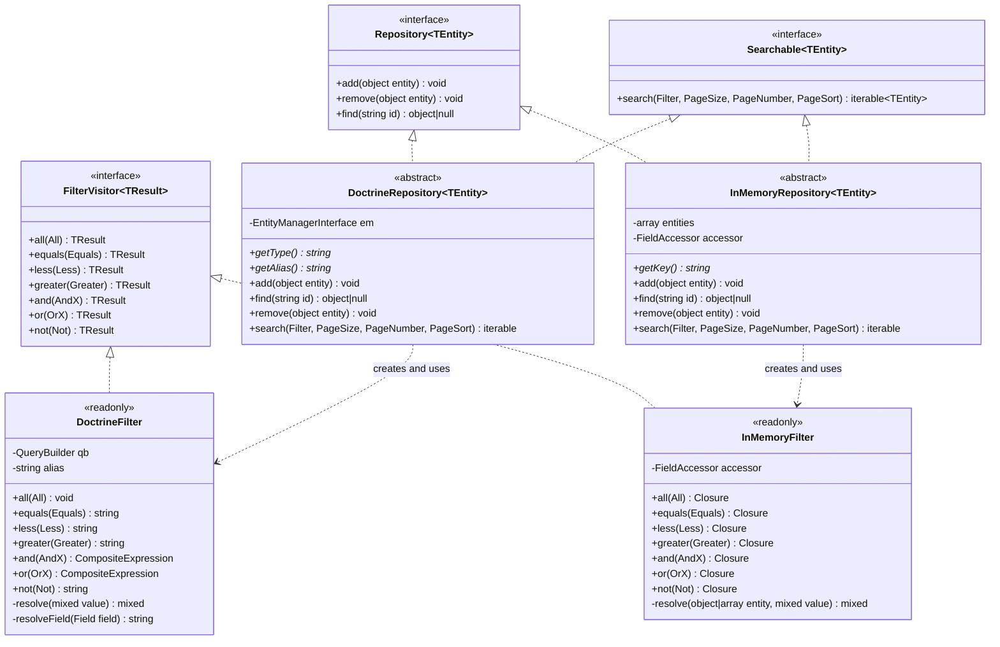
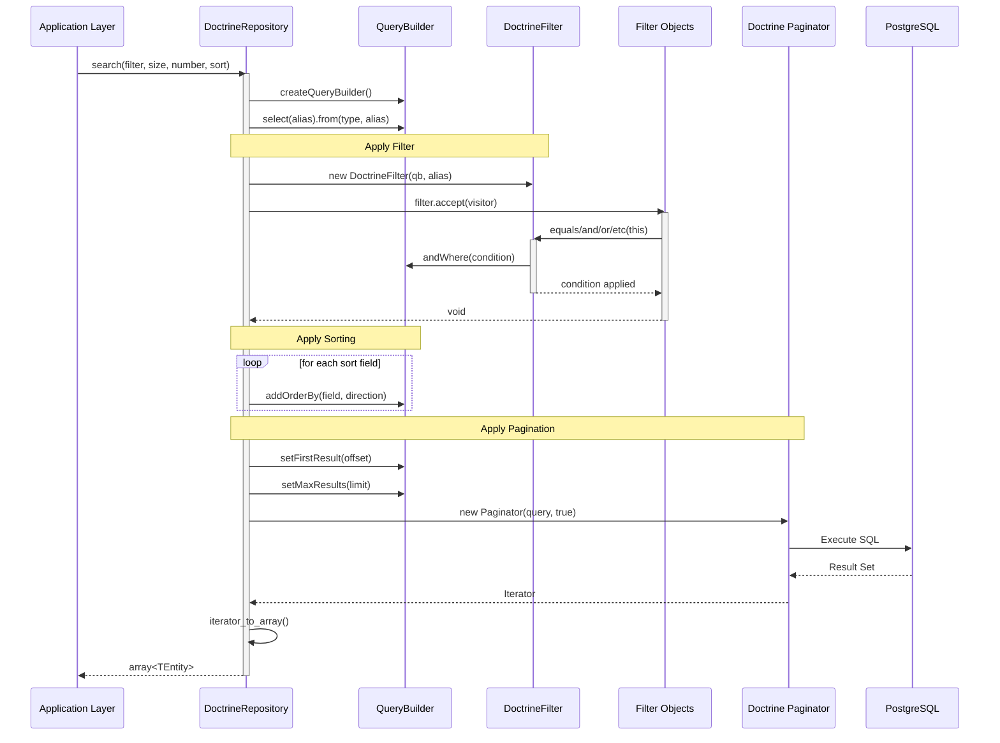
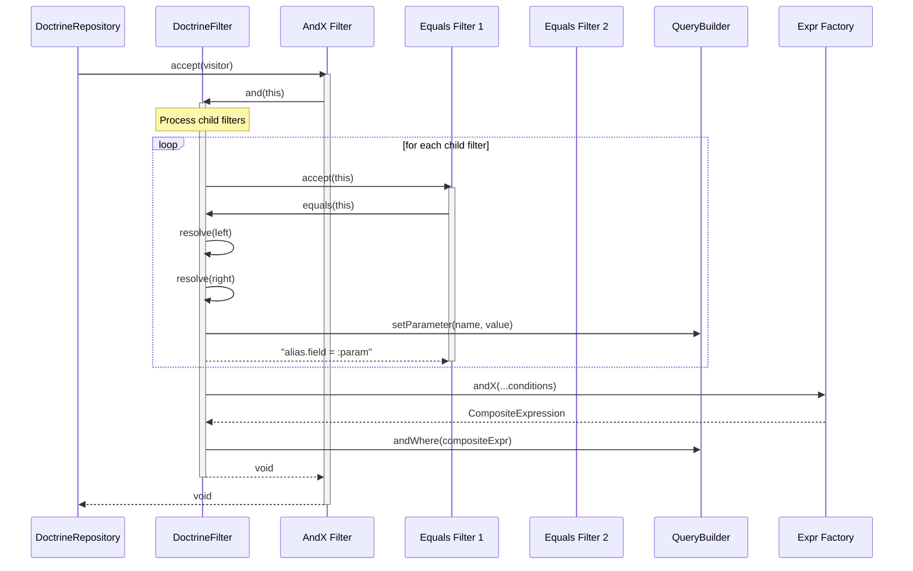
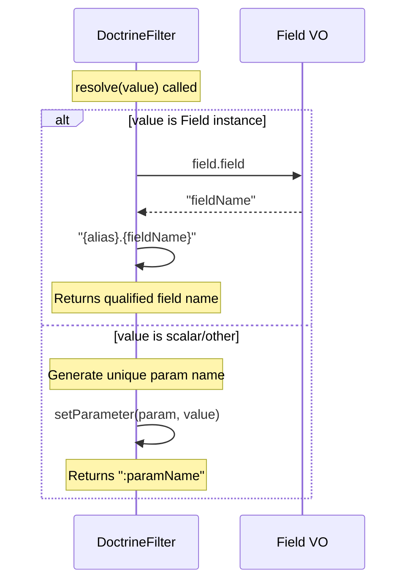

# Feature Request: Implement DoctrineFilter for Searchable Contract

**Document Version:** 1.0
**Date:** 2025-12-15
**Status:** Ready for Implementation
**Priority:** High

---

## 1. Feature Overview

### 1.1 Description

This feature implements the `DoctrineFilter` class that translates core domain filter abstractions into Doctrine ORM
query conditions. The `DoctrineFilter` class implements the `FilterVisitor<Expr>` interface, enabling the
`DoctrineRepository::search()` method to convert domain-agnostic filter objects into Doctrine QueryBuilder expressions.

The implementation follows the **Visitor Pattern** to traverse filter object trees and produce corresponding Doctrine
`Expr` objects that can be applied to `QueryBuilder` instances.

### 1.2 Business Value and User Benefit

- **Unified Query Interface**: Enables consistent querying across different persistence mechanisms (InMemory, Doctrine)
  using the same filter abstractions
- **Domain Isolation**: Business logic remains decoupled from database implementation details
- **Testability**: Application code can be tested with InMemory repositories while production uses Doctrine
- **Flexibility**: Easy to add new persistence backends without changing domain code
- **Type Safety**: Full PHP 8.4 type support with generics for compile-time safety

### 1.3 Target Audience

- **Backend Developers**: Working with repository layer and data access
- **Domain Modelers**: Defining business queries independent of persistence
- **QA Engineers**: Writing integration tests for repository functionality

---

## 2. Technical Architecture

### 2.1 High-Level Architectural Approach

The implementation uses the **Visitor Pattern** to convert filter abstractions to Doctrine-specific query expressions:

```
┌─────────────────────────────────────────────────────────────────────────┐
│                           Core Layer                                    │
│  ┌─────────────┐    ┌──────────────┐    ┌─────────────────────────────┐ │
│  │   Filter    │───▶│ FilterVisitor│◀───│ Field, Equals, AndX, etc.   │ │
│  │  Interface  │    │  Interface   │    │    (Filter Implementations) │ │
│  └─────────────┘    └──────────────┘    └─────────────────────────────┘ │
└─────────────────────────────────────────────────────────────────────────┘
                              │
                              │ implements
                              ▼
┌─────────────────────────────────────────────────────────────────────────┐
│                       Infrastructure Layer                              │
│  ┌──────────────────┐         ┌────────────────────────────────────────┐│
│  │  DoctrineFilter  │────────▶│         DoctrineRepository             ││
│  │  implements      │         │  uses DoctrineFilter in search()       ││
│  │  FilterVisitor   │         └────────────────────────────────────────┘│
│  └──────────────────┘                                                   │
│           │                                                             │
│           ▼ produces                                                    │
│  ┌──────────────────┐                                                   │
│  │  Doctrine\Expr   │◀── Doctrine ORM Query Expressions                 │
│  └──────────────────┘                                                   │
└─────────────────────────────────────────────────────────────────────────┘
```

### 2.2 Integration with Existing Codebase

The `DoctrineFilter` integrates at the following points:

1. **Implements** `\Bgl\Core\Listing\FilterVisitor` interface from Core layer
2. **Used by** `\Bgl\Infrastructure\Persistence\Doctrine\DoctrineRepository::search()` method
3. **Produces** `Doctrine\ORM\Query\Expr` objects for `QueryBuilder`
4. **Follows** the same pattern as `InMemoryFilter` for consistency

### 2.3 Technology Stack and Dependencies

| Component    | Technology | Purpose              |
|--------------|------------|----------------------|
| PHP          | 8.4        | Runtime environment  |
| Doctrine ORM | ^3.0       | Database abstraction |
| PostgreSQL   | 15.2       | Primary database     |
| Codeception  | 5.3        | Testing framework    |

**Existing Dependencies Used:**

- `doctrine/orm` - QueryBuilder and Expr classes
- Core Listing contracts - Filter, FilterVisitor, Field

---

## 3. Class Diagrams

### 3.1 Filter System Class Diagram



### 3.2 Repository and Filter Implementation Diagram



---

## 4. Sequence Diagrams

### 4.1 Search Flow with DoctrineFilter



### 4.2 Complex Filter Resolution (AndX with Nested Filters)



### 4.3 Field Resolution Flow



---

## 5. Public API / Interfaces

### 5.1 DoctrineFilter Class

```php
<?php

declare(strict_types=1);

namespace Bgl\Infrastructure\Persistence\Doctrine;

use Bgl\Core\Listing\Field;
use Bgl\Core\Listing\Filter\All;
use Bgl\Core\Listing\Filter\AndX;
use Bgl\Core\Listing\Filter\Equals;
use Bgl\Core\Listing\Filter\Greater;
use Bgl\Core\Listing\Filter\Less;
use Bgl\Core\Listing\Filter\Not;
use Bgl\Core\Listing\Filter\OrX;
use Bgl\Core\Listing\FilterVisitor;
use Doctrine\ORM\Query\Expr\Composite;
use Doctrine\ORM\QueryBuilder;

/**
 * Transforms Core filter abstractions into Doctrine ORM query conditions.
 *
 * @implements FilterVisitor<string|Composite|null>
 */
final readonly class DoctrineFilter implements FilterVisitor
{
    /**
     * @param QueryBuilder $qb    The query builder to apply conditions to
     * @param string       $alias The entity alias used in the query
     */
    public function __construct(
        private QueryBuilder $qb,
        private string $alias,
    );

    /**
     * Handles the All filter - matches all records.
     * Does not add any WHERE condition.
     *
     * @return null No condition needed
     */
    public function all(All $filter): mixed;

    /**
     * Handles equality comparison.
     *
     * @return string The WHERE condition string
     */
    public function equals(Equals $filter): mixed;

    /**
     * Handles less-than comparison.
     *
     * @return string The WHERE condition string
     */
    public function less(Less $filter): mixed;

    /**
     * Handles greater-than comparison.
     *
     * @return string The WHERE condition string
     */
    public function greater(Greater $filter): mixed;

    /**
     * Handles logical AND of multiple filters.
     *
     * @return Composite|null The composite AND expression
     */
    public function and(AndX $filter): mixed;

    /**
     * Handles logical OR of multiple filters.
     *
     * @return Composite|null The composite OR expression
     */
    public function or(OrX $filter): mixed;

    /**
     * Handles logical NOT of a filter.
     *
     * @return string The NOT expression string
     */
    public function not(Not $filter): mixed;
}
```

### 5.2 DoctrineRepository::search Method

```php
/**
 * Search entities with filtering, pagination, and sorting.
 *
 * @param Filter     $filter Filter criteria (default: None - returns empty)
 * @param PageSize   $size   Results per page (default: null - no limit)
 * @param PageNumber $number Page number, 1-indexed (default: 1)
 * @param PageSort   $sort   Sort fields and directions (default: empty)
 *
 * @return iterable<TEntity> Matching entities
 */
public function search(
    Filter $filter = None::Filter,
    PageSize $size = new PageSize(),
    PageNumber $number = new PageNumber(1),
    PageSort $sort = new PageSort([])
): iterable;
```

### 5.3 Expected Inputs and Outputs

| Method      | Input                  | Output                | Notes                 |
|-------------|------------------------|-----------------------|-----------------------|
| `all()`     | `All::Filter`          | `null`                | No WHERE clause added |
| `equals()`  | `Equals(left, right)`  | `"e.field = :param"`  | Sets parameter on QB  |
| `less()`    | `Less(left, right)`    | `"e.field < :param"`  | Sets parameter on QB  |
| `greater()` | `Greater(left, right)` | `"e.field > :param"`  | Sets parameter on QB  |
| `and()`     | `AndX([filters...])`   | `Composite` or `null` | Recursive processing  |
| `or()`      | `OrX([filters...])`    | `Composite` or `null` | Recursive processing  |
| `not()`     | `Not(filter)`          | `"NOT (condition)"`   | Wraps inner condition |

### 5.4 Error Handling Approach

| Scenario                     | Handling                                            |
|------------------------------|-----------------------------------------------------|
| Invalid field name           | Doctrine throws `QueryException` at query execution |
| Type mismatch in comparison  | Let database handle type coercion                   |
| Empty `AndX`/`OrX` array     | Return `null` (no condition)                        |
| Null parameter value         | Use `IS NULL` comparison                            |
| Non-existent entity property | Doctrine throws `QueryException`                    |

---

## 6. Directory Structure

### 6.1 New Files to Create

```
src/
└── Infrastructure/
    └── Persistence/
        └── Doctrine/
            ├── DoctrineFilter.php     # NEW - FilterVisitor implementation
            ├── DoctrineRepository.php # EXISTING - Already has search() stub
            └── Users.php              # EXISTING - Needs getAlias() method
```

### 6.2 Test Files Structure

```
tests/
├── Integration/
│   └── Repositories/
│       ├── BaseRepository.php           # EXISTING - Shared test cases
│       ├── DoctrineRepositoryCest.php   # EXISTING - Doctrine tests
│       └── InMemoryRepositoryCest.php   # EXISTING - Reference impl
└── Support/
    └── Repositories/
        ├── TestDoctrineRepository.php   # EXISTING - Test repository
        └── TestEntity.php               # EXISTING - Test entity
```

### 6.3 Naming Conventions

| Type             | Convention                                 | Example                                   |
|------------------|--------------------------------------------|-------------------------------------------|
| Visitor Class    | `{Adapter}Filter`                          | `DoctrineFilter`                          |
| Repository Class | `{Adapter}Repository`                      | `DoctrineRepository`                      |
| Test Class       | `{Target}Cest`                             | `DoctrineRepositoryCest`                  |
| Namespace        | `Bgl\Infrastructure\Persistence\{Adapter}` | `Bgl\Infrastructure\Persistence\Doctrine` |

---

## 7. Code References

### 7.1 Core Contracts (Reference Implementation Targets)

| File                                      | Lines                | Relevance                    |
|-------------------------------------------|----------------------|------------------------------|
| `src/Core/Listing/FilterVisitor.php:1-43` | Interface definition | Must implement all 7 methods |
| `src/Core/Listing/Filter.php:1-17`        | Filter interface     | Accept method contract       |
| `src/Core/Listing/Searchable.php:1-27`    | Searchable interface | Search method signature      |
| `src/Core/Listing/Field.php:1-13`         | Field value object   | Used in filter operands      |

### 7.2 Reference Implementation (InMemory)

| File                                                                   | Lines                 | Relevance                            |
|------------------------------------------------------------------------|-----------------------|--------------------------------------|
| `src/Infrastructure/Persistence/InMemory/InMemoryFilter.php:1-73`      | Complete visitor impl | Pattern to follow for Doctrine       |
| `src/Infrastructure/Persistence/InMemory/InMemoryFilter.php:35-42`     | resolve() method      | Logic for Field vs scalar resolution |
| `src/Infrastructure/Persistence/InMemory/InMemoryRepository.php:54-67` | search() impl         | Reference for pagination logic       |

### 7.3 Doctrine Integration Points

| File                                                                   | Lines               | Relevance                            |
|------------------------------------------------------------------------|---------------------|--------------------------------------|
| `src/Infrastructure/Persistence/Doctrine/DoctrineRepository.php:44-76` | search() method     | Integration point for DoctrineFilter |
| `src/Infrastructure/Persistence/Doctrine/DoctrineRepository.php:49-51` | Filter application  | Where DoctrineFilter is instantiated |
| `src/Infrastructure/Persistence/Doctrine/Users.php:1-19`               | Concrete repository | Missing `getAlias()` method          |

### 7.4 Filter Implementations (Inputs)

| File                                      | Lines         | Relevance                         |
|-------------------------------------------|---------------|-----------------------------------|
| `src/Core/Listing/Filter/Equals.php:1-24` | Equals filter | Binary comparison with left/right |
| `src/Core/Listing/Filter/AndX.php:1-25`   | AndX filter   | Composite with `filters` array    |
| `src/Core/Listing/Filter/None.php:1-21`   | None filter   | Special case: returns Not(All)    |

### 7.5 Test Integration Points

| File                                                             | Lines           | Relevance                      |
|------------------------------------------------------------------|-----------------|--------------------------------|
| `tests/Integration/Repositories/BaseRepository.php:1-149`        | Base test class | All test scenarios to pass     |
| `tests/Integration/Repositories/DoctrineRepositoryCest.php:1-31` | Doctrine test   | Test class setup               |
| `tests/Support/Repositories/TestDoctrineRepository.php:1-20`     | Test repository | Has `getAlias()` returning "e" |
| `tests/Support/Repositories/TestEntity.php:1-29`                 | Test entity     | `id` and `value` properties    |

---

## 8. Implementation Considerations

### 8.1 Potential Challenges

| Challenge                       | Solution                                                       |
|---------------------------------|----------------------------------------------------------------|
| Parameter name uniqueness       | Use counter-based naming: `param_0`, `param_1`, etc.           |
| Field vs scalar differentiation | Check `instanceof Field` before resolution                     |
| Composite expression building   | Collect child conditions, then wrap in `andX()`/`orX()`        |
| None filter edge case           | `None::Filter` creates `Not(All)` → should return empty result |

### 8.2 Edge Cases to Handle

1. **Empty composite filters**: `AndX([])` or `OrX([])` should not add any condition
2. **None filter**: Must produce a condition that matches no records (e.g., `1 = 0`)
3. **Null values in comparisons**: Use appropriate `IS NULL` handling
4. **Deeply nested filters**: Recursive visitor pattern handles naturally
5. **Both operands are Fields**: Compare two entity fields (e.g., `e.field1 = e.field2`)
6. **Neither operand is a Field**: Compare two literals (constant expression)

### 8.3 Performance Considerations

| Concern           | Mitigation                                        |
|-------------------|---------------------------------------------------|
| N+1 query problem | Use Doctrine Paginator with `fetchJoinCollection` |
| Large result sets | Pagination via `setFirstResult`/`setMaxResults`   |
| Complex filters   | Let database optimize execution plan              |
| Parameter binding | Use prepared statements (built-in security)       |

### 8.4 Security Concerns

| Concern              | Mitigation                                   |
|----------------------|----------------------------------------------|
| SQL Injection        | All values bound via `setParameter()`        |
| Field name injection | Only `Field` objects can specify field names |
| Mass data exposure   | Pagination limits result size                |

---

## 9. Testing Strategy

### 9.1 Unit Test Requirements

The `DoctrineFilter` class should have unit tests covering:

```php
/**
 * @covers \Bgl\Infrastructure\Persistence\Doctrine\DoctrineFilter
 */
final class DoctrineFilterTest extends TestCase
{
    // Test each visitor method produces correct DQL
    public function testAllReturnsNull(): void;
    public function testEqualsWithFieldAndScalar(): void;
    public function testEqualsWithScalarAndField(): void;
    public function testEqualsWithTwoFields(): void;
    public function testLessComparison(): void;
    public function testGreaterComparison(): void;
    public function testAndXWithMultipleFilters(): void;
    public function testAndXWithEmptyArray(): void;
    public function testOrXWithMultipleFilters(): void;
    public function testNotNegatesCondition(): void;
    public function testNestedCompositeFilters(): void;
}
```

### 9.2 Integration Test Scenarios

The existing `BaseRepository` test class provides comprehensive scenarios:

| Test Method            | Scenario                   | Expected Behavior                 |
|------------------------|----------------------------|-----------------------------------|
| `testQueryDefaultCall` | Search with `All::Filter`  | Returns all entities              |
| `testFilter` (None)    | Search with `None::Filter` | Returns empty array               |
| `testFilter` (Equals)  | Field equals value         | Returns matching entities         |
| `testFilter` (Greater) | Field greater than value   | Returns matching entities         |
| `testFilter` (Less)    | Field less than value      | Returns matching entities         |
| `testFilter` (AndX)    | Multiple conditions AND    | Returns intersection              |
| `testFilter` (OrX)     | Multiple conditions OR     | Returns union                     |
| `testSort`             | Single field sort          | Returns sorted results            |
| `testMultiSort`        | Multiple field sort        | Returns correctly ordered results |
| `testOffsetLimit`      | Pagination                 | Returns correct page slice        |

### 9.3 Edge Cases to Cover

| Edge Case           | Test Assertion                        |
|---------------------|---------------------------------------|
| Empty filter array  | `AndX([])` returns all records        |
| None filter         | Returns empty result set              |
| Page beyond data    | Returns empty array                   |
| Zero page size      | Returns empty array                   |
| Negative comparison | `NOT (field = value)` works correctly |
| Multi-level nesting | `AndX([OrX([...]), Equals(...)])`     |

---

## 10. Acceptance Criteria

### 10.1 Definition of Done

- [ ] `DoctrineFilter` class implemented in `src/Infrastructure/Persistence/Doctrine/`
- [ ] All 7 `FilterVisitor` methods implemented with correct Doctrine DQL generation
- [ ] `DoctrineRepository::search()` method working with all filter types
- [ ] `Users::getAlias()` method added to concrete repository
- [ ] All existing `BaseRepository` tests pass for `DoctrineRepositoryCest`
- [ ] Code passes `composer scan:all` (all quality checks)
- [ ] No new Psalm errors introduced
- [ ] Architecture tests pass (`composer dt:run`)

### 10.2 Measurable Success Criteria

| Metric                  | Target                                            |
|-------------------------|---------------------------------------------------|
| Test Pass Rate          | 100% of `DoctrineRepositoryCest` tests            |
| Static Analysis         | Zero Psalm errors at level 1                      |
| Code Coverage           | ≥80% for `DoctrineFilter` class                   |
| Architecture Compliance | Zero deptrac violations                           |
| Performance             | Search queries execute in <100ms for 1000 records |

### 10.3 Verification Commands

```bash
# Run specific integration tests
composer test -- run tests/Integration/Repositories/DoctrineRepositoryCest.php

# Run all quality checks
composer scan:all

# Run architecture tests specifically
composer dt:run

# Check test coverage
composer test:coverage
```

---

## Appendix A: Implementation Skeleton

```php
<?php

declare(strict_types=1);

namespace Bgl\Infrastructure\Persistence\Doctrine;

use Bgl\Core\Listing\Field;
use Bgl\Core\Listing\Filter\All;
use Bgl\Core\Listing\Filter\AndX;
use Bgl\Core\Listing\Filter\Equals;
use Bgl\Core\Listing\Filter\Greater;
use Bgl\Core\Listing\Filter\Less;
use Bgl\Core\Listing\Filter\Not;
use Bgl\Core\Listing\Filter\OrX;
use Bgl\Core\Listing\FilterVisitor;
use Doctrine\ORM\Query\Expr\Composite;
use Doctrine\ORM\QueryBuilder;

/**
 * @implements FilterVisitor<string|Composite|null>
 * @see \Bgl\Tests\Integration\Repositories\DoctrineRepositoryCest
 */
final readonly class DoctrineFilter implements FilterVisitor
{
    private int $paramCounter;

    public function __construct(
        private QueryBuilder $qb,
        private string $alias,
    ) {
        $this->paramCounter = 0;
    }

    #[\Override]
    public function all(All $filter): mixed
    {
        // No condition needed - matches all
        return null;
    }

    #[\Override]
    public function equals(Equals $filter): mixed
    {
        // TODO: Implement using $this->resolve() for both operands
        // Return: "{$left} = {$right}" and set parameters
    }

    #[\Override]
    public function less(Less $filter): mixed
    {
        // TODO: Similar to equals but with < operator
    }

    #[\Override]
    public function greater(Greater $filter): mixed
    {
        // TODO: Similar to equals but with > operator
    }

    #[\Override]
    public function and(AndX $filter): mixed
    {
        // TODO: Collect child conditions, wrap in $this->qb->expr()->andX()
    }

    #[\Override]
    public function or(OrX $filter): mixed
    {
        // TODO: Collect child conditions, wrap in $this->qb->expr()->orX()
    }

    #[\Override]
    public function not(Not $filter): mixed
    {
        // TODO: Wrap inner condition in NOT()
    }

    /**
     * Resolves a filter operand to either a field reference or parameter.
     */
    private function resolve(mixed $value): string
    {
        if ($value instanceof Field) {
            return "{$this->alias}.{$value->field}";
        }

        $paramName = 'param_' . $this->paramCounter++;
        $this->qb->setParameter($paramName, $value);

        return ":{$paramName}";
    }
}
```

---

## Appendix B: Required Fix for Users Repository

The `Users.php` repository is missing the required `getAlias()` method:

```php
// src/Infrastructure/Persistence/Doctrine/Users.php

#[\Override]
public function getAlias(): string
{
    return 'u';
}
```
