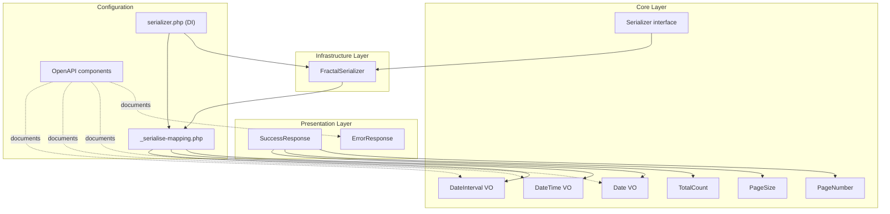
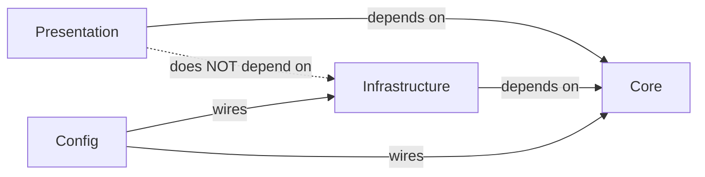

# Feature Documentation: API Response Contracts

**Document Version:** 1.0
**Feature Reference:** 0002-core-004-api-response-contracts
**Date:** February 2026

---

## 1. Commit Message

```
feat(api): add standardized API response contracts

Add SuccessResponse and ErrorResponse envelope classes in the
Presentation layer, OpenAPI component schemas (ErrorResponse,
Pagination, Date, DateTime, DateInterval, ExceptionDetails) in
configuration, and Fractal serialization mappings for core Value
Objects.

Key changes:
- Add SuccessResponse with pagination support (PageNumber, PageSize, TotalCount)
- Add ErrorResponse with validation() and serverError() factory methods
- Add serialization mappings for Date, DateTime, DateInterval VOs
- Add Ping\Result serialization mapping demonstrating nested VO usage
- Define OpenAPI component schemas in ADR-011 route configuration
- Wire FractalSerializer with mapping closures via DI config
```

---

## 2. Pull Request Description

### What & Why

This PR establishes standardized API response contracts for the BoardGameLog API, ensuring all endpoints return JSON in
a consistent format. Prior to this change, there was no shared response structure -- each endpoint would need to define
its own envelope, leading to inconsistency and duplicated error handling logic.

**Problem solved:** Without standardized response envelopes, frontend clients cannot implement a generic response
parser, pagination handling is ad-hoc, and error structures vary between endpoints.

**Business value:** Frontend developers get a predictable JSON contract. Backend developers get reusable response
classes with factory methods. OpenAPI component schemas serve as documentation that stays in sync with runtime behavior.

### Changes Made

**Presentation Layer:**

- `src/Presentation/Api/V1/Responses/SuccessResponse.php` -- success envelope with `code: 0`, `data`, optional
  pagination metadata (`page`, `limit`, `total`)
- `src/Presentation/Api/V1/Responses/ErrorResponse.php` -- error envelope with `code: 1`, `message`,
  field-level `errors` map, optional `exception` for debug mode. Includes `validation()` (HTTP 422) and
  `serverError()` (HTTP 500) factory methods.

**Core Layer:**

- `src/Core/Serialization/Serializer.php` -- serialization contract (`serialize(object): array`)
- `src/Core/ValueObjects/Date.php` -- date without time, flexible constructor (string, int, DateTimeInterface)
- `src/Core/ValueObjects/DateTime.php` -- date with time, same flexible constructor
- `src/Core/ValueObjects/DateInterval.php` -- duration interval, supports DateInterval, ISO string, seconds
- `src/Core/Listing/Page/PageNumber.php` -- pagination current page (int wrapper)
- `src/Core/Listing/Page/PageSize.php` -- pagination items per page (nullable int wrapper)
- `src/Core/Listing/Page/TotalCount.php` -- pagination total count (int wrapper)

**Infrastructure Layer:**

- `src/Infrastructure/Serialization/FractalSerializer.php` -- League Fractal adapter implementing `Serializer`
  contract, reads transformer closures from mapping array

**Configuration:**

- `config/_serialise-mapping.php` -- transformer closures for `Date`, `DateTime`, `DateInterval`, `Ping\Result`
- `config/common/serializer.php` -- DI wiring: `FractalSerializer` with production mapping
- `config/test/serializer.php` -- DI wiring: extends production mapping with `TestEntity`
- `config/common/openapi/v1.php` -- main OpenAPI spec definition
- `config/common/openapi/ping.php` -- /ping route schema

**OpenAPI Component Schemas (in ADR-011):**

- `ErrorResponse` -- error envelope schema with required `code` and `message`
- `ExceptionDetails` -- debug-mode exception info (code, message, trace)
- `Pagination` -- collection metadata (total, pages, current, page_size)
- `Date` -- date-only with `x-source` mapping (date string + timestamp)
- `DateTime` -- date-time with `x-source` mapping (datetime string + timestamp)
- `DateInterval` -- duration with `x-source` mapping (ISO interval + seconds)

### Technical Details

**Patterns used:**

- **Immutable DTOs**: `SuccessResponse` and `ErrorResponse` are `final readonly` classes, preventing mutation after
  construction
- **Factory Method**: `ErrorResponse::validation()` and `ErrorResponse::serverError()` encapsulate common error
  creation patterns
- **Adapter Pattern**: `FractalSerializer` adapts League Fractal to the `Serializer` contract
- **Schema-First Design**: OpenAPI component schemas serve as canonical response definitions per ADR-011
- **Closure-Based Transformers**: Serialization uses simple closures instead of Fractal Transformer classes, providing
  lightweight mapping

**Key design decisions:**

1. **code field**: `0` for success, `1` for error. Computed in constructor, not configurable. This provides a
   language-agnostic way to distinguish success from error without inspecting HTTP status codes.

2. **Pagination as optional VOs**: `SuccessResponse` accepts nullable `PageNumber`, `PageSize`, `TotalCount`. When
   all three are `null`, the response is non-paginated. This uses the same VOs as `DoctrineRepository::search()`.

3. **Validation errors as map**: `array<string, string[]>` structure supports multiple errors per field, enabling
   rich inline validation feedback in the UI.

4. **Exception for debug only**: The `exception` property on `ErrorResponse` carries a `\Throwable` instance. The
   serialization layer is responsible for stripping this in production environments.

5. **Dual temporal representation**: `Date` and `DateTime` schemas provide both human-readable format and integer
   timestamp. `DateInterval` provides both ISO duration and total seconds. This accommodates different frontend needs.

**Integration points:**

- `Bgl\Core\Serialization\Serializer` -- contract used by Presentation layer
- `Bgl\Infrastructure\Serialization\FractalSerializer` -- reads `config/_serialise-mapping.php`
- `Bgl\Application\Handlers\Ping\Result` -- first consumer of the serialization pipeline
- ADR-011 component schemas -- referenced via `$ref` in route response definitions

### Testing

**Manual testing:**

```bash
# Ping endpoint returns SuccessResponse structure
curl http://localhost:8080/ping

# Expected response:
# {
#     "data": {
#         "message_id": "...",
#         "datetime": {"timestamp": "...", "datetime": "..."},
#         "delay": {"seconds": 0, "interval": "PT0S"},
#         "version": "...",
#         "environment": "dev"
#     }
# }
```

**Automated tests:**

- `tests/Functional/PingHandlerCest.php` -- validates Ping handler produces correct `Result` with `DateTime` and
  `DateInterval` VOs, verifying the serialization pipeline end-to-end

**Edge cases covered:**

- Null `Date`/`DateTime` values produce `null` fields via `getNullableFormattedValue()`
- Null `DateInterval` in Ping result serializes as `null` (not partial object)
- Empty `errors` array on `ErrorResponse` (non-validation errors like 401, 404)
- `PageSize` with `null` value (no limit)

### Breaking Changes

None. This is a new feature that does not modify existing public APIs.

### Checklist

- [x] Code follows PSR-12 style guidelines
- [x] `declare(strict_types=1)` present in all files
- [x] Tests validate serialization pipeline
- [x] Feature request serves as specification document
- [x] No breaking changes
- [x] `composer scan:all` passes
- [x] Architecture tests pass (`composer dt:run`) -- Presentation depends on Core, not reverse

---

## 3. Feature Documentation

### Overview

The API Response Contracts feature provides a standardized envelope for all BoardGameLog API responses. Every success
response wraps data in a `{"code": 0, "data": ...}` structure, optionally including pagination. Every error response
uses a `{"code": 1, "message": "...", "errors": {...}}` structure with field-level validation detail.

**When to use:**

- **SuccessResponse** -- wrap handler results before returning from an API action
- **ErrorResponse** -- catch exceptions or validation failures and return structured errors
- **ErrorResponse::validation()** -- input validation failures with field-level detail
- **ErrorResponse::serverError()** -- unexpected exceptions in debug mode
- **Date/DateTime/DateInterval mappings** -- any handler result containing temporal VOs

### Usage Guide

#### Creating a Success Response (Single Item)

```php
use Bgl\Presentation\Api\V1\Responses\SuccessResponse;

// Handler returns a Result object
$result = $messageBus->handle($command);

// Wrap in success envelope
$response = new SuccessResponse(data: $result);
// JSON: {"code": 0, "data": {serialized result}}
```

#### Creating a Success Response (Collection with Pagination)

```php
use Bgl\Presentation\Api\V1\Responses\SuccessResponse;
use Bgl\Core\Listing\Page\PageNumber;
use Bgl\Core\Listing\Page\PageSize;
use Bgl\Core\Listing\Page\TotalCount;

$response = new SuccessResponse(
    data: $items,
    page: new PageNumber(2),
    limit: new PageSize(20),
    total: new TotalCount(97),
);
// JSON: {"code": 0, "data": [...], "pagination": {"total": 97, "pages": 5, "current": 2, "page_size": 20}}
```

#### Creating a Validation Error Response

```php
use Bgl\Presentation\Api\V1\Responses\ErrorResponse;

$response = ErrorResponse::validation(
    message: 'Validation failed',
    errors: [
        'email' => ['The email field is required', 'Must be a valid email address'],
        'password' => ['Must be at least 8 characters'],
    ],
);
// httpStatus: 422
// JSON: {"code": 1, "message": "Validation failed", "errors": {"email": [...], "password": [...]}}
```

#### Creating a Server Error Response (Debug Mode)

```php
use Bgl\Presentation\Api\V1\Responses\ErrorResponse;

try {
    $result = $handler($envelope);
} catch (\Throwable $e) {
    $response = ErrorResponse::serverError(
        message: 'Internal server error',
        exception: $e,
    );
    // httpStatus: 500
    // JSON: {"code": 1, "message": "Internal server error", "exception": {"code": 0, "message": "...", "trace": "..."}}
}
```

#### Creating a Generic Error Response

```php
use Bgl\Presentation\Api\V1\Responses\ErrorResponse;

// 401 Unauthorized
$response = new ErrorResponse(message: 'Authentication required', httpStatus: 401);

// 403 Forbidden
$response = new ErrorResponse(message: 'Access denied', httpStatus: 403);

// 404 Not Found
$response = new ErrorResponse(message: 'Play session not found', httpStatus: 404);

// 409 Conflict
$response = new ErrorResponse(message: 'Email already registered', httpStatus: 409);
```

#### Adding Serialization Mapping for New Handler Results

To serialize a new handler result object, add a transformer closure to `config/_serialise-mapping.php`:

```php
use Bgl\Application\Handlers\Games\SearchGames\Result as SearchResult;

return [
    // ... existing mappings ...

    SearchResult::class => static fn(SearchResult $model) => [
        'id' => $model->id,
        'name' => $model->name,
        'yearPublished' => $model->yearPublished,
        'startedAt' => $model->startedAt->isNull() ? null : $model->startedAt,
    ],
];
```

When a VO like `DateTime` appears as a value in the mapping array, the `FractalSerializer` recursively looks up its
transformer closure and produces the nested `{"timestamp": "...", "datetime": "..."}` structure automatically.

#### Referencing Error Schema in OpenAPI Route Configuration

When defining a new route in `config/common/openapi/`, reference the shared `ErrorResponse` schema:

```php
'responses' => [
    '200' => [
        'description' => 'Success',
        'content' => [
            'application/json' => [
                'schema' => [
                    'type' => 'object',
                    'required' => ['code', 'data'],
                    'properties' => [
                        'code' => ['type' => 'integer', 'example' => 0],
                        'data' => ['$ref' => '#/components/schemas/YourEntity'],
                    ],
                ],
            ],
        ],
    ],
    '400' => [
        'description' => 'Bad request',
        'content' => [
            'application/json' => [
                'schema' => ['$ref' => '#/components/schemas/ErrorResponse'],
            ],
        ],
    ],
    '422' => [
        'description' => 'Validation error',
        'content' => [
            'application/json' => [
                'schema' => ['$ref' => '#/components/schemas/ErrorResponse'],
            ],
        ],
    ],
],
```

### API Reference

#### SuccessResponse

```php
namespace Bgl\Presentation\Api\V1\Responses;

final readonly class SuccessResponse
```

**Properties:**

| Property     | Type          | Description                               |
|--------------|---------------|-------------------------------------------|
| `code`       | `int`         | Always `0` for success                    |
| `data`       | `mixed`       | Response payload (single object or array) |
| `httpStatus` | `int`         | HTTP status code (default 200)            |
| `page`       | `?PageNumber` | Current page number (null if not paginated)|
| `limit`      | `?PageSize`   | Items per page (null if not paginated)    |
| `total`      | `?TotalCount` | Total item count (null if not paginated)  |

#### ErrorResponse

```php
namespace Bgl\Presentation\Api\V1\Responses;

final readonly class ErrorResponse
```

**Properties:**

| Property     | Type                      | Description                              |
|--------------|---------------------------|------------------------------------------|
| `code`       | `int`                     | Always `1` for error                     |
| `message`    | `string`                  | Human-readable error message             |
| `httpStatus` | `int`                     | HTTP status code (default 400)           |
| `errors`     | `array<string, string[]>` | Field-level validation errors            |
| `exception`  | `?\Throwable`             | Exception object (debug mode only)       |

**Static Factory Methods:**

| Method                                                   | HTTP Status | Purpose                      |
|----------------------------------------------------------|-------------|------------------------------|
| `ErrorResponse::validation(string $msg, array $errors)`  | 422         | Input validation failure     |
| `ErrorResponse::serverError(string $msg, \Throwable $e)` | 500         | Unexpected server exception  |

#### Serializer Contract

```php
namespace Bgl\Core\Serialization;

interface Serializer
{
    public function serialize(object $data): array;
}
```

#### FractalSerializer

```php
namespace Bgl\Infrastructure\Serialization;

final readonly class FractalSerializer implements Serializer
{
    public function __construct(
        private Manager $manager,
        private array $transformer,
    );

    public function serialize(object $data): array;
}
```

The `$transformer` parameter receives the closure map from `config/_serialise-mapping.php`. The `serialize()` method
looks up the transformer by `get_class($data)`, creates a Fractal `Item` resource, and returns the serialized array.

### Architecture

#### Component Relationship Diagram



#### Dependency Direction



`SuccessResponse` and `ErrorResponse` (Presentation) depend on `PageNumber`, `PageSize`, `TotalCount` (Core). They
never reference `FractalSerializer` (Infrastructure) directly. The DI container wires the serializer independently.

### Troubleshooting

#### Common Issues and Solutions

**Issue: "Class not found" for SuccessResponse or ErrorResponse**

Cause: Autoloader not updated after file creation.

Solution: Run `composer dump-autoload` to regenerate the autoloader.

**Issue: Serializer returns empty array for a handler result**

Cause: No transformer closure registered for the result class in `config/_serialise-mapping.php`.

Solution: Add a transformer closure keyed by the fully-qualified class name of the result object.

```php
// config/_serialise-mapping.php
return [
    // ... existing ...
    YourResult::class => static fn(YourResult $model) => [
        'field' => $model->field,
    ],
];
```

**Issue: DateTime field serializes as null when value exists**

Cause: The `DateTime` VO was constructed with a value that resolved to `null` internally (e.g., invalid date string).

Solution: Check the constructor input. Use `$dateTime->isNull()` to verify before serialization.

**Issue: Pagination metadata missing from JSON output**

Cause: `page`, `limit`, and `total` parameters not passed to `SuccessResponse` constructor.

Solution: Pass all three pagination VOs when returning collection results.

```php
new SuccessResponse(
    data: $items,
    page: new PageNumber($currentPage),
    limit: new PageSize($perPage),
    total: new TotalCount($totalRows),
);
```

**Issue: Exception details visible in production response**

Cause: The serialization layer is not stripping the `exception` property in production.

Solution: Configure the response serializer to omit `exception` when `APP_ENV !== 'dev'`.

#### Error Code Reference

| Code | Meaning | Typical HTTP Status | Resolution |
|------|---------|---------------------|------------|
| 0    | Success | 200, 201, 204       | No action needed |
| 1    | Error   | 400, 401, 403, 404, 409, 422, 500 | Check `message` and `errors` fields |

---

## 4. CHANGELOG Entry

```markdown
## [Unreleased]

### Added

- Standardized API response contracts: `SuccessResponse` and `ErrorResponse` envelope classes
- OpenAPI component schemas: ErrorResponse, ExceptionDetails, Pagination, Date, DateTime, DateInterval
- Serialization mappings for core Value Objects (Date, DateTime, DateInterval)
- FractalSerializer adapter implementing Serializer contract with closure-based transformers
- Pagination support via PageNumber, PageSize, TotalCount value objects in success responses
- ErrorResponse factory methods: validation() for HTTP 422, serverError() for HTTP 500
```

---

## 5. Related Files

| File | Description |
|------|-------------|
| `src/Presentation/Api/V1/Responses/SuccessResponse.php` | Success response envelope class |
| `src/Presentation/Api/V1/Responses/ErrorResponse.php` | Error response envelope with factories |
| `src/Core/Serialization/Serializer.php` | Serialization contract interface |
| `src/Infrastructure/Serialization/FractalSerializer.php` | League Fractal adapter |
| `src/Core/ValueObjects/Date.php` | Date value object |
| `src/Core/ValueObjects/DateTime.php` | DateTime value object |
| `src/Core/ValueObjects/DateInterval.php` | DateInterval value object |
| `src/Core/Listing/Page/PageNumber.php` | Pagination: page number |
| `src/Core/Listing/Page/PageSize.php` | Pagination: page size |
| `src/Core/Listing/Page/TotalCount.php` | Pagination: total count |
| `config/_serialise-mapping.php` | Transformer closures for VOs and Ping result |
| `config/common/serializer.php` | DI config: production serializer |
| `config/test/serializer.php` | DI config: test serializer with TestEntity |
| `config/common/openapi/v1.php` | Main OpenAPI configuration |
| `config/common/openapi/ping.php` | /ping route OpenAPI definition |
| `docs/03-decisions/010-serialization-hydration.md` | ADR: Fractal + EventSauce |
| `docs/03-decisions/011-unified-route-configuration.md` | ADR: OpenAPI components with x-source |
| `tests/Functional/PingHandlerCest.php` | Functional test for Ping handler |

---

*End of Feature Documentation*
