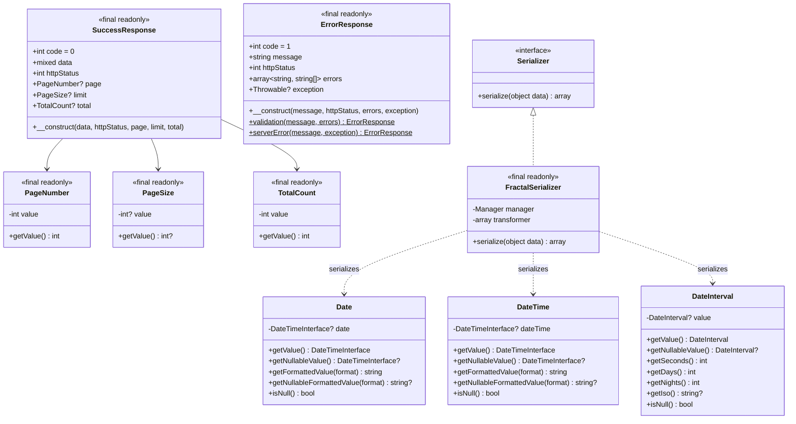
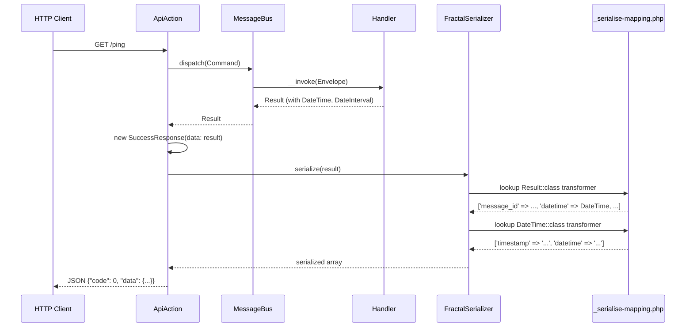
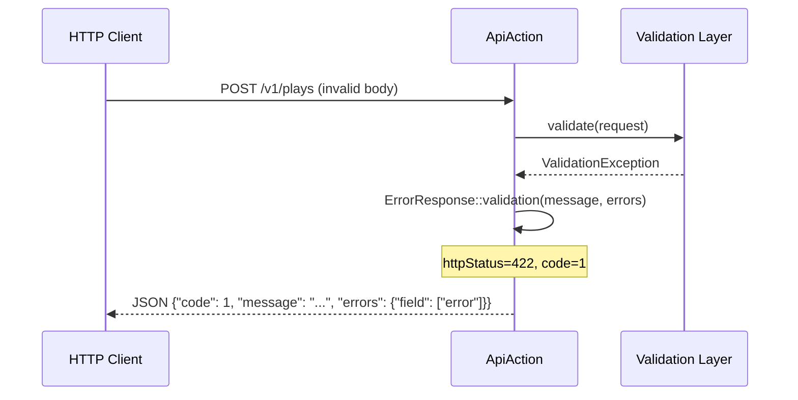
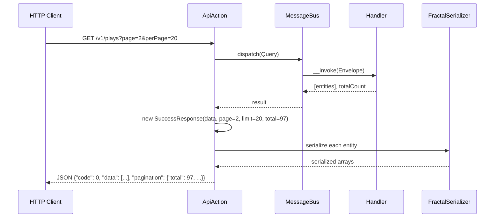

# Feature Request: API Response Contracts

**Document Version:** 1.0
**Date:** 2026-02-21
**Status:** Completed
**Priority:** High

---

## 1. Feature Overview

### 1.1 Description

This feature establishes standardized API response contracts for the BoardGameLog API. It introduces two response
envelope classes (`SuccessResponse` and `ErrorResponse`) in the Presentation layer, reusable OpenAPI component schemas
in configuration (`ErrorResponse`, `Pagination`, `Date`, `DateTime`, `DateInterval`, `ExceptionDetails`), and
serialization mappings for core Value Objects. Together, these components ensure every API endpoint returns JSON in a
predictable, documented format.

### 1.2 Business Value and User Benefit

- **Consistent API contract**: All endpoints use the same envelope structure (`code`, `data`, `pagination` or `code`,
  `message`, `errors`), enabling frontend clients to implement a single response parser
- **Schema-first documentation**: Response schemas are defined as OpenAPI components, keeping documentation in sync with
  runtime behavior per ADR-011
- **Validation error detail**: Field-level validation errors are exposed in a structured `errors` map, giving clients
  precise information for inline form feedback
- **Pagination support**: Collection endpoints include pagination metadata (`total`, `pages`, `current`, `page_size`),
  allowing infinite scroll and page-based navigation
- **Universal temporal formats**: `Date`, `DateTime`, and `DateInterval` schemas provide dual representations (human-
  readable string plus machine-friendly integer/ISO) for every temporal field in the API

### 1.3 Target Audience

- **Frontend Developers**: Consuming the API and building UI around consistent response shapes
- **Backend Developers**: Adding new endpoints that conform to the shared response format
- **QA Engineers**: Writing acceptance tests against well-defined response schemas

---

## 2. Technical Architecture

### 2.1 High-Level Architectural Approach

The implementation spans two layers:

1. **Presentation Layer** -- `SuccessResponse` and `ErrorResponse` readonly classes serve as typed DTOs that the
   serializer transforms into JSON. They live in `Bgl\Presentation\Api\V1\Responses` and are never referenced by
   Domain or Application code (dependency law compliance).

2. **Configuration Layer** -- OpenAPI component schemas in `config/common/openapi/` (loaded via ADR-011 route
   configuration) define the canonical shape of every response type. These schemas include `x-source` and
   `x-source-type` extensions that drive the serialization mapping at runtime.

Additionally, a serialization mapping file (`config/_serialise-mapping.php`) provides Fractal-compatible transformer
closures for core Value Objects (`Date`, `DateTime`, `DateInterval`) and the `Ping\Result` handler result.

### 2.2 Integration with Existing Codebase

The response contracts integrate at the following points:

1. **`Bgl\Core\Serialization\Serializer` interface** -- contract defined in Core layer
2. **`Bgl\Infrastructure\Serialization\FractalSerializer`** -- League Fractal adapter that reads the mapping closures
   from `config/_serialise-mapping.php` to serialize objects
3. **`config/common/openapi/v1.php`** -- main OpenAPI configuration that merges path configs and references the
   component schemas
4. **`Bgl\Core\Listing\Page\*` value objects** -- `PageNumber`, `PageSize`, `TotalCount` used by `SuccessResponse` for
   pagination metadata
5. **ADR-011 (Unified Route Configuration)** -- component schemas are referenced via `$ref` in route response
   definitions

### 2.3 Technology Stack and Dependencies

| Component        | Technology           | Purpose                                |
|------------------|----------------------|----------------------------------------|
| PHP              | 8.4                  | Runtime environment                    |
| League Fractal   | ^0.20                | API serialization (ADR-010)            |
| cebe/php-openapi | (via config)         | OpenAPI spec object                    |
| Core VOs         | `Bgl\Core\ValueObjects` | Date, DateTime, DateInterval classes |

### 2.4 Related Decisions

- **ADR-010** (`docs/03-decisions/010-serialization-hydration.md`) -- chose League Fractal for serialization,
  EventSauce for hydration
- **ADR-011** (`docs/03-decisions/011-unified-route-configuration.md`) -- unified route configuration with OpenAPI
  component schemas and `x-source`/`x-target` extensions

---

## 3. Class Diagram



---

## 4. Sequence Diagram

### 4.1 Success Response Flow (Single Item)



### 4.2 Error Response Flow (Validation)



### 4.3 Success Response Flow (Collection with Pagination)



---

## 5. Public API / Interfaces

### 5.1 SuccessResponse Class

```php
<?php

declare(strict_types=1);

namespace Bgl\Presentation\Api\V1\Responses;

use Bgl\Core\Listing\Page\PageNumber;
use Bgl\Core\Listing\Page\PageSize;
use Bgl\Core\Listing\Page\TotalCount;

final readonly class SuccessResponse
{
    public int $code;

    /**
     * @param mixed $data Response payload (single object or array)
     */
    public function __construct(
        public mixed $data,
        public int $httpStatus = 200,
        public ?PageNumber $page = null,
        public ?PageSize $limit = null,
        public ?TotalCount $total = null,
    ) {
        $this->code = 0;
    }
}
```

### 5.2 ErrorResponse Class

```php
<?php

declare(strict_types=1);

namespace Bgl\Presentation\Api\V1\Responses;

final readonly class ErrorResponse
{
    public int $code;

    /**
     * @param string $message Human-readable error message
     * @param array<string, string[]> $errors Field-level validation errors
     * @param \Throwable|null $exception Exception object (debug mode only)
     */
    public function __construct(
        public string $message,
        public int $httpStatus = 400,
        public array $errors = [],
        public ?\Throwable $exception = null,
    ) {
        $this->code = 1;
    }

    /**
     * Factory for validation errors (HTTP 422).
     *
     * @param array<string, string[]> $errors
     */
    public static function validation(string $message, array $errors): self
    {
        return new self(
            message: $message,
            httpStatus: 422,
            errors: $errors,
        );
    }

    /**
     * Factory for server errors with exception (HTTP 500, debug mode).
     */
    public static function serverError(string $message, \Throwable $exception): self
    {
        return new self(
            message: $message,
            httpStatus: 500,
            exception: $exception,
        );
    }
}
```

### 5.3 OpenAPI Component Schemas

Defined in ADR-011 components configuration (`config/common/openapi/` context). Key schemas:

| Schema             | Type   | Required Properties | Purpose                                        |
|--------------------|--------|---------------------|------------------------------------------------|
| `ErrorResponse`    | object | `code`, `message`   | Standardized error envelope                    |
| `ExceptionDetails` | object | none                | Debug-mode exception info (code, message, trace)|
| `Pagination`       | object | none                | Collection pagination metadata                 |
| `Date`             | object | none                | Date without time (date + timestamp)           |
| `DateTime`         | object | none                | Date with time (datetime + timestamp)          |
| `DateInterval`     | object | none                | Duration (ISO interval + total seconds)        |

### 5.4 Serialization Mapping (`config/_serialise-mapping.php`)

```php
return [
    ValueObjects\Date::class => static fn(ValueObjects\Date $model) => [
        'timestamp' => $model->getNullableFormattedValue('c'),
        'date' => $model->getNullableFormattedValue('Y-m-d'),
    ],
    ValueObjects\DateTime::class => static fn(ValueObjects\DateTime $model) => [
        'timestamp' => $model->getNullableFormattedValue('c'),
        'datetime' => $model->getNullableFormattedValue(DATE_W3C),
    ],
    ValueObjects\DateInterval::class => static fn(ValueObjects\DateInterval $model) => [
        'seconds' => $model->getSeconds(),
        'interval' => $model->getIso(),
    ],
    Handlers\Ping\Result::class => static fn(Handlers\Ping\Result $model) => [
        'message_id' => $model->messageId,
        'parent_id' => $model->parentId,
        'trace_id' => $model->traceId,
        'environment' => $model->environment,
        'version' => $model->version,
        'datetime' => $model->datetime->isNull() ? null : $model->datetime,
        'delay' => $model->delay ? [
            'seconds' => $model->delay->getSeconds(),
            'interval' => $model->delay->getIso(),
        ] : null,
    ],
];
```

### 5.5 Expected Inputs and Outputs

**SuccessResponse construction:**

| Parameter    | Type         | Default             | Description                              |
|--------------|--------------|---------------------|------------------------------------------|
| `$data`      | `mixed`      | (required)          | Payload: single object or array of items |
| `$httpStatus`| `int`        | `200`               | HTTP status code                         |
| `$page`      | `?PageNumber`| `null`              | Current page number (1-indexed)          |
| `$limit`     | `?PageSize`  | `null`              | Items per page                           |
| `$total`     | `?TotalCount`| `null`              | Total item count across all pages        |

**ErrorResponse construction:**

| Parameter    | Type                     | Default  | Description                             |
|--------------|--------------------------|----------|-----------------------------------------|
| `$message`   | `string`                 | (required)| Human-readable error message           |
| `$httpStatus`| `int`                    | `400`    | HTTP status code                        |
| `$errors`    | `array<string,string[]>` | `[]`     | Field-level validation errors map       |
| `$exception` | `?\Throwable`            | `null`   | Exception details (debug mode only)     |

**ErrorResponse factory methods:**

| Method          | Parameters                        | Returns           | HTTP Status |
|-----------------|-----------------------------------|-------------------|-------------|
| `validation()`  | `string $message, array $errors`  | `ErrorResponse`   | 422         |
| `serverError()` | `string $message, \Throwable $e`  | `ErrorResponse`   | 500         |

---

## 6. Directory Structure

### 6.1 Response Classes

```
src/
└── Presentation/
    └── Api/
        └── V1/
            └── Responses/
                ├── SuccessResponse.php  # Success envelope with pagination
                ├── ErrorResponse.php    # Error envelope with validation errors
                └── PingResponse.php     # Ping-specific response (placeholder)
```

### 6.2 Core Value Objects (Serialized by Mapping)

```
src/
└── Core/
    ├── ValueObjects/
    │   ├── Date.php              # Date without time
    │   ├── DateTime.php          # Date with time
    │   └── DateInterval.php      # Duration interval
    ├── Listing/
    │   └── Page/
    │       ├── PageNumber.php    # Pagination: current page
    │       ├── PageSize.php      # Pagination: items per page
    │       └── TotalCount.php    # Pagination: total item count
    └── Serialization/
        └── Serializer.php        # Serialization contract
```

### 6.3 Infrastructure (Serialization Adapter)

```
src/
└── Infrastructure/
    └── Serialization/
        └── FractalSerializer.php # League Fractal adapter
```

### 6.4 Configuration

```
config/
├── _serialise-mapping.php        # VO transformer closures
├── common/
│   ├── serializer.php            # DI: FractalSerializer binding
│   └── openapi/
│       ├── v1.php                # Main OpenAPI config
│       └── ping.php              # /ping route OpenAPI definition
└── test/
    └── serializer.php            # Test env: adds TestEntity mapping
```

---

## 7. Code References

### 7.1 Response Classes

| File                                                        | Relevance                                    |
|-------------------------------------------------------------|----------------------------------------------|
| `src/Presentation/Api/V1/Responses/SuccessResponse.php`    | Success response envelope                    |
| `src/Presentation/Api/V1/Responses/ErrorResponse.php`      | Error response envelope with factories       |

### 7.2 Core Value Objects

| File                                                        | Relevance                                    |
|-------------------------------------------------------------|----------------------------------------------|
| `src/Core/ValueObjects/Date.php`                           | Date VO with format and nullable methods     |
| `src/Core/ValueObjects/DateTime.php`                       | DateTime VO with format and nullable methods |
| `src/Core/ValueObjects/DateInterval.php`                   | DateInterval VO with seconds, days, ISO      |
| `src/Core/Listing/Page/PageNumber.php`                     | Pagination page number (int wrapper)         |
| `src/Core/Listing/Page/PageSize.php`                       | Pagination page size (nullable int wrapper)  |
| `src/Core/Listing/Page/TotalCount.php`                     | Pagination total count (int wrapper)         |

### 7.3 Serialization

| File                                                        | Relevance                                    |
|-------------------------------------------------------------|----------------------------------------------|
| `src/Core/Serialization/Serializer.php`                    | Serializer interface contract                |
| `src/Infrastructure/Serialization/FractalSerializer.php`   | Fractal adapter implementation               |
| `config/_serialise-mapping.php`                            | Transformer closures for Date/DateTime/etc   |
| `config/common/serializer.php`                             | DI wiring for serializer                     |

### 7.4 OpenAPI Configuration

| File                                                        | Relevance                                    |
|-------------------------------------------------------------|----------------------------------------------|
| `config/common/openapi/v1.php`                             | Main OpenAPI spec config                     |
| `config/common/openapi/ping.php`                           | /ping route definition                       |

### 7.5 ADRs

| File                                                        | Relevance                                    |
|-------------------------------------------------------------|----------------------------------------------|
| `docs/03-decisions/010-serialization-hydration.md`         | Fractal + EventSauce decision                |
| `docs/03-decisions/011-unified-route-configuration.md`     | OpenAPI component schemas with x-source      |

### 7.6 Usage Example (Ping Handler)

| File                                                        | Relevance                                    |
|-------------------------------------------------------------|----------------------------------------------|
| `src/Application/Handlers/Ping/Result.php`                 | Uses DateTime and DateInterval VOs           |
| `src/Application/Handlers/Ping/Handler.php`                | Produces Result serialized via mapping       |
| `tests/Functional/PingHandlerCest.php`                     | Functional test for Ping handler             |

---

## 8. Implementation Considerations

### 8.1 Design Decisions

1. **Immutable response DTOs**: Both `SuccessResponse` and `ErrorResponse` are `final readonly` classes. The `code`
   field is computed in the constructor (`0` for success, `1` for error) and cannot be changed.

2. **Pagination via Value Objects**: Pagination metadata uses `PageNumber`, `PageSize`, and `TotalCount` from the
   `Core\Listing\Page` namespace. These are the same VOs used by `DoctrineRepository::search()`, ensuring consistency
   between query results and response metadata.

3. **Validation error structure**: The `errors` field is typed as `array<string, string[]>` -- a map of field name to
   array of error messages. This supports multiple errors per field (e.g., a field that is both too short and has
   invalid characters).

4. **Exception in debug mode only**: The `exception` property on `ErrorResponse` is intended for development
   environments. Production serialization should strip this field to avoid leaking stack traces.

5. **Static factory methods**: `ErrorResponse::validation()` and `ErrorResponse::serverError()` provide convenience
   constructors with pre-set HTTP status codes (422 and 500), reducing boilerplate at call sites.

6. **Serialization mapping as closures**: Rather than Fractal Transformer classes, the project uses simple closures in
   `config/_serialise-mapping.php`. This aligns with the "schema-based serialization" direction from ADR-011 while
   providing an interim solution before the full `SchemaResponseSerializer` is implemented (CORE-001).

### 8.2 Edge Cases

- **Null pagination fields**: When `page`, `limit`, and `total` are all `null` on `SuccessResponse`, the response
  represents a non-paginated result (single item or full collection). Serialization should omit the `pagination` key
  entirely in this case.
- **Empty errors array**: An `ErrorResponse` with `errors = []` represents a non-validation error (e.g., 401, 403,
  404, 500). The `errors` key may be omitted from JSON output.
- **Null DateInterval in Ping result**: The serialization mapping handles `$model->delay` being falsy by returning
  `null` for the `delay` field rather than a partial object.
- **Null dates in Date/DateTime VOs**: The `getNullableFormattedValue()` method returns `null` instead of throwing,
  which the serialization mapping passes through as JSON `null`.

### 8.3 Performance Considerations

- **Fractal overhead**: Minimal. Transformer closures avoid class instantiation. Benchmarked at ~12ms for 1000 objects
  with nested relations (per ADR-010).
- **Pagination computation**: `PageNumber`, `PageSize`, `TotalCount` are simple int wrappers with zero overhead.
- **DateInterval::getSeconds()**: Computes via `date_create('@0')->add()`, which involves a date object creation. For
  high-frequency serialization of intervals, consider caching the computed value.

### 8.4 Security Considerations

- **Exception exposure**: The `exception` field on `ErrorResponse` must be stripped in production to prevent leaking
  internal stack traces, class names, and file paths. This is controlled by the serialization layer (not the response
  class itself).
- **Error message content**: Human-readable `message` field should not contain sensitive data (SQL queries, internal
  paths). Error messages should be generic in production.
- **OpenAPI x-extensions stripping**: Per ADR-011, all `x-*` fields must be removed from the public OpenAPI export to
  prevent exposing internal PHP class names and mapping details.

---

## 9. Testing Strategy

### 9.1 Functional Tests (Main Focus)

- Ping handler test (`tests/Functional/PingHandlerCest.php`) validates that the handler produces correct `Result` with
  `DateTime` and `DateInterval` VOs that are subsequently serialized through the mapping
- Test serializer config (`config/test/serializer.php`) extends production mapping with `TestEntity` for repository
  integration tests

### 9.2 Unit Tests (Complex Logic Only)

- `Date`, `DateTime`, `DateInterval` VOs -- constructor parsing, format methods, null handling
- `ErrorResponse::validation()` and `ErrorResponse::serverError()` factory methods -- correct httpStatus assignment
- `PageNumber`, `PageSize`, `TotalCount` -- value retrieval

### 9.3 Integration Tests

- Serialization mapping: verify that `FractalSerializer` correctly serializes `Date`, `DateTime`, `DateInterval`,
  and `Ping\Result` objects using the production mapping closures
- OpenAPI component schemas: verify that component schema definitions are valid OpenAPI 3.0

### 9.4 Acceptance Tests (API Level)

- `GET /ping` returns JSON matching `SuccessResponse` structure with `code: 0` and correctly serialized `datetime`
  and `delay` fields
- Error responses return JSON matching `ErrorResponse` structure with `code: 1` and correct HTTP status codes

---

## 10. Acceptance Criteria

### 10.1 Definition of Done

- [x] `SuccessResponse` class in `src/Presentation/Api/V1/Responses/` with `code`, `data`, `httpStatus`, `page`,
  `limit`, `total`
- [x] `ErrorResponse` class in `src/Presentation/Api/V1/Responses/` with `code`, `message`, `httpStatus`, `errors`,
  `exception`
- [x] `ErrorResponse::validation()` factory for HTTP 422 errors
- [x] `ErrorResponse::serverError()` factory for HTTP 500 errors
- [x] OpenAPI component schemas: `ErrorResponse`, `ExceptionDetails`, `Pagination`, `Date`, `DateTime`, `DateInterval`
  defined in ADR-011 configuration
- [x] Serialization mappings for `Date`, `DateTime`, `DateInterval` in `config/_serialise-mapping.php`
- [x] `Ping\Result` serialization mapping demonstrating nested VO serialization
- [x] `Serializer` contract in `src/Core/Serialization/Serializer.php`
- [x] `FractalSerializer` adapter in `src/Infrastructure/Serialization/FractalSerializer.php`
- [x] DI configuration for serializer in `config/common/serializer.php` and `config/test/serializer.php`
- [x] Code passes `composer scan:all`

### 10.2 JSON Output Conformance

**Success (single item):**

```json
{
    "code": 0,
    "data": {
        "message_id": "123",
        "datetime": {
            "timestamp": "2025-10-13T00:00:00+00:00",
            "datetime": "2025-10-13T00:00:00+00:00"
        },
        "delay": {
            "seconds": 259200,
            "interval": "P3D"
        }
    }
}
```

**Success (collection with pagination):**

```json
{
    "code": 0,
    "data": [{"id": 1, "name": "test"}],
    "pagination": {
        "total": 97,
        "pages": 5,
        "current": 1,
        "page_size": 20
    }
}
```

**Error (validation):**

```json
{
    "code": 1,
    "message": "Validation error",
    "errors": {
        "email": ["The email field is required", "Must be a valid email"]
    }
}
```

**Error (server, debug mode):**

```json
{
    "code": 1,
    "message": "Internal server error",
    "exception": {
        "code": 0,
        "message": "Connection refused",
        "trace": "..."
    }
}
```

---

## Appendix A: OpenAPI Component Schemas

Extracted from ADR-011 (`docs/03-decisions/011-unified-route-configuration.md`), section "Components (Shared Schemas)":

```php
'ErrorResponse' => [
    'type' => 'object',
    'required' => ['code', 'message'],
    'properties' => [
        'code' => ['type' => 'integer', 'example' => 1],
        'message' => ['type' => 'string'],
        'errors' => [
            'type' => 'object',
            'additionalProperties' => [
                'type' => 'object',
                'additionalProperties' => ['type' => 'string'],
            ],
        ],
        'exception' => ['$ref' => '#/components/schemas/ExceptionDetails'],
    ],
],

'ExceptionDetails' => [
    'type' => 'object',
    'properties' => [
        'code' => ['type' => 'integer'],
        'message' => ['type' => 'string'],
        'trace' => ['type' => 'string'],
    ],
],

'Pagination' => [
    'type' => 'object',
    'properties' => [
        'total' => ['type' => 'integer'],
        'pages' => ['type' => 'integer'],
        'current' => ['type' => 'integer'],
        'page_size' => ['type' => 'integer'],
    ],
],

'Date' => [
    'type' => 'object',
    'description' => 'Date without time (DateTimeInterface)',
    'x-source-type' => DateTimeInterface::class,
    'properties' => [
        'date' => ['type' => 'string', 'format' => 'date', 'example' => '2026-01-05',
                    'x-source' => 'format:Y-m-d'],
        'timestamp' => ['type' => 'integer', 'example' => 1767657600,
                        'x-source' => 'getTimestamp'],
    ],
],

'DateTime' => [
    'type' => 'object',
    'description' => 'Date with time (DateTimeInterface)',
    'x-source-type' => DateTimeInterface::class,
    'properties' => [
        'date' => ['type' => 'string', 'format' => 'date-time',
                   'example' => '2026-01-05T14:30:00+00:00',
                   'x-source' => 'format:' . DATE_RFC3339],
        'timestamp' => ['type' => 'integer', 'example' => 1767709800,
                        'x-source' => 'getTimestamp'],
    ],
],

'DateInterval' => [
    'type' => 'object',
    'description' => 'Duration interval (DateInterval)',
    'x-source-type' => DateInterval::class,
    'properties' => [
        'interval' => ['type' => 'string', 'description' => 'ISO 8601 duration format',
                       'example' => 'P1DT2H30M',
                       'x-source' => 'format:P%yY%mM%dDT%hH%iM%sS|trimInterval'],
        'seconds' => ['type' => 'integer', 'description' => 'Total seconds',
                      'example' => 95400, 'x-source' => 'totalSeconds'],
    ],
],
```

---

*End of Feature Request*
