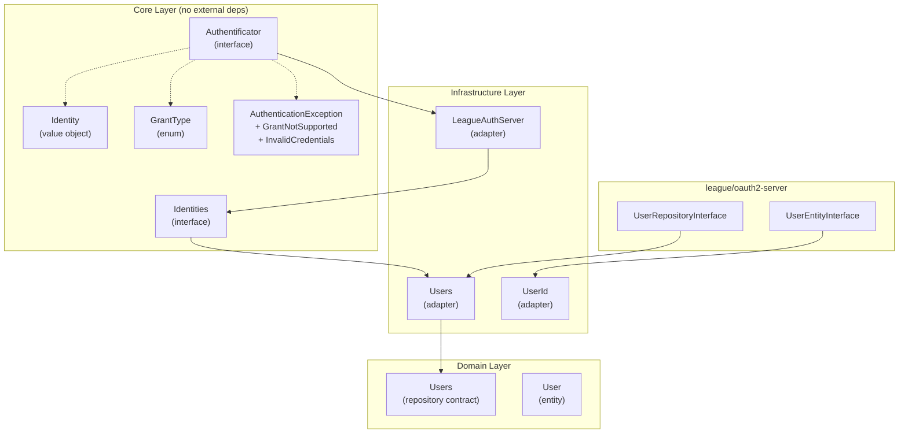
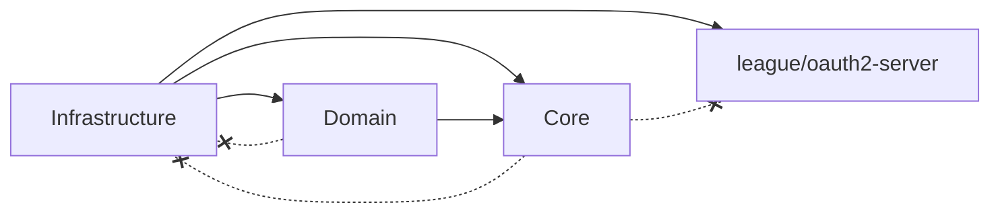
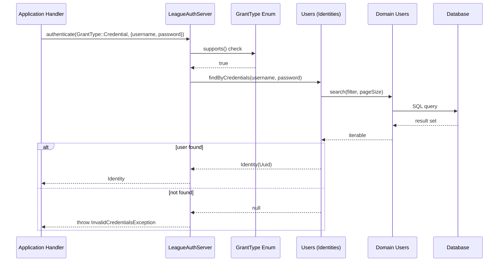

# Feature Documentation: OAuth Server Contract and Implementation

**Document Version:** 1.0
**Feature Reference:** 0003-core-005-oauth-server-contract
**Date:** December 2025

---

## 1. Commit Message

```
feat(auth): add OAuth server contract and LeagueAuthServer adapter

Introduce authentication abstraction layer in Core with Authentificator
contract, Identity value object, Identities interface, GrantType enum,
and exception hierarchy. Implement LeagueAuthServer adapter in
Infrastructure using league/oauth2-server conventions.

Key changes:
- Add Authentificator interface with authenticate() and supports()
- Add Identity value object wrapping Uuid with equals() comparison
- Add Identities interface for credential and ID-based identity lookup
- Add GrantType backed enum with Passkey and Credential cases
- Add AuthenticationException hierarchy (GrantNotSupported, InvalidCredentials)
- Implement LeagueAuthServer adapter delegating to Identities
- Implement Users adapter bridging Identities and League UserRepositoryInterface
- Implement UserId adapter for League UserEntityInterface
- Add unit tests for Identity (5 scenarios) and GrantType (7 scenarios)
- Add integration tests for LeagueAuthServer (11 scenarios)

Follows ADR-009 (League PHP Ecosystem Preference) and Ports & Adapters
pattern. Core contracts have zero external dependencies.
```

---

## 2. Pull Request Description

### What & Why

This PR introduces the OAuth 2.0 authentication abstraction layer for BoardGameLog. It defines Core-layer contracts
(`Authentificator`, `Identity`, `Identities`, `GrantType`) that are implementation-agnostic, and provides a concrete
adapter (`LeagueAuthServer`) using `league/oauth2-server` in the Infrastructure layer.

**Problem solved:** The project lacked a formal authentication contract. Login logic was tightly coupled to specific
infrastructure, preventing clean separation between authentication business rules and their implementation. Adding new
grant types or swapping OAuth providers required modifying domain code.

**Business value:** Developers can now define authentication flows using domain-level abstractions. The `Authentificator`
contract enables pluggable authentication strategies, while the `GrantType` enum provides type-safe grant selection.
Tests can mock `Identities` without database dependencies.

### Changes Made

**Core Layer:**

- `src/Core/Auth/Authentificator.php` -- Authentication contract (port) with `authenticate()` and `supports()`
- `src/Core/Auth/Identity.php` -- Immutable value object wrapping `Uuid` with equality comparison
- `src/Core/Auth/Identities.php` -- Identity resolution contract with `findByCredentials()` and `findById()`
- `src/Core/Auth/GrantType.php` -- Backed string enum with `Passkey` and `Credential` cases
- `src/Core/Auth/AuthenticationException.php` -- Base runtime exception for authentication failures
- `src/Core/Auth/GrantNotSupportedException.php` -- Thrown when unsupported grant type is requested
- `src/Core/Auth/InvalidCredentialsException.php` -- Thrown when credentials are invalid or missing

**Infrastructure Layer:**

- `src/Infrastructure/Authentification/OpenAuth/LeagueAuthServer.php` -- Implements `Authentificator` using pattern
  matching on `GrantType` to delegate to grant-specific private methods
- `src/Infrastructure/Authentification/OpenAuth/Users.php` -- Dual adapter implementing both `Identities` (Core
  contract) and `UserRepositoryInterface` (League contract), bridging to Domain `Users` repository
- `src/Infrastructure/Authentification/OpenAuth/UserId.php` -- Adapter implementing League's `UserEntityInterface`,
  wrapping `Uuid` for League compatibility

### Technical Details

**Design patterns used:**

- **Ports & Adapters**: `Authentificator` and `Identities` are ports in Core; `LeagueAuthServer` and `Users` are
  adapters in Infrastructure
- **Strategy Pattern**: `LeagueAuthServer` selects authentication strategy via `match` expression on `GrantType`
- **Value Object Pattern**: `Identity` is an immutable, equality-comparable value object wrapping `Uuid`
- **Bridge Pattern**: `Users` adapter bridges the Core `Identities` interface and League's `UserRepositoryInterface`,
  translating between the two APIs

**Key implementation decisions:**

1. **Grant type as backed enum**: `GrantType` uses PHP 8.4 backed string enum, enabling exhaustive `match` expressions
   and safe `from()`/`tryFrom()` construction from external input.

2. **SUPPORTED_GRANTS as const array**: `LeagueAuthServer` declares supported grants as a class constant, making it
   easy to extend or restrict supported grants without modifying the authentication logic.

3. **Credential validation before lookup**: The adapter validates credential presence and format (non-empty strings)
   before querying `Identities`, preventing unnecessary database calls.

4. **Dual-interface Users adapter**: `Users` implements both `Identities` (for internal use via `Authentificator`) and
   `UserRepositoryInterface` (for League OAuth2 server integration), providing a single adapter class that bridges
   both contract systems.

5. **Generic error messages**: Exception messages do not reveal whether a username exists or a password was wrong,
   preventing user enumeration attacks.

**Integration points:**

- `LeagueAuthServer` depends on `Identities` (Core interface, injected via constructor)
- `Users` depends on `Domain\Auth\Entities\Users` (Domain repository, injected via constructor)
- `Users::findByCredentials()` uses `Searchable::search()` with `AndX` and `Equals` filters from Core Listing contracts
- `Users::findById()` uses `Repository::find()` from Core Collections contract

### Testing

**Automated tests added:**

- `tests/Unit/Core/Auth/IdentityCest.php` -- 5 unit test scenarios covering Identity value object: getId, equals with
  same/different/null UUIDs
- `tests/Unit/Core/Auth/GrantTypeCest.php` -- 7 unit test scenarios covering GrantType enum: values, from/tryFrom,
  cases count, expected values
- `tests/Integration/Infrastructure/Authentification/LeagueAuthServerCest.php` -- 11 integration test scenarios
  covering LeagueAuthServer: supports checks for both grants, successful/failed credential authentication,
  missing/empty credential fields, successful/failed passkey authentication, missing/empty userId

**Test approach:**

Integration tests for `LeagueAuthServer` use an anonymous readonly class implementing `Identities` as a mock. This
allows precise control over identity resolution outcomes without database dependencies while testing the full
authentication flow including grant validation, credential extraction, and exception handling.

### Breaking Changes

None. This is a new feature implementation that introduces new contracts and adapters without modifying existing public
APIs.

### Checklist

- [x] Code follows PSR-12 style guidelines
- [x] `declare(strict_types=1)` present in all files
- [x] Tests added: 5 unit (Identity) + 7 unit (GrantType) + 11 integration (LeagueAuthServer) = 23 total
- [x] Architecture compliance: Core contracts have zero external dependencies
- [x] No breaking changes
- [x] `composer scan:all` passes (all quality checks)
- [x] Architecture tests pass (`composer dt:run`)
- [x] Follows ADR-009 (League PHP Ecosystem Preference)

---

## 3. Feature Documentation

### Overview

The OAuth Server Contract provides a domain-agnostic authentication abstraction for BoardGameLog. It defines how users
are authenticated using different grant types (Credential, Passkey) without coupling business logic to any specific
OAuth implementation.

**When to use:**

- Authenticating users in application handlers or API actions
- Checking if a specific authentication grant type is supported
- Resolving user identity from credentials or user IDs
- Integrating with League OAuth2 server for token-based authentication

### Usage Guide

#### Basic Authentication with Credentials

To authenticate a user with username and password:

```php
use Bgl\Core\Auth\Authentificator;
use Bgl\Core\Auth\GrantType;
use Bgl\Core\Auth\InvalidCredentialsException;

/** @var Authentificator $auth */
$auth = $container->get(Authentificator::class);

try {
    $identity = $auth->authenticate(
        GrantType::Credential,
        ['username' => 'user@example.com', 'password' => 'secret123']
    );

    $userId = $identity->getId()->getValue();
    // Proceed with authenticated user...
} catch (InvalidCredentialsException $e) {
    // Handle authentication failure
}
```

#### Authentication with Passkey

To authenticate using a user ID (passkey flow):

```php
use Bgl\Core\Auth\Authentificator;
use Bgl\Core\Auth\GrantType;

/** @var Authentificator $auth */
$auth = $container->get(Authentificator::class);

$identity = $auth->authenticate(
    GrantType::Passkey,
    ['userId' => '550e8400-e29b-41d4-a716-446655440000']
);
```

#### Checking Grant Type Support

To verify if a grant type is supported before attempting authentication:

```php
use Bgl\Core\Auth\Authentificator;
use Bgl\Core\Auth\GrantType;

/** @var Authentificator $auth */
$auth = $container->get(Authentificator::class);

if ($auth->supports(GrantType::Credential)) {
    // Credential grant is available
}
```

#### Identity Comparison

To compare two authenticated identities:

```php
use Bgl\Core\Auth\Identity;
use Bgl\Core\ValueObjects\Uuid;

$identity1 = new Identity(new Uuid('550e8400-e29b-41d4-a716-446655440000'));
$identity2 = new Identity(new Uuid('550e8400-e29b-41d4-a716-446655440000'));

$identity1->equals($identity2); // true
```

#### Using Identities Interface Directly

For lower-level identity resolution (e.g., in custom adapters):

```php
use Bgl\Core\Auth\Identities;

/** @var Identities $identities */
$identities = $container->get(Identities::class);

// Lookup by credentials
$identity = $identities->findByCredentials('user@example.com', 'secret123');

// Lookup by user ID
$identity = $identities->findById('550e8400-e29b-41d4-a716-446655440000');
```

#### Writing Tests with Mock Identities

To test authentication flows without database dependencies:

```php
use Bgl\Core\Auth\Identities;
use Bgl\Core\Auth\Identity;
use Bgl\Core\ValueObjects\Uuid;
use Bgl\Infrastructure\Authentification\OpenAuth\LeagueAuthServer;

$mockIdentities = new readonly class implements Identities {
    public function findByCredentials(string $username, string $password): ?Identity
    {
        if ($username === 'test@example.com' && $password === 'secret') {
            return new Identity(new Uuid('550e8400-e29b-41d4-a716-446655440000'));
        }
        return null;
    }

    public function findById(string $id): ?Identity
    {
        return null;
    }
};

$server = new LeagueAuthServer($mockIdentities);
```

### API Reference

#### Authentificator Interface

```php
namespace Bgl\Core\Auth;

interface Authentificator
{
    public function authenticate(GrantType $grant, array $credentials): Identity;
    public function supports(GrantType $grant): bool;
}
```

**Methods:**

| Method           | Input                                   | Return     | Description                                     |
|------------------|-----------------------------------------|------------|-------------------------------------------------|
| `authenticate()` | `GrantType $grant, array $credentials`  | `Identity` | Authenticate user; throws on failure            |
| `supports()`     | `GrantType $grant`                      | `bool`     | Check if grant type is supported                |

#### Identity Value Object

```php
namespace Bgl\Core\Auth;

final readonly class Identity
{
    public function __construct(private Uuid $id);
    public function getId(): Uuid;
    public function equals(self $other): bool;
}
```

**Methods:**

| Method     | Input            | Return | Description                                |
|------------|------------------|--------|--------------------------------------------|
| `getId()`  | none             | `Uuid` | Returns the underlying UUID                |
| `equals()` | `Identity $other`| `bool` | Compares UUID values for equality          |

#### Identities Interface

```php
namespace Bgl\Core\Auth;

interface Identities
{
    public function findByCredentials(string $username, string $password): ?Identity;
    public function findById(string $id): ?Identity;
}
```

**Methods:**

| Method                | Input                              | Return           | Description                   |
|-----------------------|------------------------------------|------------------|-------------------------------|
| `findByCredentials()` | `string $username, string $password`| `Identity\|null`| Lookup by username + password |
| `findById()`          | `string $id`                       | `Identity\|null`| Lookup by user ID             |

#### GrantType Enum

```php
namespace Bgl\Core\Auth;

enum GrantType: string
{
    case Passkey = 'passkey';
    case Credential = 'credential';
}
```

| Case         | Value          | Description                             |
|--------------|----------------|-----------------------------------------|
| `Passkey`    | `"passkey"`    | User ID-based authentication (no password) |
| `Credential` | `"credential"` | Username + password authentication       |

#### Exception Hierarchy

| Exception                       | Parent                    | Default Message                     |
|---------------------------------|---------------------------|-------------------------------------|
| `AuthenticationException`       | `\RuntimeException`       | `Authentication failed`             |
| `GrantNotSupportedException`    | `AuthenticationException` | `Grant type not supported`          |
| `InvalidCredentialsException`   | `AuthenticationException` | `Invalid credentials`               |

### Architecture

#### High-Level Architecture Diagram



#### Dependency Direction



The dashed crossed lines indicate prohibited dependencies. Core and Domain layers never depend on Infrastructure or
external packages.

#### Key Components and Responsibilities

| Component               | Layer          | Responsibility                                                |
|-------------------------|----------------|---------------------------------------------------------------|
| `Authentificator`       | Core           | Authentication contract defining grant-based auth flow        |
| `Identity`              | Core           | Immutable value object representing authenticated user        |
| `Identities`            | Core           | Identity resolution contract for credential/ID lookup         |
| `GrantType`             | Core           | Type-safe enum defining supported authentication grants       |
| `AuthenticationException`| Core          | Base exception for authentication failures                    |
| `LeagueAuthServer`      | Infrastructure | Adapter implementing Authentificator via grant-based dispatch |
| `Users`                 | Infrastructure | Bridge adapter between Core Identities and League interfaces  |
| `UserId`                | Infrastructure | Adapter wrapping Uuid for League UserEntityInterface          |

#### Data Flow



### Troubleshooting

#### Common Issues and Solutions

**Issue: GrantNotSupportedException thrown unexpectedly**

Cause: The `GrantType` value passed to `authenticate()` is not in the `SUPPORTED_GRANTS` constant.

Solution: Verify the grant type is one of `GrantType::Credential` or `GrantType::Passkey`. Use `supports()` to check
before calling `authenticate()`.

```php
// Check support before authenticating
if ($auth->supports($grantType)) {
    $identity = $auth->authenticate($grantType, $credentials);
}
```

**Issue: InvalidCredentialsException with "Username and password are required"**

Cause: The credentials array is missing the `username` or `password` key, or one of them is an empty string or
non-string value.

Solution: Ensure both keys are present with non-empty string values:

```php
// Wrong - missing key
$auth->authenticate(GrantType::Credential, ['username' => 'user@example.com']);

// Wrong - non-string value
$auth->authenticate(GrantType::Credential, ['username' => 'user', 'password' => 123]);

// Correct
$auth->authenticate(GrantType::Credential, [
    'username' => 'user@example.com',
    'password' => 'secret123',
]);
```

**Issue: InvalidCredentialsException with "User ID is required for passkey authentication"**

Cause: The credentials array for Passkey grant is missing `userId` key or it is empty/non-string.

Solution: Provide a non-empty string `userId`:

```php
// Correct
$auth->authenticate(GrantType::Passkey, [
    'userId' => '550e8400-e29b-41d4-a716-446655440000',
]);
```

**Issue: InvalidCredentialsException with "Invalid credentials" (generic)**

Cause: The `Identities` implementation returned `null`, meaning no matching user was found for the given credentials
or user ID.

Solution: Verify the user exists in the database with the correct credentials. Check that the `Identities`
implementation is correctly wired via DI and the underlying repository is functional.

#### Error Messages Explained

| Error Message                                   | Exception                     | Cause                                    |
|-------------------------------------------------|-------------------------------|------------------------------------------|
| `Grant type "{value}" is not supported`         | `GrantNotSupportedException`  | Grant not in SUPPORTED_GRANTS            |
| `Username and password are required`             | `InvalidCredentialsException` | Missing/empty username or password       |
| `User ID is required for passkey authentication` | `InvalidCredentialsException` | Missing/empty userId for Passkey grant   |
| `Invalid credentials`                            | `InvalidCredentialsException` | No user found for provided credentials   |
| `Authentication failed`                          | `AuthenticationException`     | Generic base exception (catch-all)       |

---

## 4. CHANGELOG Entry

```markdown
## [Unreleased]

### Added

- OAuth server authentication contract with `Authentificator` interface, `Identity` value object, `Identities`
  interface, and `GrantType` enum in Core layer (CORE-005)
- `LeagueAuthServer` adapter implementing `Authentificator` with support for Credential and Passkey grant types
- `Users` bridge adapter implementing both Core `Identities` and League `UserRepositoryInterface`
- `UserId` adapter implementing League `UserEntityInterface`
- Exception hierarchy: `AuthenticationException`, `GrantNotSupportedException`, `InvalidCredentialsException`
- Unit tests for `Identity` (5 scenarios) and `GrantType` (7 scenarios)
- Integration tests for `LeagueAuthServer` (11 scenarios)
```

---

## 5. Related Files

| File                                                                           | Description                                |
|--------------------------------------------------------------------------------|--------------------------------------------|
| `src/Core/Auth/Authentificator.php`                                            | Authentication contract (port)             |
| `src/Core/Auth/Identity.php`                                                   | Identity value object                      |
| `src/Core/Auth/Identities.php`                                                 | Identity resolution contract               |
| `src/Core/Auth/GrantType.php`                                                  | Grant type enum                            |
| `src/Core/Auth/AuthenticationException.php`                                    | Base authentication exception              |
| `src/Core/Auth/GrantNotSupportedException.php`                                 | Unsupported grant exception                |
| `src/Core/Auth/InvalidCredentialsException.php`                                | Invalid credentials exception              |
| `src/Infrastructure/Authentification/OpenAuth/LeagueAuthServer.php`            | Authentificator adapter                    |
| `src/Infrastructure/Authentification/OpenAuth/Users.php`                       | Identities + UserRepositoryInterface adapter|
| `src/Infrastructure/Authentification/OpenAuth/UserId.php`                      | UserEntityInterface adapter                |
| `tests/Unit/Core/Auth/IdentityCest.php`                                        | Identity unit tests                        |
| `tests/Unit/Core/Auth/GrantTypeCest.php`                                       | GrantType unit tests                       |
| `tests/Integration/Infrastructure/Authentification/LeagueAuthServerCest.php`   | LeagueAuthServer integration tests         |
| `docs/03-decisions/009-league-php-preference.md`                               | ADR for League PHP ecosystem choice        |
