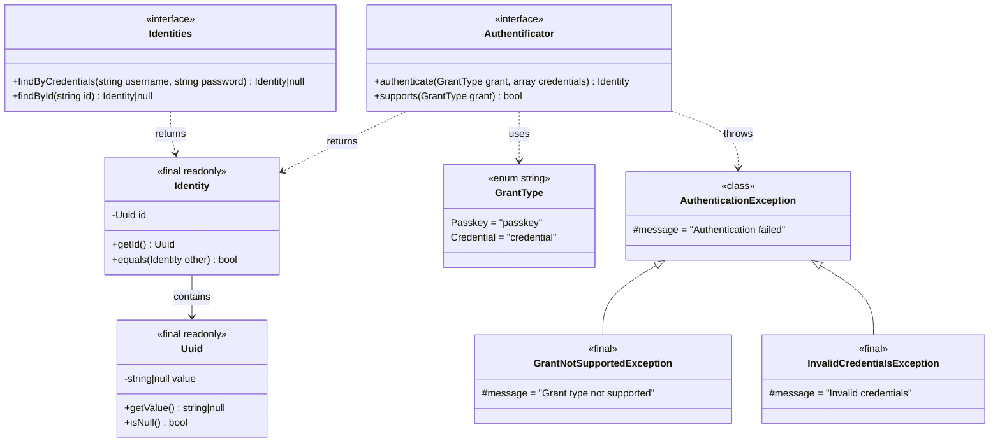
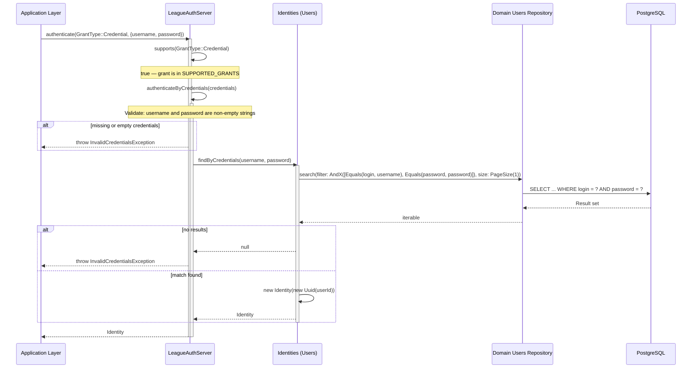
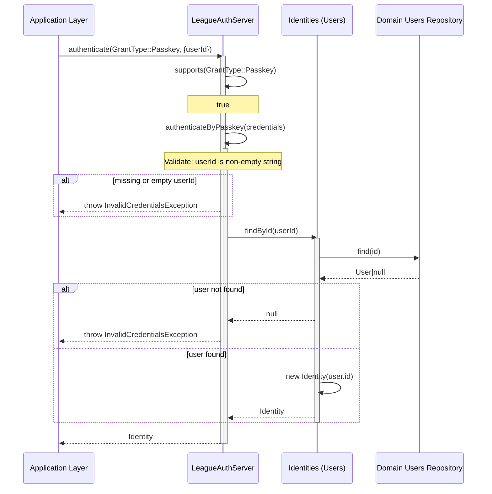
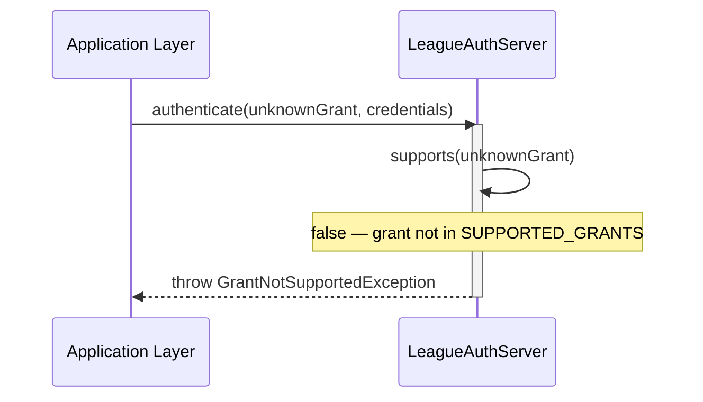

# Feature Request: OAuth Server Contract and Implementation

**Document Version:** 1.0
**Date:** 2025-12-20
**Status:** Completed
**Priority:** High

---

## 1. Feature Overview

### 1.1 Description

This feature introduces an OAuth 2.0 authentication abstraction layer in the Core layer and its concrete implementation
using `league/oauth2-server` in the Infrastructure layer. The system defines a grant-based authentication contract
(`Authentificator`), an `Identity` value object representing authenticated users, an `Identities` interface for identity
resolution, and a `GrantType` enum supporting Passkey and Credential authentication flows. The `LeagueAuthServer`
adapter in Infrastructure implements the `Authentificator` contract by delegating to `Identities` for credential
validation.

### 1.2 Business Value and User Benefit

- **Pluggable Authentication**: The `Authentificator` contract decouples business logic from any specific OAuth
  implementation, allowing replacement of `league/oauth2-server` without affecting domain code
- **Multiple Grant Types**: Support for both Credential (username/password) and Passkey (user ID-based) authentication
  enables flexible login strategies
- **Domain Isolation**: Authentication contracts live in Core, ensuring inner layers never depend on infrastructure
  packages
- **Testability**: The `Identities` interface enables mock-based testing of authentication flows without database or
  external service dependencies
- **League Ecosystem Alignment**: Follows ADR-009 (League PHP Ecosystem Preference) by using `league/oauth2-server` as
  the OAuth2 implementation

### 1.3 Target Audience

- **Backend Developers**: Implementing authentication handlers and login flows
- **Domain Modelers**: Defining authentication-related business rules independent of OAuth provider
- **QA Engineers**: Writing integration tests for authentication scenarios

---

## 2. Technical Architecture

### 2.1 High-Level Architectural Approach

The implementation follows the **Ports & Adapters** (Hexagonal Architecture) pattern:

- **Port (Core)**: `Authentificator` interface defines the authentication contract; `Identities` defines the identity
  resolution contract; `Identity` is the value object returned on successful authentication
- **Adapter (Infrastructure)**: `LeagueAuthServer` implements `Authentificator` using `league/oauth2-server` conventions;
  `Users` implements both `Identities` and `League\OAuth2\Server\Repositories\UserRepositoryInterface`

The `GrantType` enum uses PHP 8.4 backed enums to provide type-safe grant selection with exhaustive `match` handling in
the adapter. The `LeagueAuthServer` delegates authentication to the appropriate private method based on grant type,
which in turn queries `Identities` for identity resolution.

### 2.2 Integration with Existing Codebase

The OAuth contracts integrate at the following points:

1. **Core layer** (`Bgl\Core\Auth\`): Defines `Authentificator`, `Identity`, `Identities`, `GrantType`, and exception
   hierarchy — no dependencies on external packages
2. **Domain layer** (`Bgl\Domain\Profile\Entities\Users`): Existing user repository contract used as data source for
   identity resolution
3. **Infrastructure layer** (`Bgl\Infrastructure\Authentification\OpenAuth\`): `LeagueAuthServer` implements
   `Authentificator`; `Users` implements both `Identities` and League's `UserRepositoryInterface`; `UserId` implements
   League's `UserEntityInterface`
4. **Application layer** (`Bgl\Application\Handlers\Auth\LoginByCredentials\`): Existing login handler uses domain
   `Users` repository for credential-based authentication
5. **Presentation layer** (`Bgl\Presentation\Api\V1\Requests\Auth\LoginRequest`): HTTP request DTO implementing the
   login command interface

### 2.3 Technology Stack and Dependencies

| Component              | Technology             | Purpose                              |
|------------------------|------------------------|--------------------------------------|
| PHP                    | 8.4                    | Runtime environment                  |
| league/oauth2-server   | ^9.0                   | OAuth2 server implementation         |
| Doctrine ORM           | ^3.0                   | User persistence (via Users repo)    |
| Codeception            | 5.3                    | Testing framework                    |

**External Dependencies Used:**

- `league/oauth2-server` — `UserRepositoryInterface`, `UserEntityInterface`, `ClientEntityInterface`
- Core Listing contracts — `Searchable`, `Filter`, `PageSize` (used in `Users` adapter)

---

## 3. Class Diagrams

### 3.1 Core Auth Contracts



### 3.2 Infrastructure Adapters

```mermaid
classDiagram
    direction TB

    class Authentificator {
        <<interface>>
        +authenticate(GrantType, array) Identity
        +supports(GrantType) bool
    }

    class Identities {
        <<interface>>
        +findByCredentials(string, string) Identity|null
        +findById(string) Identity|null
    }

    class UserRepositoryInterface {
        <<interface League>>
        +getUserEntityByUserCredentials(string, string, string, ClientEntityInterface) UserEntityInterface|null
    }

    class UserEntityInterface {
        <<interface League>>
        +getIdentifier() string
    }

    class LeagueAuthServer {
        <<final readonly>>
        -Identities identities
        -SUPPORTED_GRANTS array
        +authenticate(GrantType, array) Identity
        +supports(GrantType) bool
        -authenticateByCredentials(array) Identity
        -authenticateByPasskey(array) Identity
    }

    class Users {
        <<final readonly>>
        -UserRepository users
        +getUserEntityByUserCredentials(...) UserEntityInterface|null
        +findByCredentials(string, string) Identity|null
        +findById(string) Identity|null
    }

    class UserId {
        <<final readonly>>
        -Uuid uuid
        +getIdentifier() string
    }

    Authentificator <|.. LeagueAuthServer
    Identities <|.. Users
    UserRepositoryInterface <|.. Users
    UserEntityInterface <|.. UserId
    LeagueAuthServer --> Identities: depends on
    Users --> "Domain Users" : delegates to
```

---

## 4. Sequence Diagrams

### 4.1 Credential Authentication Flow



### 4.2 Passkey Authentication Flow



### 4.3 Unsupported Grant Flow



---

## 5. Public API / Interfaces

### 5.1 Authentificator Interface

```php
<?php

declare(strict_types=1);

namespace Bgl\Core\Auth;

interface Authentificator
{
    /**
     * Authenticate user with given grant type and credentials.
     *
     * @param GrantType $grant The grant type to use
     * @param array<string, mixed> $credentials Grant-specific credentials
     *
     * @throws AuthenticationException on authentication failure
     */
    public function authenticate(GrantType $grant, array $credentials): Identity;

    /**
     * Check if this authenticator supports the given grant type.
     */
    public function supports(GrantType $grant): bool;
}
```

### 5.2 Identity Value Object

```php
<?php

declare(strict_types=1);

namespace Bgl\Core\Auth;

use Bgl\Core\ValueObjects\Uuid;

final readonly class Identity
{
    public function __construct(private Uuid $id);

    public function getId(): Uuid;

    public function equals(self $other): bool;
}
```

### 5.3 Identities Interface

```php
<?php

declare(strict_types=1);

namespace Bgl\Core\Auth;

interface Identities
{
    /**
     * Find identity by username and password credentials.
     */
    public function findByCredentials(string $username, string $password): ?Identity;

    /**
     * Find identity by user ID.
     */
    public function findById(string $id): ?Identity;
}
```

### 5.4 GrantType Enum

```php
<?php

declare(strict_types=1);

namespace Bgl\Core\Auth;

enum GrantType: string
{
    case Passkey = 'passkey';
    case Credential = 'credential';
}
```

### 5.5 LeagueAuthServer Adapter

```php
<?php

declare(strict_types=1);

namespace Bgl\Infrastructure\Authentification\OpenAuth;

use Bgl\Core\Auth\Authentificator;
use Bgl\Core\Auth\GrantNotSupportedException;
use Bgl\Core\Auth\GrantType;
use Bgl\Core\Auth\Identities;
use Bgl\Core\Auth\Identity;
use Bgl\Core\Auth\InvalidCredentialsException;

final readonly class LeagueAuthServer implements Authentificator
{
    private const array SUPPORTED_GRANTS = [
        GrantType::Credential,
        GrantType::Passkey,
    ];

    public function __construct(private Identities $identities);

    public function authenticate(GrantType $grant, array $credentials): Identity;

    public function supports(GrantType $grant): bool;

    private function authenticateByCredentials(array $credentials): Identity;

    private function authenticateByPasskey(array $credentials): Identity;
}
```

### 5.6 Expected Inputs and Outputs

| Method / Context                        | Input                                      | Output                     | Notes                             |
|-----------------------------------------|--------------------------------------------|----------------------------|-----------------------------------|
| `Authentificator::authenticate()`       | `GrantType`, `array<string, mixed>`        | `Identity`                 | Throws on failure                 |
| `Authentificator::supports()`           | `GrantType`                                | `bool`                     | Checks SUPPORTED_GRANTS           |
| `Identities::findByCredentials()`       | `string username`, `string password`       | `Identity\|null`           | null if not found                 |
| `Identities::findById()`               | `string id`                                | `Identity\|null`           | null if not found                 |
| `Identity::equals()`                    | `Identity other`                           | `bool`                     | Compares Uuid values              |
| `Users::getUserEntityByUserCredentials` | `string, string, string, ClientEntity`     | `UserEntityInterface\|null`| League OAuth2 bridge method       |

### 5.7 Error Handling

| Scenario                          | Exception                       | Message                                        |
|-----------------------------------|---------------------------------|------------------------------------------------|
| Unsupported grant type            | `GrantNotSupportedException`    | `Grant type "{value}" is not supported`        |
| Missing or empty username         | `InvalidCredentialsException`   | `Username and password are required`            |
| Missing or empty password         | `InvalidCredentialsException`   | `Username and password are required`            |
| Credentials do not match any user | `InvalidCredentialsException`   | `Invalid credentials`                          |
| Missing or empty userId (passkey) | `InvalidCredentialsException`   | `User ID is required for passkey authentication`|
| UserId not found (passkey)        | `InvalidCredentialsException`   | `Invalid credentials`                          |

---

## 6. Directory Structure

### 6.1 Files Created

```
src/
├── Core/
│   └── Auth/
│       ├── Authentificator.php         # Authentication contract (port)
│       ├── Identity.php                # Identity value object
│       ├── Identities.php              # Identity resolution contract
│       ├── GrantType.php               # Grant type enum (Passkey, Credential)
│       ├── AuthenticationException.php # Base exception
│       ├── GrantNotSupportedException.php  # Unsupported grant
│       └── InvalidCredentialsException.php # Bad credentials
│
└── Infrastructure/
    └── Authentification/
        └── OpenAuth/
            ├── LeagueAuthServer.php     # Authentificator adapter (league/oauth2-server)
            ├── Users.php                # Identities + UserRepositoryInterface adapter
            └── UserId.php               # UserEntityInterface adapter

tests/
├── Unit/
│   └── Core/
│       └── Auth/
│           ├── IdentityCest.php         # Identity value object tests
│           └── GrantTypeCest.php        # GrantType enum tests
│
└── Integration/
    └── Infrastructure/
        └── Authentification/
            └── LeagueAuthServerCest.php # LeagueAuthServer adapter tests
```

### 6.2 Existing Files Referenced (Not Modified)

```
src/
├── Core/
│   ├── ValueObjects/Uuid.php            # Used by Identity
│   ├── Collections/Repository.php       # Extended by Domain Users
│   └── Listing/Searchable.php           # Extended by Domain Users
│
├── Domain/
│   └── Auth/
│       ├── Entities/User.php            # User entity
│       ├── Entities/UserId.php          # Domain UserId VO
│       ├── Entities/UserStatus.php      # User status enum
│       └── Entities/Users.php           # User repository contract
│
├── Application/
│   └── Handlers/Auth/LoginByCredentials/
│       ├── Command.php                  # Login command interface
│       └── Handler.php                  # Login handler
│
└── Presentation/
    └── Api/V1/Requests/Auth/
        └── LoginRequest.php             # HTTP request DTO
```

### 6.3 Naming Conventions

| Type                | Convention                                            | Example                                        |
|---------------------|-------------------------------------------------------|------------------------------------------------|
| Contract interface  | Noun or adjective (no `Interface` suffix)             | `Authentificator`, `Identities`                |
| Value Object        | Singular noun                                         | `Identity`                                     |
| Enum                | Singular noun with `PascalCase` cases                 | `GrantType` with `Passkey`, `Credential`       |
| Exception           | Descriptive `*Exception`                              | `GrantNotSupportedException`                   |
| Adapter class       | Implementation-specific name                          | `LeagueAuthServer`                             |
| Namespace           | `Bgl\{Layer}\{Context}\{SubContext}`                  | `Bgl\Infrastructure\Authentification\OpenAuth` |

---

## 7. Code References

### 7.1 Core Contracts

| File                                           | Relevance                                             |
|------------------------------------------------|-------------------------------------------------------|
| `src/Core/Auth/Authentificator.php`            | Main authentication port — 2 methods                  |
| `src/Core/Auth/Identity.php`                   | Immutable value object wrapping Uuid                  |
| `src/Core/Auth/Identities.php`                 | Identity resolution port — 2 lookup methods           |
| `src/Core/Auth/GrantType.php`                  | Backed string enum — Passkey, Credential              |
| `src/Core/Auth/AuthenticationException.php`    | Base exception for all auth failures                  |
| `src/Core/Auth/GrantNotSupportedException.php` | Thrown when grant is not in SUPPORTED_GRANTS           |
| `src/Core/Auth/InvalidCredentialsException.php`| Thrown when credentials are invalid or missing         |

### 7.2 Infrastructure Adapters

| File                                                           | Relevance                                                         |
|----------------------------------------------------------------|-------------------------------------------------------------------|
| `src/Infrastructure/Authentification/OpenAuth/LeagueAuthServer.php` | Implements `Authentificator`, delegates to `Identities`          |
| `src/Infrastructure/Authentification/OpenAuth/Users.php`            | Implements `Identities` + League `UserRepositoryInterface`       |
| `src/Infrastructure/Authentification/OpenAuth/UserId.php`           | Implements League `UserEntityInterface`, wraps `Uuid`            |

### 7.3 Domain Integration Points

| File                                      | Relevance                                               |
|-------------------------------------------|---------------------------------------------------------|
| `src/Domain/Profile/Entities/Users.php`      | User repository used by `Users` adapter for data access |
| `src/Domain/Profile/Entities/User.php`       | User entity with id, email, createdAt, status           |
| `src/Core/ValueObjects/Uuid.php`          | Shared UUID value object used by `Identity`             |
| `src/Core/Listing/Searchable.php`         | Search interface used by `Users` for credential lookup  |

### 7.4 Test Files

| File                                                                    | Relevance                                                  |
|-------------------------------------------------------------------------|------------------------------------------------------------|
| `tests/Unit/Core/Auth/IdentityCest.php`                                | Unit tests for Identity: getId, equals with same/different |
| `tests/Unit/Core/Auth/GrantTypeCest.php`                               | Unit tests for GrantType: values, from, tryFrom, cases     |
| `tests/Integration/Infrastructure/Authentification/LeagueAuthServerCest.php` | Integration tests for LeagueAuthServer with mock Identities |

### 7.5 Architectural Decision Records

| File                                           | Relevance                                     |
|------------------------------------------------|-----------------------------------------------|
| `docs/03-decisions/009-league-php-preference.md` | ADR establishing league/oauth2-server choice |
| `docs/03-decisions/001-clean-architecture.md`    | Clean Architecture principles followed       |
| `docs/03-decisions/002-ddd.md`                   | DDD patterns for bounded contexts            |

---

## 8. Implementation Considerations

### 8.1 Potential Challenges

| Challenge                                   | Solution Applied                                                                  |
|---------------------------------------------|-----------------------------------------------------------------------------------|
| Grant type extensibility                    | `GrantType` is a backed enum; new cases can be added without breaking existing code|
| Credential validation without database      | `Identities` interface enables mock-based testing via anonymous readonly class     |
| League OAuth2 bridge compatibility          | `Users` implements both `Identities` and `UserRepositoryInterface` for dual use   |
| Match exhaustiveness for grant types        | PHP `match` expression ensures all `GrantType` cases are handled at compile time  |

### 8.2 Edge Cases Handled

1. **Missing credentials keys**: Both `authenticateByCredentials` and `authenticateByPasskey` check for key existence
   using `isset()` before accessing array values
2. **Non-string credential values**: Type check with `\is_string()` before using credential values; defaults to empty
   string if type mismatch
3. **Empty string credentials**: Explicit check for empty strings before querying `Identities`
4. **Null identity from lookup**: Both grant handlers check for `null` return from `Identities` and throw
   `InvalidCredentialsException`
5. **Passkey grant in League bridge**: `Users::getUserEntityByUserCredentials()` handles passkey grant specially by using
   `find()` instead of `search()` since no password is involved

### 8.3 Performance Considerations

| Concern                        | Mitigation                                                     |
|--------------------------------|----------------------------------------------------------------|
| Credential lookup cost         | `Users::findByCredentials` uses `PageSize(1)` to limit results|
| Enum instantiation overhead    | PHP 8.4 backed enums are singletons; zero allocation cost      |
| Identity object creation       | `Identity` is `final readonly` — immutable, no side effects   |

### 8.4 Security Considerations

| Concern                          | Mitigation                                                       |
|----------------------------------|------------------------------------------------------------------|
| Credential exposure              | Credentials passed as typed array, not stored on objects         |
| Grant type injection             | `GrantType` is a backed enum — only valid cases accepted         |
| Timing attacks on auth           | Exception messages are generic; no distinction between "user not found" and "wrong password"|
| Unsupported grant escalation     | `supports()` check runs before any credential processing         |

---

## 9. Testing Strategy

### 9.1 Unit Tests (Identity Value Object)

Located in `tests/Unit/Core/Auth/IdentityCest.php`:

| Test Method                     | Scenario                         | Expected Behavior              |
|---------------------------------|----------------------------------|--------------------------------|
| `testGetId`                     | Access Identity's UUID           | Returns same Uuid instance     |
| `testEqualsWithSameId`          | Two identities with same UUID    | Returns true                   |
| `testEqualsWithDifferentId`     | Two identities with different UUID| Returns false                 |
| `testEqualsWithNullUuids`       | Both identities have null UUID   | Returns true                   |
| `testNotEqualsWhenOneIsNull`    | One null UUID, one non-null      | Returns false                  |

### 9.2 Unit Tests (GrantType Enum)

Located in `tests/Unit/Core/Auth/GrantTypeCest.php`:

| Test Method                       | Scenario                        | Expected Behavior              |
|-----------------------------------|---------------------------------|--------------------------------|
| `testPasskeyValue`                | Passkey string value            | Equals `"passkey"`             |
| `testCredentialValue`             | Credential string value         | Equals `"credential"`          |
| `testFromStringPasskey`           | Create from valid string        | Returns `GrantType::Passkey`   |
| `testFromStringCredential`        | Create from valid string        | Returns `GrantType::Credential`|
| `testTryFromInvalidReturnsNull`   | Create from invalid string      | Returns null                   |
| `testCasesCount`                  | Count all cases                 | Equals 2                       |
| `testCasesContainsExpectedValues` | Cases contain expected values   | Contains both enum cases       |

### 9.3 Integration Tests (LeagueAuthServer Adapter)

Located in `tests/Integration/Infrastructure/Authentification/LeagueAuthServerCest.php`:

| Test Method                                     | Scenario                            | Expected Behavior                           |
|-------------------------------------------------|-------------------------------------|---------------------------------------------|
| `testSupportsCredentialGrant`                   | Check Credential grant support      | Returns true                                |
| `testSupportsPasskeyGrant`                      | Check Passkey grant support         | Returns true                                |
| `testAuthenticateByCredentialsSuccess`          | Valid username + password           | Returns matching Identity                   |
| `testAuthenticateByCredentialsFailure`          | Valid format, no matching user      | Throws `InvalidCredentialsException`        |
| `testAuthenticateByCredentialsMissingUsername`   | Password only, no username key     | Throws `InvalidCredentialsException`        |
| `testAuthenticateByCredentialsMissingPassword`   | Username only, no password key     | Throws `InvalidCredentialsException`        |
| `testAuthenticateByCredentialsEmptyUsername`     | Empty string username              | Throws `InvalidCredentialsException`        |
| `testAuthenticateByPasskeySuccess`              | Valid userId                        | Returns matching Identity                   |
| `testAuthenticateByPasskeyFailure`              | Non-existent userId                 | Throws `InvalidCredentialsException`        |
| `testAuthenticateByPasskeyMissingUserId`        | Empty credentials array             | Throws `InvalidCredentialsException`        |
| `testAuthenticateByPasskeyEmptyUserId`          | Empty string userId                 | Throws `InvalidCredentialsException`        |

### 9.4 Test Approach

The integration tests use a mock `Identities` implementation (anonymous readonly class) that allows configuring
specific return values for `findByCredentials` and `findById`. This isolates the `LeagueAuthServer` logic from
database concerns while testing the full authentication flow including grant validation, credential extraction, and
identity resolution.

---

## 10. Acceptance Criteria

### 10.1 Definition of Done

- [x] `Authentificator` contract in `Core/Auth/` with `authenticate()` and `supports()` methods
- [x] `Identity` value object in `Core/Auth/` with `getId()` and `equals()` methods
- [x] `Identities` contract in `Core/Auth/` with `findByCredentials()` and `findById()` methods
- [x] `GrantType` backed enum in `Core/Auth/` with `Passkey` and `Credential` cases
- [x] Exception hierarchy: `AuthenticationException` > `GrantNotSupportedException`, `InvalidCredentialsException`
- [x] `LeagueAuthServer` adapter implementing `Authentificator` with support for both grant types
- [x] `Users` adapter implementing both `Identities` and `UserRepositoryInterface`
- [x] `UserId` adapter implementing `UserEntityInterface`
- [x] Unit tests for `Identity` value object (5 scenarios)
- [x] Unit tests for `GrantType` enum (7 scenarios)
- [x] Integration tests for `LeagueAuthServer` adapter (11 scenarios)
- [x] Code passes `composer scan:all` (all quality checks)
- [x] No Psalm errors introduced
- [x] Architecture tests pass (`composer dt:run`)

### 10.2 Measurable Success Criteria

| Metric                     | Target                                         | Achieved |
|----------------------------|-------------------------------------------------|----------|
| Unit test pass rate        | 100% of IdentityCest + GrantTypeCest tests     | Yes      |
| Integration test pass rate | 100% of LeagueAuthServerCest tests             | Yes      |
| Static analysis            | Zero Psalm errors at level 1                   | Yes      |
| Architecture compliance    | Zero deptrac violations                        | Yes      |
| Grant type coverage        | Both Passkey and Credential fully tested        | Yes      |
| Exception path coverage    | All 6 error scenarios have dedicated tests     | Yes      |

### 10.3 Verification Commands

```bash
# Run unit tests for Core Auth
composer test:unit -- --group auth

# Run integration tests for LeagueAuthServer
composer test:intg -- --group leagueAuthServer

# Run all quality checks
composer scan:all

# Run architecture tests specifically
composer dt:run
```
