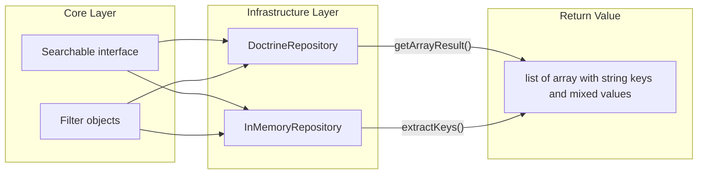

# Feature Documentation: Searchable Contract Return Type Refactor

**Document Version:** 1.0
**Feature Reference:** 0004-core-006-searchable-return-type-refactor
**Date:** February 2026

---

## 1. Commit Message

```
feat(listing): improve searchable contract and repository implementations

Refactor Searchable::search() to return composite key arrays instead of
full entity objects. Adds abstract getKeys() method to DoctrineRepository
and InMemoryRepository, enabling partial SELECT projection in Doctrine
(getArrayResult) and key extraction via FieldAccessor in InMemory.

Key changes:
- Remove @template-covariant TEntity from Searchable interface
- Change return type to list<array<string, mixed>> (composite key arrays)
- Add abstract getKeys(): array to both repository base classes
- DoctrineRepository: SELECT only key fields, use getArrayResult()
- InMemoryRepository: replace getKey() with getKeys(), add extractKeys()
- Update all concrete repositories and test expectations
```

---

## 2. Pull Request Description

### What & Why

This PR refactors the `Searchable::search()` contract to return lightweight key arrays instead of full entity objects.
The motivation is to decouple search result sets from entity hydration, enabling more efficient list endpoints and
preparing the codebase for entities with composite primary keys (e.g., play session records keyed by `user_id` +
`game_id`).

**Problem solved:** The previous `search()` method returned fully hydrated entity objects (`iterable<TEntity>`), which
was wasteful for listing endpoints that only need identifiers to build paginated responses. The Doctrine implementation
used `getResult()` which hydrates complete ORM entity graphs, and the InMemory implementation returned entity references
directly.

**Business value:** Search queries now transfer minimal data (key fields only) from database to application. Callers
can use the returned keys with `Repository::find()` for full entity retrieval when needed, following the CQRS read-model
pattern where listing and detail retrieval are separate operations.

### Changes Made

**Core Layer:**

- `src/Core/Listing/Searchable.php` -- Removed `@template-covariant TEntity of object` generic parameter. Changed return
  type PHPDoc to `list<array<string, mixed>>`. The interface is now non-generic.

**Infrastructure Layer (Doctrine):**

- `src/Infrastructure/Persistence/Doctrine/DoctrineRepository.php` -- Added `abstract public function getKeys(): array`.
  The `search()` method now builds a partial SELECT clause from `getKeys()` (e.g., `SELECT e.id`) and uses
  `getArrayResult()` instead of `getResult()` for scalar array output.
- `src/Infrastructure/Persistence/Doctrine/Users.php` -- Implements `getKeys()` returning `['id']`.

**Infrastructure Layer (InMemory):**

- `src/Infrastructure/Persistence/InMemory/InMemoryRepository.php` -- Replaced single `getKey(): string` with
  `getKeys(): array`. Added private `extractKeys(object $entity): array` that uses `FieldAccessor` to read key fields
  from entities. Changed internal storage type to `array<string, TEntity>` keyed by the first key field.
  The `search()` method now applies `array_map($this->extractKeys(...))` after filtering, sorting, and slicing.
- `src/Infrastructure/Persistence/InMemory/InMemoryFilter.php` -- Minor improvements to closure return types.
- `src/Infrastructure/Persistence/InMemory/Users.php` -- Renamed `getKey()` to `getKeys()` returning `['id']`.

**Test Infrastructure:**

- `tests/Integration/Repositories/BaseRepository.php` -- All expected values updated from entity objects to key arrays
  (e.g., `[['id' => '1'], ['id' => '2']]`).
- `tests/Support/Repositories/TestDoctrineRepository.php` -- Implements `getKeys()` returning `['id']`.
- `tests/Support/Repositories/TestInMemoryRepository.php` -- Renamed `getKey()` to `getKeys()`.
- `tests/Support/Repositories/TestEntity.php` -- Added optional `status` property for richer test scenarios.

### Technical Details

**Design patterns used:**

- Template Method Pattern: `getKeys()` is declared abstract in base repository classes; concrete repositories define
  which fields constitute the primary key. The base `search()` method uses these keys for projection.
- Ports & Adapters: The `Searchable` contract in Core defines the interface; Doctrine and InMemory provide adapter
  implementations with different projection strategies.

**Key implementation decisions:**

1. **Partial SELECT in Doctrine:** The `search()` method builds `SELECT e.id` (or `SELECT e.user_id, e.game_id` for
   composite keys) by mapping `getKeys()` to qualified field names. Uses `getArrayResult()` which returns
   `list<array<string, mixed>>` natively -- no post-processing needed.

2. **Key extraction in InMemory:** The `extractKeys()` method iterates `getKeys()` and reads each field via
   `FieldAccessor::get()`. This reuses existing reflection-based property access from `AnyFieldAccessor` without
   adding new infrastructure.

3. **Storage keying in InMemory:** Entities are stored in `array<string, TEntity>` keyed by the first key field
   (via `getKeys()[0]`), enabling O(1) `find()` and `remove()` operations.

4. **Non-generic Searchable:** Removing the `@template-covariant TEntity` simplifies the contract and eliminates
   covariance complexity. The return type is always `list<array<string, mixed>>` regardless of entity type.

### Testing

**Automated tests (all in `BaseRepository`, run for both implementations):**

| Test                   | Filter/Config                              | Expected Output                                |
|------------------------|--------------------------------------------|------------------------------------------------|
| `testQueryDefaultCall` | `All::Filter`, 3 entities                  | `[['id' => '1'], ['id' => '2'], ['id' => '3']]` |
| `testQueryDefaultCall` | `All::Filter`, empty                       | `[]`                                           |
| `testFilter`           | `None::Filter`                             | `[]`                                           |
| `testFilter`           | `Equals(Field('id'), '1')`                 | `[['id' => '1']]`                             |
| `testFilter`           | `Equals('c', Field('value'))`              | `[['id' => '3'], ['id' => '4']]`              |
| `testFilter`           | `Greater(Field('id'), '2')`                | `[['id' => '3'], ['id' => '4']]`              |
| `testFilter`           | `Less(Field('value'), 'c')`                | `[['id' => '1'], ['id' => '2']]`              |
| `testFilter`           | `AndX([Equals(id,'1'), Equals(value,'c')])` | `[]`                                          |
| `testFilter`           | `OrX([Equals(id,'1'), Equals(value,'b')])` | `[['id' => '1'], ['id' => '2']]`              |
| `testSort`             | Desc by `id`                               | `[['id' => '3'], ['id' => '2'], ['id' => '1']]` |
| `testMultiSort`        | Desc `value`, Asc `id`                     | `[['id' => '2'], ['id' => '1'], ['id' => '3']]` |
| `testOffsetLimit`      | Page 1, size 1                             | `[['id' => '1']]`                             |
| `testOffsetLimit`      | Page 2, size 1                             | `[['id' => '2']]`                             |
| `testOffsetLimit`      | Page 1, size 0                             | `[]`                                           |
| `testOffsetLimit`      | Page 5, size 10                            | `[]`                                           |

### Breaking Changes

**Breaking for `Searchable::search()` consumers:** The return type changed from `iterable<TEntity>` (entity objects) to
`list<array<string, mixed>>` (key arrays). Any code that previously iterated search results as entities must be updated
to handle key arrays instead.

**Breaking for `InMemoryRepository` subclasses:** The `getKey(): string` method was renamed to `getKeys(): array`.
All concrete InMemory repositories must update their method signature.

**Not breaking:** `Repository::find()`, `Repository::add()`, `Repository::remove()` are unchanged.

### Checklist

- [x] Code follows PSR-12 style guidelines
- [x] `declare(strict_types=1)` present in all files
- [x] Tests updated in `BaseRepository` with new expected values
- [x] Both Doctrine and InMemory implementations produce identical output format
- [x] `composer scan:all` passes (all quality checks)
- [x] Architecture tests pass (`composer dt:run`)
- [x] No new Psalm errors introduced

---

## 3. Feature Documentation

### Overview

The `Searchable::search()` method provides a domain-agnostic interface for querying repositories with filtering,
sorting, and pagination. After this refactoring, it returns **key arrays** (lightweight identifier maps) instead of
full entity objects.

**When to use:**

- Building list/index endpoints where you need entity identifiers for further retrieval
- Implementing cursor-based pagination using composite keys
- Creating efficient search APIs where result sets should be lightweight

**When NOT to use:**

- When you need the full entity object immediately -- use `Repository::find()` instead
- For single-entity retrieval by ID -- use `Repository::find()`

### Usage Guide

#### Basic Search Returning Key Arrays

```php
use Bgl\Core\Listing\Filter\All;

$keys = $repository->search(filter: All::Filter);
// Returns: [['id' => 'uuid-1'], ['id' => 'uuid-2'], ['id' => 'uuid-3']]

// To get full entities, use find() on each key:
foreach ($keys as $key) {
    $entity = $repository->find($key['id']);
}
```

#### Filtered Search

```php
use Bgl\Core\Listing\Field;
use Bgl\Core\Listing\Filter\Equals;
use Bgl\Core\Listing\Filter\AndX;

// Find by single field
$keys = $repository->search(
    filter: new Equals(new Field('email'), 'user@example.com')
);
// Returns: [['id' => 'matching-uuid']]

// Compound filter
$keys = $repository->search(
    filter: new AndX([
        new Equals(new Field('status'), 'active'),
        new Greater(new Field('createdAt'), '2025-01-01'),
    ])
);
```

#### Paginated and Sorted Search

```php
use Bgl\Core\Listing\Filter\All;
use Bgl\Core\Listing\Page\PageSize;
use Bgl\Core\Listing\Page\PageNumber;
use Bgl\Core\Listing\Page\PageSort;
use Bgl\Core\Listing\Page\SortDirection;

// Page 2, 25 items per page, sorted by name
$keys = $repository->search(
    filter: All::Filter,
    size: new PageSize(25),
    number: new PageNumber(2),
    sort: new PageSort(['name' => SortDirection::Asc])
);
// Returns: [['id' => 'uuid-26'], ['id' => 'uuid-27'], ...]
```

#### Implementing a New Repository with Composite Keys

```php
// Domain contract
interface Plays extends Repository, Searchable {}

// Doctrine implementation
final class DoctrinePlays extends DoctrineRepository implements Plays
{
    #[\Override]
    public function getType(): string
    {
        return Play::class;
    }

    #[\Override]
    public function getAlias(): string
    {
        return 'p';
    }

    #[\Override]
    public function getKeys(): array
    {
        return ['userId', 'gameId']; // Composite key
    }
}

// Usage
$keys = $playsRepository->search(filter: All::Filter);
// Returns: [
//     ['userId' => 'uuid-1', 'gameId' => 'uuid-2'],
//     ['userId' => 'uuid-1', 'gameId' => 'uuid-3'],
// ]
```

#### InMemory Implementation for Tests

```php
final class InMemoryPlays extends InMemoryRepository implements Plays
{
    #[\Override]
    public function getKeys(): array
    {
        return ['userId', 'gameId'];
    }
}
```

### API Reference

#### Searchable Interface

```php
namespace Bgl\Core\Listing;

interface Searchable
{
    /**
     * @return list<array<string, mixed>>
     */
    public function search(
        Filter $filter = None::Filter,
        PageSize $size = new PageSize(),
        PageNumber $number = new PageNumber(1),
        PageSort $sort = new PageSort([])
    ): iterable;
}
```

**Parameters:**

| Parameter | Type         | Default             | Description                          |
|-----------|--------------|---------------------|--------------------------------------|
| `$filter` | `Filter`     | `None::Filter`      | Filter criteria (None = empty result) |
| `$size`   | `PageSize`   | `new PageSize()`    | Results per page (`null` = no limit) |
| `$number` | `PageNumber` | `new PageNumber(1)` | Page number (1-indexed)              |
| `$sort`   | `PageSort`   | `new PageSort([])`  | Sort fields and directions           |

**Return value:** `list<array<string, mixed>>` -- List of key-value maps where keys are field names from `getKeys()`.

#### DoctrineRepository (Abstract Base)

| Method        | Signature                          | Purpose                                    |
|---------------|------------------------------------|--------------------------------------------|
| `getType()`   | `abstract public function getType(): string`  | Returns entity class-string           |
| `getAlias()`  | `abstract public function getAlias(): string` | Returns DQL alias (e.g., `'e'`, `'u'`) |
| `getKeys()`   | `abstract public function getKeys(): array`   | Returns key field names                |
| `search()`    | Inherited from `Searchable`        | Builds DQL with partial SELECT + filters   |

#### InMemoryRepository (Abstract Base)

| Method          | Signature                          | Purpose                                       |
|-----------------|------------------------------------|--------------------------------------------|---|
| `getKeys()`     | `abstract public function getKeys(): array`   | Returns key field names                |
| `search()`      | Inherited from `Searchable`        | Filters, sorts, slices, then projects keys    |
| `extractKeys()` | `private function extractKeys(object $entity): array` | Reads key fields via FieldAccessor |

### Architecture

#### Data Flow Diagram



#### Key Components and Responsibilities

| Component            | Layer          | Responsibility                                                    |
|----------------------|----------------|-------------------------------------------------------------------|
| `Searchable`         | Core           | Contract defining `search()` with key-array return type           |
| `DoctrineRepository` | Infrastructure | Partial SELECT on key fields, `getArrayResult()` for scalar output |
| `InMemoryRepository` | Infrastructure | In-memory filtering + `extractKeys()` via `FieldAccessor`         |
| `FieldAccessor`      | Core           | Reads entity properties by name (reflection-based)                |
| `getKeys()`          | Infrastructure | Template method declaring key field names per concrete repository |

### Troubleshooting

#### Common Issues and Solutions

**Issue: Empty results when using default `search()` call**

Cause: The default filter is `None::Filter` which explicitly matches no records.

Solution: Pass `All::Filter` to retrieve all records.

```php
// Returns empty -- None::Filter is the default
$results = $repository->search();

// Returns all records
$results = $repository->search(filter: All::Filter);
```

**Issue: `getKeys()` not defined on concrete repository**

Cause: After the refactoring, all concrete repository classes must implement `getKeys()`.

Solution: Add the method to your repository class:

```php
#[\Override]
public function getKeys(): array
{
    return ['id']; // or composite: ['userId', 'gameId']
}
```

**Issue: InMemory repository `getKey()` method not found**

Cause: The method was renamed from `getKey()` (singular) to `getKeys()` (plural, returns array).

Solution: Rename the method and change the return type:

```php
// Before
public function getKey(): string { return 'id'; }

// After
public function getKeys(): array { return ['id']; }
```

**Issue: Test assertions fail with "expected entity, got array"**

Cause: `search()` now returns key arrays, not entity objects.

Solution: Update test expectations to match key-array format:

```php
// Before
$i->assertEquals([$entity1, $entity2], $result);

// After
$i->assertEquals([['id' => '1'], ['id' => '2']], $result);
```

---

## 4. CHANGELOG Entry

```markdown
## [Unreleased]

### Changed

- `Searchable::search()` now returns `list<array<string, mixed>>` (composite key arrays) instead of entity objects
- `InMemoryRepository::getKey()` renamed to `getKeys()` returning `list<string>` for composite key support
- `DoctrineRepository::search()` uses partial SELECT and `getArrayResult()` for efficient key-only queries

### Added

- `DoctrineRepository::getKeys()` abstract method for declaring key field names
- `InMemoryRepository::extractKeys()` private method for projecting key fields from entities
- `TestEntity::status` optional property for richer test scenarios
```

---

## 5. Related Files

| File                                                                | Description                                |
|---------------------------------------------------------------------|--------------------------------------------|
| `src/Core/Listing/Searchable.php`                                   | Core contract (return type changed)        |
| `src/Infrastructure/Persistence/Doctrine/DoctrineRepository.php`    | Doctrine base with getKeys() and projection |
| `src/Infrastructure/Persistence/InMemory/InMemoryRepository.php`    | InMemory base with getKeys() and extraction |
| `src/Infrastructure/Persistence/Doctrine/Users.php`                 | Concrete Doctrine repository               |
| `src/Infrastructure/Persistence/InMemory/Users.php`                 | Concrete InMemory repository               |
| `tests/Integration/Repositories/BaseRepository.php`                 | Shared integration test scenarios          |
| `tests/Integration/Repositories/DoctrineRepositoryCest.php`         | Doctrine integration tests                 |
| `tests/Integration/Repositories/InMemoryRepositoryCest.php`         | InMemory integration tests                 |
| `tests/Support/Repositories/TestDoctrineRepository.php`             | Test Doctrine repository                   |
| `tests/Support/Repositories/TestInMemoryRepository.php`             | Test InMemory repository                   |
| `tests/Support/Repositories/TestEntity.php`                         | Test entity with id, value, status         |

---

*End of Feature Documentation*
