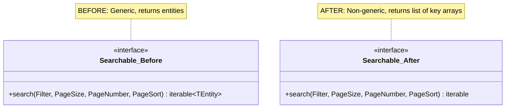
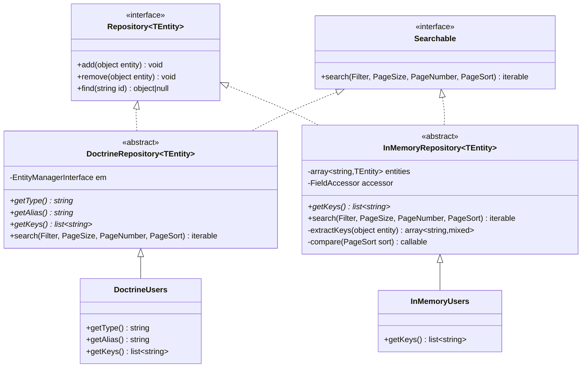
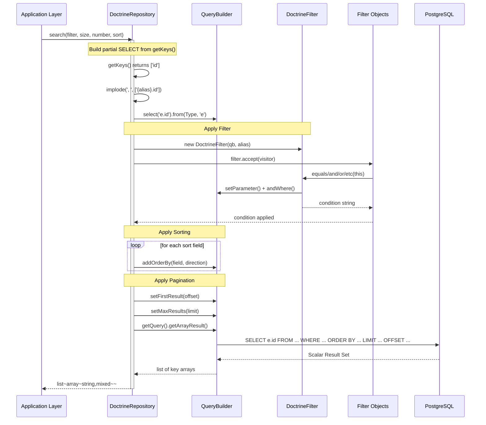
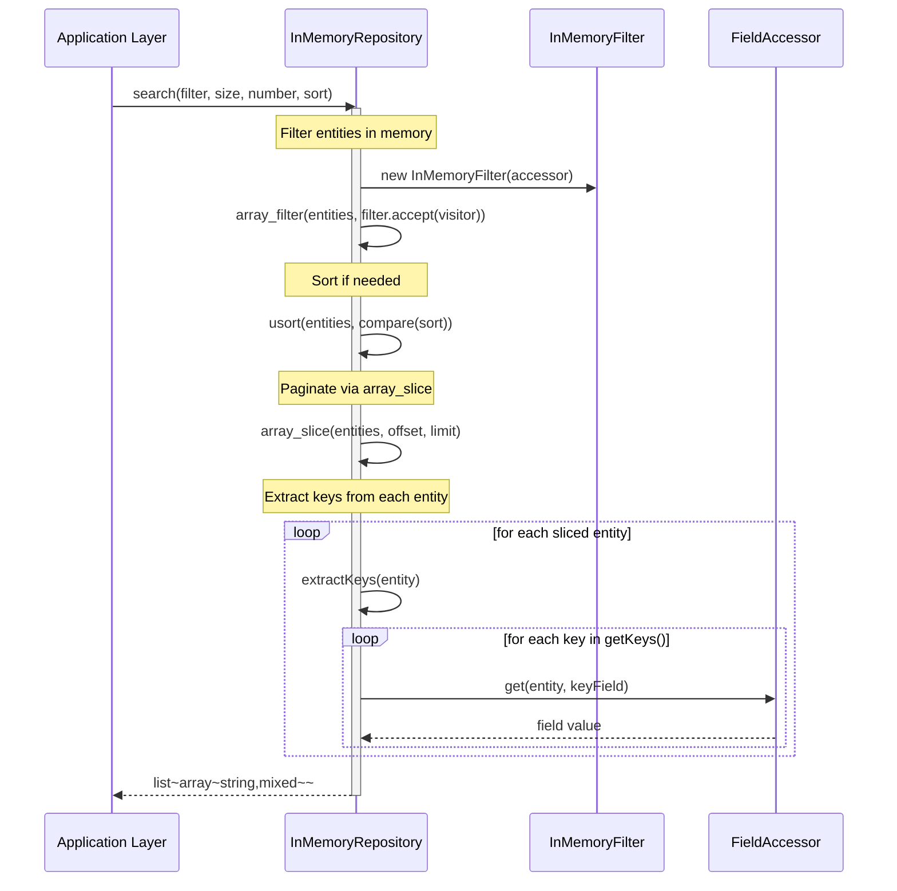

# Feature Request: Searchable Contract Return Type Refactor

**Document Version:** 1.0
**Date:** 2026-02-21
**Status:** Completed (commit b68417a)
**Priority:** High

---

## 1. Feature Overview

### 1.1 Description

This feature refactors the `Searchable::search()` contract to return composite key arrays (`list<array<string, mixed>>`)
instead of full entity objects (`iterable<TEntity>`). The change decouples search result sets from entity hydration,
enabling more efficient data retrieval patterns where callers only need identifiers to proceed with further operations.

Both `DoctrineRepository` and `InMemoryRepository` implementations were updated to project only key fields declared via
the new `getKeys()` abstract method. The `Searchable` interface lost its generic `@template-covariant TEntity` parameter,
becoming a simpler, non-generic contract.

### 1.2 Business Value and User Benefit

- **Performance**: Doctrine searches use `getArrayResult()` with a partial SELECT clause instead of full entity hydration,
  reducing memory usage and query overhead for list endpoints
- **Flexibility**: Callers receive lightweight key arrays that can be used for batch `find()` calls, cursor-based
  pagination, or passed to other services without coupling to entity structure
- **Composite key support**: The `getKeys()` method supports multi-field keys (e.g., `['user_id', 'game_id']`), preparing
  the codebase for join-table entities in future bounded contexts (Plays, Stats)
- **Consistency**: Both InMemory and Doctrine implementations now produce identical output format, eliminating test/prod
  divergence

### 1.3 Target Audience

- **Backend Developers**: Working with repository layer and data listing endpoints
- **Domain Modelers**: Designing entities with composite primary keys
- **QA Engineers**: Writing integration tests for search and pagination

---

## 2. Technical Architecture

### 2.1 High-Level Architectural Approach

The refactoring touches three architectural layers while preserving the dependency direction rule
(Infrastructure -> Application -> Domain -> Core):

1. **Core layer** -- `Searchable` interface: removed generic type parameter, changed return type PHPDoc from
   `iterable<TEntity>` to `list<array<string, mixed>>`
2. **Infrastructure layer** -- `DoctrineRepository` and `InMemoryRepository`: both abstract classes gained an
   `abstract public function getKeys(): array` method and updated `search()` implementations
3. **Test layer** -- `BaseRepository` assertions: expected values changed from entity comparisons to key-array
   comparisons

The change follows the **Template Method Pattern**: the abstract `getKeys()` defines which fields to project, while the
base `search()` implementation handles filtering, sorting, pagination, and key extraction.

### 2.2 Integration with Existing Codebase

The refactoring integrates at the following points:

1. **Modifies** `Bgl\Core\Listing\Searchable` -- contract change (return type)
2. **Modifies** `Bgl\Infrastructure\Persistence\Doctrine\DoctrineRepository` -- adds `getKeys()`, changes SELECT clause
   and result hydration
3. **Modifies** `Bgl\Infrastructure\Persistence\InMemory\InMemoryRepository` -- replaces `getKey()` with `getKeys()`,
   adds `extractKeys()` helper
4. **Modifies** concrete repositories (`Doctrine\Users`, `InMemory\Users`) -- implement `getKeys()` returning `['id']`
5. **Modifies** `tests/Integration/Repositories/BaseRepository.php` -- updates expected values to key arrays

### 2.3 Technology Stack and Dependencies

| Component    | Technology | Purpose              |
|--------------|------------|----------------------|
| PHP          | 8.4        | Runtime environment  |
| Doctrine ORM | ^3.0       | Database abstraction |
| PostgreSQL   | 15.2       | Primary database     |
| Codeception  | 5.3        | Testing framework    |

No new dependencies introduced. Uses existing `FieldAccessor` infrastructure for InMemory key extraction.

---

## 3. Class Diagrams

### 3.1 Searchable Contract (Before vs After)



### 3.2 Repository Hierarchy with getKeys()



---

## 4. Sequence Diagrams

### 4.1 DoctrineRepository::search() -- Key Projection Flow



### 4.2 InMemoryRepository::search() -- Key Extraction Flow



---

## 5. Public API / Interfaces

### 5.1 Searchable Interface (Changed)

```php
<?php

declare(strict_types=1);

namespace Bgl\Core\Listing;

use Bgl\Core\Listing\Filter\None;
use Bgl\Core\Listing\Page\PageNumber;
use Bgl\Core\Listing\Page\PageSize;
use Bgl\Core\Listing\Page\PageSort;

interface Searchable
{
    /**
     * @return list<array<string, mixed>> List of key arrays (e.g., [['id' => 'uuid-1'], ['id' => 'uuid-2']])
     */
    public function search(
        Filter $filter = None::Filter,
        PageSize $size = new PageSize(),
        PageNumber $number = new PageNumber(1),
        PageSort $sort = new PageSort([])
    ): iterable;
}
```

### 5.2 DoctrineRepository::getKeys() (New Abstract Method)

```php
/**
 * @return list<string> Key field names
 */
abstract public function getKeys(): array;
```

### 5.3 InMemoryRepository::getKeys() (Renamed from getKey())

```php
/**
 * @return list<string> Key field names
 */
abstract public function getKeys(): array;
```

### 5.4 Return Value Examples

| Entity Type  | getKeys() Returns              | search() Output Example                                    |
|--------------|--------------------------------|------------------------------------------------------------|
| User         | `['id']`                       | `[['id' => '550e8400-...'], ['id' => 'a1b2c3d4-...']]`    |
| Play (future)| `['user_id', 'game_id']`       | `[['user_id' => 'uuid-1', 'game_id' => 'uuid-2']]`        |

### 5.5 Key Behavioral Changes

| Aspect                     | Before                                   | After                                       |
|----------------------------|------------------------------------------|---------------------------------------------|
| Return type                | `iterable<TEntity>` (full entities)      | `list<array<string, mixed>>` (key arrays)   |
| Generic parameter          | `@template-covariant TEntity of object`  | None (non-generic)                           |
| Doctrine hydration         | `getResult()` (full ORM hydration)       | `getArrayResult()` (scalar projection)      |
| SELECT clause              | `SELECT e` (all columns)                 | `SELECT e.id` (key columns only)            |
| InMemory entity access     | Returned directly                        | Projected via `extractKeys()` + FieldAccessor|
| InMemory key method        | `getKey(): string` (single)              | `getKeys(): array` (composite)              |
| InMemory entity storage    | `TEntity[]`                              | `array<string, TEntity>` (keyed by first key)|

---

## 6. Directory Structure

### 6.1 Modified Files

```
src/
├── Core/
│   └── Listing/
│       ├── Fields/
│       │   └── AnyFieldAccessor.php       # MODIFIED - minor adjustment
│       ├── Page/
│       │   ├── PageSize.php               # MODIFIED - getValue() return type
│       │   └── TotalCount.php             # MODIFIED - enhanced
│       └── Searchable.php                 # MODIFIED - return type changed, generic removed
│
├── Infrastructure/
│   └── Persistence/
│       ├── Doctrine/
│       │   ├── DoctrineRepository.php     # MODIFIED - getKeys(), SELECT projection, getArrayResult()
│       │   └── Users.php                  # MODIFIED - implements getKeys()
│       └── InMemory/
│           ├── InMemoryFilter.php         # MODIFIED - improvements
│           ├── InMemoryRepository.php     # MODIFIED - getKeys(), extractKeys(), storage type
│           └── Users.php                  # MODIFIED - getKeys() replaces getKey()
│
tests/
├── Integration/
│   └── Repositories/
│       └── BaseRepository.php             # MODIFIED - expected values are key arrays
├── Support/
│   ├── Helpers/
│   │   └── StringHelper.php              # MODIFIED - minor
│   └── Repositories/
│       ├── TestDoctrineRepository.php     # MODIFIED - implements getKeys()
│       ├── TestEntity.php                 # MODIFIED - added status field
│       └── TestInMemoryRepository.php     # MODIFIED - getKeys() replaces getKey()
```

---

## 7. Code References

### 7.1 Core Contract Change

| File                               | Relevance                                              |
|------------------------------------|--------------------------------------------------------|
| `src/Core/Listing/Searchable.php`  | Central contract: return type changed to key arrays    |
| `src/Core/Listing/FilterVisitor.php` | Unchanged, but used by search implementations        |
| `src/Core/Listing/Field.php`       | Unchanged, used in filter operands                     |

### 7.2 Doctrine Implementation

| File                                                           | Relevance                                             |
|----------------------------------------------------------------|-------------------------------------------------------|
| `src/Infrastructure/Persistence/Doctrine/DoctrineRepository.php` | Added `getKeys()`, partial SELECT, `getArrayResult()` |
| `src/Infrastructure/Persistence/Doctrine/DoctrineFilter.php`   | Unchanged, produces WHERE conditions                  |
| `src/Infrastructure/Persistence/Doctrine/Users.php`            | Implements `getKeys()` returning `['id']`             |

### 7.3 InMemory Implementation

| File                                                             | Relevance                                                |
|------------------------------------------------------------------|----------------------------------------------------------|
| `src/Infrastructure/Persistence/InMemory/InMemoryRepository.php` | Replaced `getKey()` with `getKeys()`, added `extractKeys()` |
| `src/Infrastructure/Persistence/InMemory/InMemoryFilter.php`    | Minor improvements to closures                           |
| `src/Infrastructure/Persistence/InMemory/Users.php`             | Implements `getKeys()` returning `['id']`                |

### 7.4 Test Infrastructure

| File                                                     | Relevance                                       |
|----------------------------------------------------------|-------------------------------------------------|
| `tests/Integration/Repositories/BaseRepository.php`      | Expected values changed to `[['id' => '...']]`  |
| `tests/Support/Repositories/TestDoctrineRepository.php`  | Implements `getKeys()` returning `['id']`        |
| `tests/Support/Repositories/TestInMemoryRepository.php`  | Implements `getKeys()` returning `['id']`        |
| `tests/Support/Repositories/TestEntity.php`              | Added optional `status` field for richer tests   |

---

## 8. Implementation Considerations

### 8.1 Challenges Addressed

| Challenge                                  | Solution                                                         |
|--------------------------------------------|------------------------------------------------------------------|
| Breaking `Searchable<TEntity>` generic     | Removed generic parameter entirely; return type is now key arrays |
| InMemory key extraction without reflection | Used existing `FieldAccessor` infrastructure                     |
| Doctrine partial SELECT with key fields    | `implode()` on `getKeys()` to build `SELECT e.id, e.other_key`  |
| InMemory entity storage without getKey()   | Use first key from `getKeys()[0]` via FieldAccessor              |
| Pagination with nullable PageSize          | Added null-coalescing: `($limit ?? 0)` for offset calculation    |

### 8.2 Edge Cases Handled

1. **Empty entity set**: Both implementations return `[]` for empty collections
2. **Zero page size**: `DoctrineRepository` returns `[]` immediately when `PageSize(0)` is passed
3. **Page beyond data**: Returns `[]` (Doctrine via OFFSET, InMemory via `array_slice`)
4. **Null page size (no limit)**: Doctrine skips `setFirstResult`/`setMaxResults`; InMemory passes `null` to `array_slice`
5. **Single vs composite keys**: `getKeys()` supports both `['id']` and `['user_id', 'game_id']`

### 8.3 Performance Impact

| Aspect                   | Before                           | After                           |
|--------------------------|----------------------------------|---------------------------------|
| Doctrine SELECT          | All entity columns               | Only key columns                |
| Doctrine hydration       | Full ORM entity objects          | Scalar arrays (`getArrayResult`) |
| Memory per search result | Full entity graph                | Minimal key-value pairs         |
| InMemory projection      | Returned entities directly       | One `FieldAccessor::get()` per key per entity |

### 8.4 Backward Compatibility

This is a **breaking change** for any code that consumed `Searchable::search()` results as entity objects. However:

- At the time of implementation, no application-layer handlers used `search()` directly
- All consumers go through the `BaseRepository` test infrastructure which was updated simultaneously
- The `Repository::find()` method remains unchanged for entity retrieval by ID

---

## 9. Testing Strategy

### 9.1 Integration Tests (Main Focus)

All tests are defined in `BaseRepository` and run against both `DoctrineRepositoryCest` and `InMemoryRepositoryCest`:

| Test Method            | Scenario                   | Expected Return Value                              |
|------------------------|----------------------------|----------------------------------------------------|
| `testQueryDefaultCall` | `All::Filter`, 3 entities  | `[['id' => '1'], ['id' => '2'], ['id' => '3']]`   |
| `testQueryDefaultCall` | `All::Filter`, empty set   | `[]`                                               |
| `testFilter` (None)    | `None::Filter`             | `[]`                                               |
| `testFilter` (Equals)  | `Field('id') = '1'`        | `[['id' => '1']]`                                  |
| `testFilter` (Equals)  | `'c' = Field('value')`     | `[['id' => '3'], ['id' => '4']]`                   |
| `testFilter` (Greater) | `Field('id') > '2'`        | `[['id' => '3'], ['id' => '4']]`                   |
| `testFilter` (Less)    | `Field('value') < 'c'`     | `[['id' => '1'], ['id' => '2']]`                   |
| `testFilter` (AndX)    | `id='1' AND value='c'`     | `[]` (no match)                                    |
| `testFilter` (OrX)     | `id='1' OR value='b'`      | `[['id' => '1'], ['id' => '2']]`                   |
| `testSort`             | Descending by `id`         | `[['id' => '3'], ['id' => '2'], ['id' => '1']]`   |
| `testMultiSort`        | Desc value, Asc id         | `[['id' => '2'], ['id' => '1'], ['id' => '3']]`   |
| `testOffsetLimit`      | Page 1, size 1             | `[['id' => '1']]`                                  |
| `testOffsetLimit`      | Page 2, size 1             | `[['id' => '2']]`                                  |
| `testOffsetLimit`      | Page 1, size 0             | `[]`                                               |
| `testOffsetLimit`      | Page 5, size 10            | `[]` (beyond data)                                 |

### 9.2 Verification Commands

```bash
# Run repository integration tests
composer test:intg

# Run all quality checks
composer scan:all
```

---

## 10. Acceptance Criteria

### 10.1 Definition of Done

- [x] `Searchable::search()` returns `list<array<string, mixed>>` (composite key arrays)
- [x] Support for composite unique keys via `getKeys()` returning `list<string>`
- [x] Integration tests in `BaseRepository.php` updated with key-array expected values
- [x] Doctrine repository uses partial SELECT (`getKeys()` fields only) + `getArrayResult()`
- [x] InMemory repository uses `extractKeys()` via `FieldAccessor` for key projection
- [x] Concrete repositories (`Users`) implement `getKeys()` returning `['id']`
- [x] All tests pass (`composer scan:all`)

### 10.2 Measurable Success Criteria

| Metric                  | Target                                                       | Achieved |
|-------------------------|--------------------------------------------------------------|----------|
| Test pass rate          | 100% of `BaseRepository` tests for both Doctrine and InMemory | Yes      |
| Static analysis         | Zero Psalm errors at level 1                                 | Yes      |
| Architecture compliance | Zero deptrac violations                                      | Yes      |
| Both implementations    | Identical output format for identical input                   | Yes      |

---

## Appendix A: Diff Summary (commit b68417a)

14 files changed, 143 insertions, 74 deletions:

| File                                         | Change Type  | Key Modification                                    |
|----------------------------------------------|--------------|-----------------------------------------------------|
| `src/Core/Listing/Searchable.php`            | Modified     | Removed generic, changed return type PHPDoc         |
| `src/Core/Listing/Fields/AnyFieldAccessor.php` | Modified   | Minor adjustment                                    |
| `src/Core/Listing/Page/PageSize.php`         | Modified     | Return type improvement                             |
| `src/Core/Listing/Page/TotalCount.php`       | Modified     | Enhanced value object                               |
| `src/Infrastructure/.../DoctrineRepository.php` | Modified  | Added `getKeys()`, partial SELECT, `getArrayResult` |
| `src/Infrastructure/.../Doctrine/Users.php`  | Modified     | Added `getKeys()` returning `['id']`                |
| `src/Infrastructure/.../InMemoryFilter.php`  | Modified     | Closure improvements                                |
| `src/Infrastructure/.../InMemoryRepository.php` | Modified  | `getKey()`->`getKeys()`, `extractKeys()`, storage   |
| `src/Infrastructure/.../InMemory/Users.php`  | Modified     | `getKey()`->`getKeys()`                             |
| `tests/.../BaseRepository.php`               | Modified     | Expected values changed to key arrays               |
| `tests/Support/Helpers/StringHelper.php`     | Modified     | Minor                                               |
| `tests/.../TestDoctrineRepository.php`       | Modified     | Added `getKeys()` returning `['id']`                |
| `tests/.../TestEntity.php`                   | Modified     | Added optional `status` field                       |
| `tests/.../TestInMemoryRepository.php`       | Modified     | `getKey()`->`getKeys()`                             |
