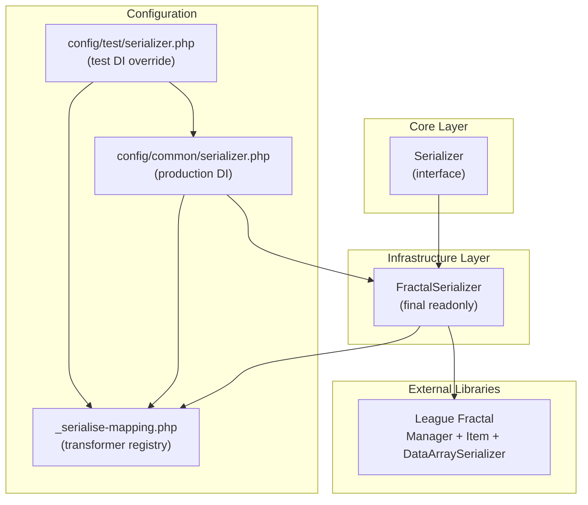

# Feature Documentation: Denormalization and Serialization Components (CORE-001)

**Document Version:** 1.0
**Feature Reference:** 0007-core-001-denormalization-serialization
**Date:** January 2026

---

## 1. Commit Message

```
feat(core): add serialization contract and FractalSerializer adapter

Introduce the Serializer contract in Core layer and FractalSerializer
adapter in Infrastructure layer using League Fractal. Add transformer
mapping registry as a centralized config file with callables for Date,
DateTime, DateInterval, and Ping Result.

Key changes:
- Add Serializer interface in Core/Serialization
- Add FractalSerializer implementing Serializer via League Fractal Manager
- Add _serialise-mapping.php as class-to-callable transformer registry
- Add DI config for production (DataArraySerializer) and test (TestEntity)
- Add integration tests: BaseSerializer with 3 scenarios, FractalSerializerCest
```

---

## 2. Pull Request Description

### What & Why

This PR adds the serialization layer for the BoardGameLog API. Domain objects returned by handlers need to be
transformed into JSON-friendly associative arrays before being sent as API responses. Rather than using Symfony
Serializer (heavy, reflection-based), this implementation uses League Fractal (lightweight, explicit transformers)
per ADR-010.

**Problem solved:** Without a serialization abstraction, each presentation handler would need to manually convert
domain objects to arrays, leading to duplicated transformation logic and no consistent output format.

**Business value:** Centralized, tested, and performance-optimized serialization with explicit control over what data
is exposed in API responses.

### Changes Made

**Core Layer:**

- `src/Core/Serialization/Serializer.php` -- Interface with single method `serialize(object $data): array`

**Infrastructure Layer:**

- `src/Infrastructure/Serialization/FractalSerializer.php` -- League Fractal adapter that looks up callables from a
  transformer mapping array, wraps data in a Fractal `Item`, and delegates to `Fractal\Manager`

**Configuration:**

- `config/_serialise-mapping.php` -- Transformer registry mapping class names to callable transformers for:
  `ValueObjects\Date`, `ValueObjects\DateTime`, `ValueObjects\DateInterval`, `Handlers\Ping\Result`
- `config/common/serializer.php` -- Production DI: creates `FractalSerializer` with `DataArraySerializer` and
  production mapping; aliases `Serializer::class` to `FractalSerializer::class`
- `config/test/serializer.php` -- Test DI override: extends production mapping with `TestEntity` transformer

**Tests:**

- `tests/Integration/Serialization/BaseSerializer.php` -- Abstract base with 3 test scenarios
- `tests/Integration/Serialization/FractalSerializerCest.php` -- Concrete integration test for Fractal

### Technical Details

**Patterns Used:**

- Ports & Adapters: `Serializer` (port) in Core, `FractalSerializer` (adapter) in Infrastructure
- Strategy Pattern: Transformer lookup by class name enables different serialization per domain type
- DI Alias: `Serializer::class => FractalSerializer::class` allows swapping implementations

**Key Implementation Decisions:**

1. **Callable transformers instead of TransformerAbstract classes** -- Closures in the mapping array avoid creating a
   class per domain object while remaining compatible with Fractal's `Item` resource
2. **DataArraySerializer** -- Returns `['data' => [...]]` format; `FractalSerializer` extracts `['data']` to return
   flat arrays
3. **Null transformer fallback** -- When no transformer exists for a class, `null` is passed; Fractal returns empty
   data, resulting in `[]`
4. **Centralized mapping file** -- `_serialise-mapping.php` serves as the transformer registry without needing a
   formal class

**Integration Points:**

- Implements `Bgl\Core\Serialization\Serializer` contract
- Used by future CORE-003 (Mediator) for response serialization
- Transformer mapping includes `Ping\Result` DTO used by the `/ping` health endpoint

### Testing

**Automated Tests Added:**

| Test                                           | Description                                         |
|------------------------------------------------|-----------------------------------------------------|
| `BaseSerializer::testSerializeSimpleObject`    | Serialize TestEntity with all fields populated      |
| `BaseSerializer::testSerializeObjectWithNullField` | Serialize TestEntity with null status field     |
| `BaseSerializer::testSerializeNestedObject`    | Serialize Ping Result with nested DateTime/Interval |

Test groups: `core`, `serialization`, `serializer`

```bash
# Run serialization tests
composer test:intg -- --group serializer
```

### Breaking Changes

None. This is a new feature that does not modify existing public APIs.

### Checklist

- [x] Code follows PSR-12 style guidelines
- [x] `declare(strict_types=1)` present in all files
- [x] `composer scan:all` passes
- [x] Tests added for new functionality
- [x] No Deptrac violations
- [x] ADR-009 (League preference) and ADR-010 (Serialization decision) referenced

---

## 3. Feature Documentation

### Overview

The serialization layer transforms domain objects (entities, value objects, DTOs) into associative arrays suitable for
JSON API responses. It provides a single contract (`Serializer`) that the presentation layer depends on, with the
`FractalSerializer` as the concrete implementation backed by League Fractal.

**When to use:**

- Transforming handler results into API response payloads
- Serializing value objects (`Date`, `DateTime`, `DateInterval`) with consistent format
- Any place where a domain object needs to be converted to an array for output

### Usage Guide

#### Adding a New Transformer

To serialize a new domain object, add an entry to `config/_serialise-mapping.php`:

```php
use Bgl\Domain\Games\Entities\Game;

return [
    // ... existing mappings ...

    Game::class => static fn(Game $game) => [
        'id' => (string) $game->id(),
        'name' => $game->name(),
        'minPlayers' => $game->minPlayers(),
        'maxPlayers' => $game->maxPlayers(),
    ],
];
```

#### Serializing an Object

Inject the `Serializer` contract and call `serialize()`:

```php
use Bgl\Core\Serialization\Serializer;

final readonly class SomeHandler
{
    public function __construct(
        private Serializer $serializer,
    ) {
    }

    public function handle(object $result): array
    {
        return $this->serializer->serialize($result);
        // Returns: ['id' => '...', 'name' => '...', ...]
    }
}
```

#### Handling Nested Objects

Transformers can return nested structures. For example, the `Ping\Result` transformer returns a nested `datetime`
object that is itself a `DateTime` value object:

```php
Handlers\Ping\Result::class => static fn(Handlers\Ping\Result $model) => [
    'message_id' => $model->messageId,
    'datetime' => $model->datetime->isNull() ? null : $model->datetime,
    // When 'datetime' is a DateTime VO, Fractal will serialize it
    // using the DateTime transformer, producing:
    // ['timestamp' => '...', 'datetime' => '...']
],
```

#### Test Environment

The test DI config extends the production mapping with test-specific transformers:

```php
// config/test/serializer.php
return [
    FractalSerializer::class => static function (ContainerInterface $container): FractalSerializer {
        $manager = $container->get(Manager::class);

        return new FractalSerializer(
            $manager, (require __DIR__ . '/../_serialise-mapping.php') + [
                TestEntity::class => static fn(TestEntity $entity) => [
                    'id' => $entity->getId(),
                    'value' => $entity->getValue(),
                    'status' => $entity->getStatus(),
                ],
            ]
        );
    },
];
```

### API Reference

#### Serializer Interface

```php
namespace Bgl\Core\Serialization;

interface Serializer
{
    /**
     * Serialize a domain object to an associative array.
     *
     * @param object $data Domain object (entity, VO, DTO)
     * @return array Serialized key-value pairs
     */
    public function serialize(object $data): array;
}
```

#### FractalSerializer Class

```php
namespace Bgl\Infrastructure\Serialization;

final readonly class FractalSerializer implements Serializer
{
    /**
     * @param Manager $manager   Fractal Manager configured with DataArraySerializer
     * @param array   $transformer Class-to-callable transformer mapping
     */
    public function __construct(
        private Manager $manager,
        private array $transformer,
    );

    public function serialize(object $data): array;
}
```

**Behavior:**

| Input                              | Output                           |
|------------------------------------|----------------------------------|
| Object with registered transformer | Associative array from callable  |
| Object without transformer         | Empty array `[]`                 |
| Object with nested VO transformer  | Nested associative array         |

### Architecture

#### Component Diagram



#### Dependency Direction

```
Core (Serializer interface)
  ^
  |  implements
  |
Infrastructure (FractalSerializer)
  |
  |  uses
  v
League Fractal (external library)
```

This follows the Architectural Dependency Law: Infrastructure depends on Core, never reverse.

### Troubleshooting

#### Common Issues and Solutions

**Issue: serialize() returns empty array for a domain object**

Cause: No transformer registered for the object's class in `_serialise-mapping.php`.

Solution: Add a transformer entry for the class:

```php
// config/_serialise-mapping.php
MyEntity::class => static fn(MyEntity $entity) => [
    'id' => $entity->id(),
    // ...
],
```

**Issue: Nested object not serialized, appears as object in array**

Cause: Fractal does not automatically detect nested objects. The transformer must explicitly handle nested output or
return the nested object so Fractal can apply its transformer.

Solution: Return the nested object directly in the transformer; ensure the nested class also has a registered
transformer:

```php
'datetime' => $model->datetime->isNull() ? null : $model->datetime,
```

**Issue: Different serialization needed for same class in different contexts**

Cause: The current registry maps one transformer per class.

Solution: For now, create a wrapper DTO for the alternative context, each with its own transformer. Future schema-based
serialization (ADR-011) will support context-aware output via `x-source` mappings.

#### Error Messages Explained

| Error Message / Behavior              | Meaning                                      | Resolution                                    |
|---------------------------------------|----------------------------------------------|-----------------------------------------------|
| Empty array `[]` returned             | No transformer for class                     | Add mapping in `_serialise-mapping.php`       |
| TypeError on `serialize()`            | Non-object passed                            | Ensure argument is an object                  |
| Null value in nested field            | Transformer returns null for nullable field  | Expected behavior for nullable properties     |

---

## 4. CHANGELOG Entry

```markdown
## [Unreleased]

### Added

- Serializer contract in Core layer (`Bgl\Core\Serialization\Serializer`)
- FractalSerializer adapter using League Fractal (`Bgl\Infrastructure\Serialization\FractalSerializer`)
- Transformer mapping registry for Date, DateTime, DateInterval, and Ping Result
- DI configuration for production and test environments
- Integration tests for serialization layer
```

---

## 5. Related Files

| File                                                         | Description                                    |
|--------------------------------------------------------------|------------------------------------------------|
| `src/Core/Serialization/Serializer.php`                      | Core serializer contract (interface)           |
| `src/Infrastructure/Serialization/FractalSerializer.php`      | League Fractal adapter implementation          |
| `config/_serialise-mapping.php`                               | Transformer registry (class => callable)       |
| `config/common/serializer.php`                                | Production DI configuration                    |
| `config/test/serializer.php`                                  | Test DI configuration override                 |
| `tests/Integration/Serialization/BaseSerializer.php`          | Abstract base test with shared scenarios       |
| `tests/Integration/Serialization/FractalSerializerCest.php`   | Fractal-specific integration test             |
| `src/Core/ValueObjects/Date.php`                              | Date value object (has transformer)            |
| `src/Core/ValueObjects/DateTime.php`                          | DateTime value object (has transformer)        |
| `src/Core/ValueObjects/DateInterval.php`                      | DateInterval value object (has transformer)    |
| `src/Application/Handlers/Ping/Result.php`                    | Ping result DTO (has transformer)              |
| `docs/03-decisions/009-league-php-preference.md`              | ADR: League ecosystem preference               |
| `docs/03-decisions/010-serialization-hydration.md`            | ADR: Fractal + EventSauce decision             |
| `docs/03-decisions/011-unified-route-configuration.md`        | ADR: Future schema-based approach              |
