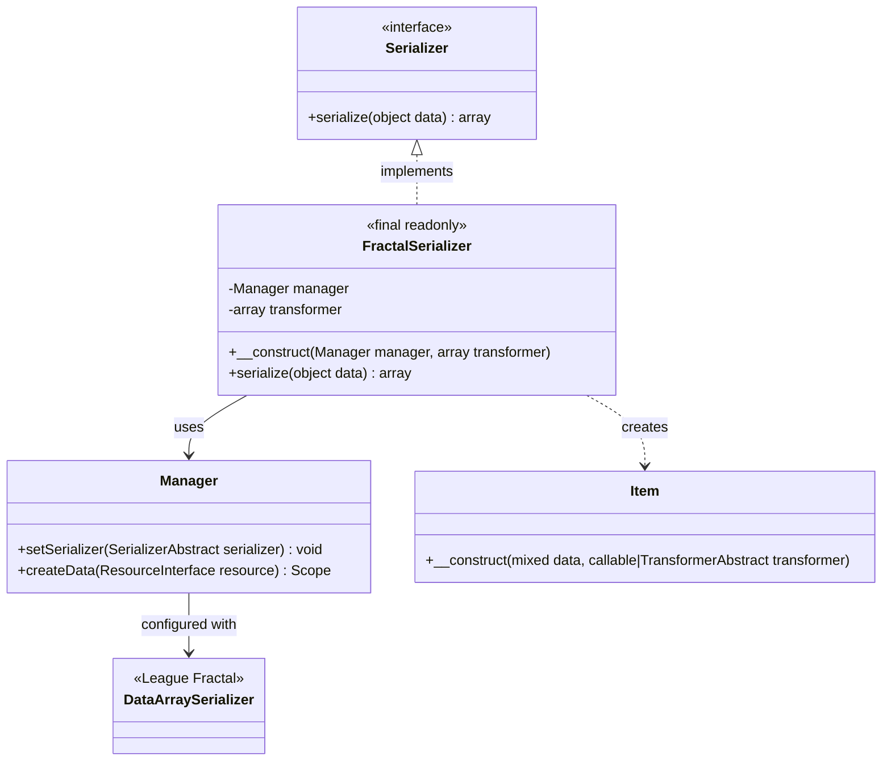
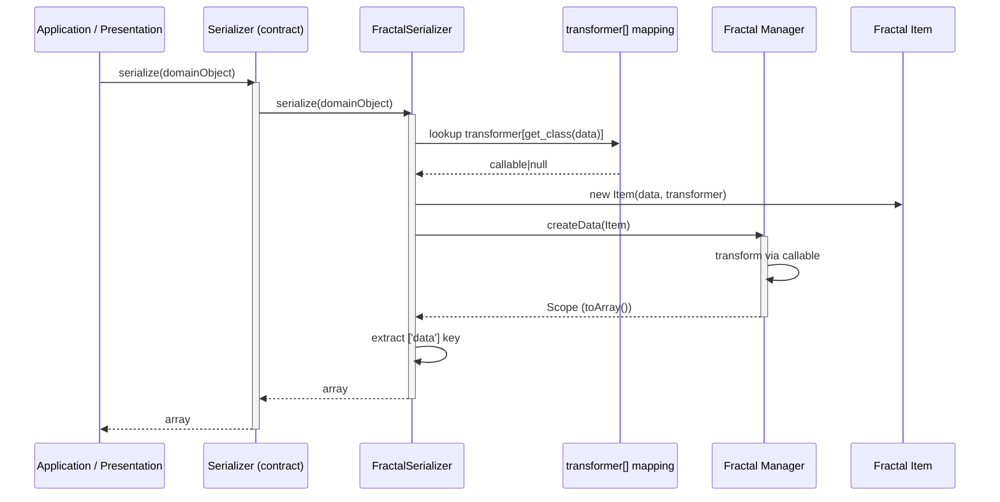
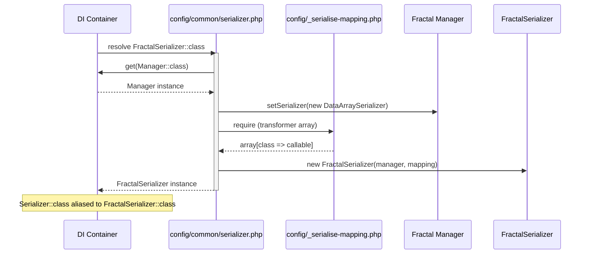
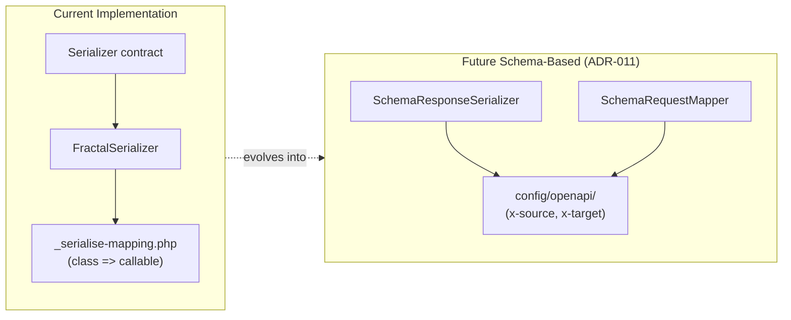

# Feature Request: Denormalization and Serialization Components (CORE-001)

**Document Version:** 1.0
**Date:** 2026-01-05
**Status:** Completed
**Priority:** High (Foundation, Sprint 0)

---

## 1. Feature Overview

### 1.1 Description

This feature introduces the serialization layer for transforming domain objects into API response payloads. It consists
of a core `Serializer` contract in the domain layer and a `FractalSerializer` adapter in the infrastructure layer
backed by League Fractal. Transformer mappings are maintained in a centralized configuration file that acts as a
lightweight transformer registry, mapping PHP class names to callable transformers. DI container configuration wires
everything together for production and test environments.

The BACKLOG originally scoped this task as "Schema-Based Request/Response Mapping" using OpenAPI `x-target` /
`x-source` extensions. The implemented scope is narrower: it covers the outbound serialization pipeline only. The
inbound denormalization pipeline (request hydration via EventSauce Object Hydrator) and the OpenAPI schema-driven
mapper/serializer remain as future work (see Section 8).

### 1.2 Business Value and User Benefit

- **Domain Isolation**: Business logic returns domain objects; serialization is handled at the infrastructure boundary
- **Explicit Output Control**: Each domain class has a clearly defined transformer, making API response structure
  predictable and auditable
- **Testability**: The `Serializer` contract enables swapping implementations in tests, with the test DI config
  extending the production mapping for test entities
- **Performance**: League Fractal provides approximately 3-4x better performance than Symfony Serializer for typical
  API serialization use cases (see ADR-010)
- **Ecosystem Alignment**: Follows League PHP preference established in ADR-009

### 1.3 Target Audience

- **Backend Developers**: Defining transformers for new domain objects, integrating serialization into handlers
- **API Consumers**: Receiving consistently structured JSON responses
- **QA Engineers**: Writing integration tests that verify serialization output

---

## 2. Technical Architecture

### 2.1 High-Level Architectural Approach

The implementation follows the **Ports & Adapters** pattern:

- **Port (Core)**: `Bgl\Core\Serialization\Serializer` -- an interface defining the serialization contract
- **Adapter (Infrastructure)**: `Bgl\Infrastructure\Serialization\FractalSerializer` -- implementation using
  `League\Fractal\Manager` with a class-to-transformer mapping array

Transformer definitions are plain PHP callables stored in `config/_serialise-mapping.php`. The `FractalSerializer`
uses `get_class($data)` to look up the appropriate transformer at runtime, wraps the data in a Fractal `Item`
resource, and delegates serialization to `League\Fractal\Manager`.

This approach avoids the need for a formal `TransformerRegistry` class -- the PHP array serves as the registry,
and the DI container handles instantiation and injection.

### 2.2 Integration with Existing Codebase

1. **Core Layer**: `Serializer` interface lives alongside other core contracts (`Messages`, `Collections`, `Listing`)
2. **Infrastructure Layer**: `FractalSerializer` sits in `Infrastructure/Serialization/`, parallel to
   `Infrastructure/Persistence/` and `Infrastructure/MessageBus/`
3. **DI Container**: Wired via `config/common/serializer.php` (production) and `config/test/serializer.php` (test
   override with additional test entity mappings)
4. **Presentation Layer**: Response objects (`SuccessResponse`, `PingResponse`) carry domain data; the serializer
   transforms it before JSON encoding (integration via future CORE-003 Mediator)

### 2.3 Technology Stack and Dependencies

| Component      | Technology            | Purpose                           |
|----------------|-----------------------|-----------------------------------|
| PHP            | 8.4                   | Runtime environment               |
| League Fractal | ^0.21.0               | API response transformation       |
| Slim 4         | Framework             | HTTP layer (consumes serializer)  |
| Codeception    | 5.x                   | Testing framework                 |

**ADR References:**

- ADR-009: League PHP Ecosystem Preference
- ADR-010: Serialization and Hydration (Fractal and EventSauce)
- ADR-011: Unified Route Configuration (future schema-based serialization)

---

## 3. Class Diagram



---

## 4. Sequence Diagram

### 4.1 Serialization Flow



### 4.2 DI Container Wiring



---

## 5. Public API / Interfaces

### 5.1 Serializer Contract

```php
<?php

declare(strict_types=1);

namespace Bgl\Core\Serialization;

interface Serializer
{
    public function serialize(object $data): array;
}
```

**Method:** `serialize(object $data): array`

| Parameter | Type     | Description                                    |
|-----------|----------|------------------------------------------------|
| `$data`   | `object` | Domain object to serialize (entity, DTO, etc.) |
| Return    | `array`  | Flat associative array of serialized data      |

### 5.2 FractalSerializer Implementation

```php
<?php

declare(strict_types=1);

namespace Bgl\Infrastructure\Serialization;

use Bgl\Core\Serialization\Serializer;
use League\Fractal\Manager;
use League\Fractal\Resource\Item;

final readonly class FractalSerializer implements Serializer
{
    public function __construct(
        private Manager $manager,
        private array $transformer,
    ) {
    }

    public function serialize(object $data): array
    {
        return $this->manager->createData(
            new Item(
                data: $data,
                transformer: $this->transformer[get_class($data)] ?? null,
            )
        )->toArray()['data'] ?? [];
    }
}
```

### 5.3 Transformer Mapping Registry

The transformer registry is a PHP array in `config/_serialise-mapping.php`, mapping fully-qualified class names to
callable transformers:

```php
<?php

declare(strict_types=1);

use Bgl\Application\Handlers;
use Bgl\Core\ValueObjects;

return [
    ValueObjects\Date::class => static fn(ValueObjects\Date $model) => [
        'timestamp' => $model->getNullableFormattedValue('c'),
        'date' => $model->getNullableFormattedValue('Y-m-d'),
    ],
    ValueObjects\DateTime::class => static fn(ValueObjects\DateTime $model) => [
        'timestamp' => $model->getNullableFormattedValue('c'),
        'datetime' => $model->getNullableFormattedValue(DATE_W3C),
    ],
    ValueObjects\DateInterval::class => static fn(ValueObjects\DateInterval $model) => [
        'seconds' => $model->getSeconds(),
        'interval' => $model->getIso(),
    ],
    Handlers\Ping\Result::class => static fn(Handlers\Ping\Result $model) => [
        'message_id' => $model->messageId,
        'parent_id' => $model->parentId,
        'trace_id' => $model->traceId,
        'environment' => $model->environment,
        'version' => $model->version,
        'datetime' => $model->datetime->isNull() ? null : $model->datetime,
        'delay' => $model->delay ? [
            'seconds' => $model->delay->getSeconds(),
            'interval' => $model->delay->getIso(),
        ] : null,
    ],
];
```

### 5.4 Expected Inputs and Outputs

| Input Object                 | Transformer Output                                                     |
|------------------------------|------------------------------------------------------------------------|
| `ValueObjects\Date`         | `['timestamp' => 'ISO string', 'date' => 'Y-m-d']`                    |
| `ValueObjects\DateTime`     | `['timestamp' => 'ISO string', 'datetime' => 'W3C datetime']`         |
| `ValueObjects\DateInterval` | `['seconds' => int, 'interval' => 'ISO 8601 duration']`               |
| `Handlers\Ping\Result`      | `['message_id' => str, 'parent_id' => str, ...]` with nested objects  |
| Unknown class (no mapping)  | `[]` (empty array, null transformer)                                   |

### 5.5 Error Handling Approach

| Scenario                     | Handling                                                                |
|------------------------------|-------------------------------------------------------------------------|
| No transformer for class     | `null` transformer passed to Fractal Item; returns empty array `[]`    |
| Transformer throws exception | Exception propagates to caller (no internal catch)                      |
| Non-object input             | PHP type error at `serialize(object $data)` signature                   |
| Nested object serialization  | Transformer returns nested object (e.g., `DateTime`); Fractal recurses |

---

## 6. Directory Structure

### 6.1 Source Files

```
src/
├── Core/
│   └── Serialization/
│       └── Serializer.php              # Contract interface
│
└── Infrastructure/
    └── Serialization/
        └── FractalSerializer.php       # League Fractal adapter
```

### 6.2 Configuration Files

```
config/
├── _serialise-mapping.php              # Transformer registry (class => callable)
├── common/
│   └── serializer.php                  # Production DI config
└── test/
    └── serializer.php                  # Test DI override (adds TestEntity mapping)
```

### 6.3 Test Files

```
tests/
├── Integration/
│   └── Serialization/
│       ├── BaseSerializer.php          # Abstract base with shared test scenarios
│       └── FractalSerializerCest.php   # Concrete Fractal integration tests
└── Support/
    └── Repositories/
        └── TestEntity.php              # Test entity used in serialization tests
```

---

## 7. Code References

### 7.1 Core Contract

| File                                   | Relevance                        |
|----------------------------------------|----------------------------------|
| `src/Core/Serialization/Serializer.php` | The serializer interface (port) |

### 7.2 Infrastructure Implementation

| File                                                  | Relevance                                         |
|-------------------------------------------------------|---------------------------------------------------|
| `src/Infrastructure/Serialization/FractalSerializer.php` | League Fractal adapter implementation           |

### 7.3 Configuration

| File                               | Relevance                                                    |
|------------------------------------|--------------------------------------------------------------|
| `config/_serialise-mapping.php`    | Transformer registry: class-to-callable mapping              |
| `config/common/serializer.php`     | Production DI: wires Manager, DataArraySerializer, mapping   |
| `config/test/serializer.php`       | Test DI: extends production mapping with TestEntity callable |

### 7.4 ADR References

| File                                            | Relevance                              |
|-------------------------------------------------|----------------------------------------|
| `docs/03-decisions/009-league-php-preference.md` | Justification for League Fractal      |
| `docs/03-decisions/010-serialization-hydration.md` | Detailed comparison and decision    |
| `docs/03-decisions/011-unified-route-configuration.md` | Future schema-based approach     |

### 7.5 Tests

| File                                                         | Relevance                                       |
|--------------------------------------------------------------|-------------------------------------------------|
| `tests/Integration/Serialization/BaseSerializer.php`          | Base test class with 3 shared test scenarios    |
| `tests/Integration/Serialization/FractalSerializerCest.php`   | Concrete Fractal integration test              |

### 7.6 Domain Objects with Transformers

| File                                             | Relevance                                       |
|--------------------------------------------------|-------------------------------------------------|
| `src/Core/ValueObjects/Date.php`                 | Date value object (has transformer)             |
| `src/Core/ValueObjects/DateTime.php`             | DateTime value object (has transformer)         |
| `src/Core/ValueObjects/DateInterval.php`         | DateInterval value object (has transformer)     |
| `src/Application/Handlers/Ping/Result.php`       | Ping result DTO (has transformer with nesting)  |

---

## 8. Implementation Considerations

### 8.1 What Was Implemented vs. BACKLOG Scope

The BACKLOG defines CORE-001 as "Schema-Based Request/Response Mapping" with `SchemaRequestMapper` (`x-target`) and
`SchemaResponseSerializer` (`x-source`) contracts driven by OpenAPI configuration. The actual implementation covers
a subset:

| BACKLOG Scope                                  | Implementation Status  |
|------------------------------------------------|------------------------|
| `Serializer` contract (outbound)               | Completed              |
| `FractalSerializer` adapter                    | Completed              |
| Transformer registry (class-to-callable map)   | Completed (config file)|
| DI configuration (production + test)           | Completed              |
| Integration tests                              | Completed              |
| `SchemaRequestMapper` (`x-target` hydration)   | Not implemented        |
| `SchemaResponseSerializer` (`x-source` schema) | Not implemented        |
| `SauceDenormalizer` (EventSauce)               | Not implemented        |
| OpenAPI schema integration                     | Not implemented        |
| Pipe syntax (`\|date:c`, `\|nullable`)          | Not implemented        |

The schema-based approach described in ADR-011 represents the target architecture for future iterations.

### 8.2 Design Decisions

1. **Array-based transformer registry** instead of a formal `TransformerRegistry` class: Keeps configuration simple
   and avoids premature abstraction. The array can be promoted to a class if dynamic registration or caching is
   needed in the future.

2. **Callable transformers** instead of `TransformerAbstract` subclasses: The `FractalSerializer` accepts plain
   callables (closures) in the mapping array. This avoids creating a class per domain object while still being
   compatible with Fractal's `Item` resource.

3. **`DataArraySerializer`** as the Fractal serializer: Returns data in `['data' => [...]]` format. The
   `FractalSerializer` extracts the `['data']` key to return a flat array.

4. **Null transformer fallback**: When no transformer is registered for a class, `null` is passed to Fractal `Item`.
   This produces an empty array rather than throwing an exception, enabling graceful degradation.

### 8.3 Potential Challenges

| Challenge                                | Mitigation                                                      |
|------------------------------------------|-----------------------------------------------------------------|
| Nested object serialization              | Transformers can return nested objects; Fractal handles recursion|
| Missing transformer for new domain class | Returns empty array; caught by integration tests                |
| Transformer mapping grows large          | Can be split into per-context files merged in `_serialise-mapping.php` |
| Thread safety of Fractal Manager         | Manager is created per-request via DI container                 |

### 8.4 Edge Cases

1. **Null-safe nested objects**: The `Ping\Result` transformer handles nullable `delay` and uses `isNull()` check
   on `DateTime` value object
2. **Empty transformer map**: If `_serialise-mapping.php` returns an empty array, all serializations return `[]`
3. **Same class, different contexts**: Currently one transformer per class; if different contexts need different
   output, the mapping must be refactored (e.g., context-aware registry)

### 8.5 Performance

- League Fractal is approximately 3-4x faster than Symfony Serializer for typical API payloads (ADR-010 benchmarks)
- Callable transformers avoid reflection overhead
- `get_class()` lookup is O(1) on the array

### 8.6 Security

- Transformers explicitly define output fields, preventing accidental exposure of internal properties
- No automatic serialization that could leak sensitive data
- `x-*` extensions in OpenAPI config (future) will be stripped from public export

---

## 9. Testing Strategy

### 9.1 Integration Tests (Main Focus)

The `BaseSerializer` abstract class defines 3 test scenarios, inherited by `FractalSerializerCest`:

| Test Method                          | Scenario                                     | Assertions                                              |
|--------------------------------------|----------------------------------------------|---------------------------------------------------------|
| `testSerializeSimpleObject`          | Serialize `TestEntity` with all fields set   | Array contains `id`, `value`, `status` with correct values |
| `testSerializeObjectWithNullField`   | Serialize `TestEntity` with null `status`    | Array contains `id`, `value`; `status` is `null`        |
| `testSerializeNestedObject`          | Serialize `Ping\Result` with nested VOs      | Nested `datetime` and `delay` arrays with correct values |

### 9.2 Test Configuration

The test DI config (`config/test/serializer.php`) extends the production mapping with a `TestEntity` transformer:

```php
TestEntity::class => static fn(TestEntity $entity) => [
    'id' => $entity->getId(),
    'value' => $entity->getValue(),
    'status' => $entity->getStatus(),
],
```

### 9.3 Coverage Gaps and Future Tests

| Gap                                     | Priority | Notes                                       |
|-----------------------------------------|----------|---------------------------------------------|
| Unknown class (no transformer)          | Medium   | Should verify empty array return             |
| Large collection serialization          | Low      | Performance test for collection support      |
| Concurrent transformer registration     | Low      | Not applicable with current array approach   |

---

## 10. Acceptance Criteria

### 10.1 Definition of Done (Completed)

- [x] `Serializer` contract defined in `src/Core/Serialization/`
- [x] `FractalSerializer` implementation in `src/Infrastructure/Serialization/`
- [x] Transformer mapping in `config/_serialise-mapping.php` for `Date`, `DateTime`, `DateInterval`, `Ping\Result`
- [x] DI configuration for production (`config/common/serializer.php`)
- [x] DI configuration for tests (`config/test/serializer.php`) with `TestEntity` transformer
- [x] Integration tests in `tests/Integration/Serialization/` passing
- [x] Code passes `composer scan:all` (all quality checks)
- [x] No Psalm errors introduced
- [x] Architecture tests pass (`composer dt:run`)

### 10.2 Remaining BACKLOG Items (Not in Scope)

- [ ] `SchemaRequestMapper` contract for mapping HTTP request to array via `x-target`
- [ ] `SchemaResponseSerializer` contract for serializing domain objects via `x-source`
- [ ] EventSauce Object Hydrator integration (`SauceDenormalizer`)
- [ ] Support for nested objects and `$ref` resolution in schema
- [ ] Pipe syntax support (`|date:c`, `|nullable`, `|int`, `|datetime`, etc.)
- [ ] Integration with OpenAPI config schemas from `config/openapi/`

### 10.3 Verification Commands

```bash
# Run serialization integration tests
composer test:intg -- --group serializer

# Run all quality checks
composer scan:all

# Run architecture tests
composer dt:run
```

---

## Appendix A: Relationship to Future CORE-001 Schema Work

The current implementation provides a working serialization layer that is used by CORE-003 (Mediator Pattern)
for serializing handler results into API responses. The BACKLOG vision for CORE-001 describes a more
ambitious schema-driven approach using OpenAPI `x-source`/`x-target` extensions (ADR-011). When that work is
undertaken, the existing `Serializer` contract can be replaced or extended with the `SchemaResponseSerializer`,
and the callable-based transformer mapping can evolve into schema-driven property extraction.


