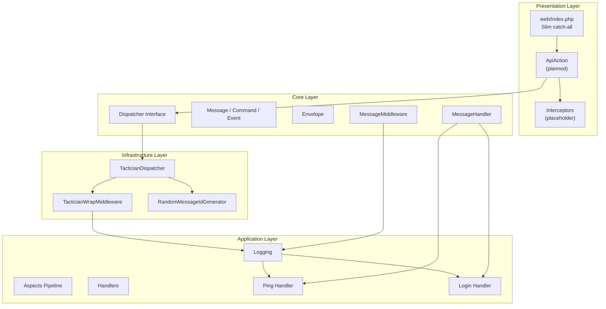
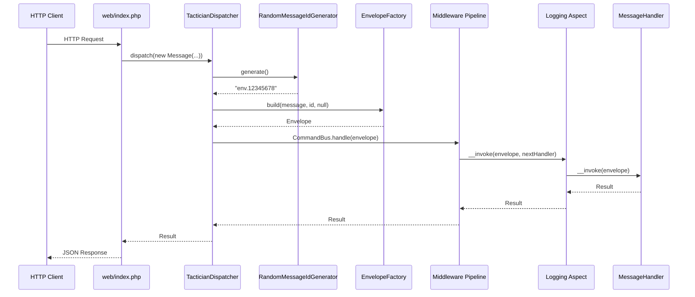

# Feature Documentation: Mediator Pattern and Unified API Entry Point

**Document Version:** 1.0
**Feature Reference:** 0008-core-003-mediator-pattern
**Date:** January 2026

---

## 1. Commit Message

```
feat(core): implement mediator pattern with unified API entry point

Implement the Mediator Pattern providing a unified Dispatcher interface,
Envelope-based message tracing, and middleware pipeline for cross-cutting
concerns. The Tactician command bus is wrapped behind project-owned
contracts to maintain infrastructure independence.

Key changes:
- Add Core message contracts: Message, Command, Event, Dispatcher,
  MessageHandler, MessageMiddleware, Envelope, EnvelopeFactory
- Add TacticianDispatcher implementing Dispatcher with handler mapping
  and middleware pipeline via TacticianWrapMiddleware adapter
- Add Logging aspect as first MessageMiddleware implementation
- Add Ping handler as reference implementation with /ping endpoint
- Add web/index.php catch-all route delegating to ApiAction
- Add OpenAPI route configuration for /ping per ADR-011
- Add RandomMessageIdGenerator with environment-prefixed IDs

Technical decisions:
- Envelope wraps every Message with messageId, parentId, traceId for
  distributed tracing across nested dispatches
- TacticianWrapMiddleware adapts project MessageMiddleware to Tactician
  Middleware interface, checking instanceof Envelope for dual-mode support
- Child DI Container created per dispatcher for handler resolution,
  wrapping the parent container for other services
- Middleware pipeline order defined in config/common/bus.php
```

---

## 2. Pull Request Description

### What & Why

This PR implements the Mediator Pattern as the central communication mechanism between Presentation and Application
layers in the BoardGameLog API. It addresses the need for decoupled, extensible request processing with consistent
cross-cutting concern handling.

**Problem solved:** Without a mediator, controllers would directly depend on specific handlers, creating tight coupling
between layers. Adding cross-cutting concerns (logging, transactions) would require modifying every handler individually.

**Business value:** The Mediator Pattern enables a single entry point for all API requests, consistent middleware
processing, distributed message tracing, and straightforward addition of new endpoints by creating Message/Handler pairs
and route configuration entries.

### Changes Made

**Core Layer (`src/Core/Messages/`):**

- `Message.php` -- base message interface with generic `TResult` template
- `Command.php` -- state-changing message extending `Message<TResult>`
- `Event.php` -- notification message extending `Message<null>`
- `Dispatcher.php` -- message bus contract with `dispatch(Message, ?Envelope)` signature
- `Envelope.php` -- immutable readonly wrapper with `messageId`, `parentId`, `traceId`, `at`, `headers`
- `EnvelopeFactory.php` -- creates envelopes with parent trace propagation
- `MessageHandler.php` -- handler contract with generic message/result typing
- `MessageIdGenerator.php` -- ID generation contract returning `non-empty-string`
- `MessageMiddleware.php` -- aspect contract operating on `Envelope` + `MessageHandler`

**Application Layer:**

- `Application/Aspects/Logging.php` -- first aspect implementation: logs start, finish, and errors with message class
  and envelope context
- `Application/Handlers/Ping/Command.php` -- reference message with `DateTimeImmutable` for delay calculation
- `Application/Handlers/Ping/Handler.php` -- reference handler demonstrating clock usage and envelope tracing
- `Application/Handlers/Ping/Result.php` -- structured result with datetime, delay, version, environment, tracing IDs

**Infrastructure Layer:**

- `Infrastructure/MessageBus/Tactician/TacticianDispatcher.php` -- primary `Dispatcher` implementation wrapping
  Tactician `CommandBus` with project middleware and child DI container for handler resolution
- `Infrastructure/MessageBus/Tactician/TacticianWrapMiddleware.php` -- adapts `MessageMiddleware` to Tactician
  `Middleware` with `Envelope` detection for dual-mode support
- `Infrastructure/MessageBus/Tactician/TacticianCommandNameExtractor.php` -- extracts message class from `Envelope`
- `Infrastructure/MessageBus/Tactician/NextHandler.php` -- bridges `callable $next` to `MessageHandler`
- `Infrastructure/MessageId/RandomMessageIdGenerator.php` -- environment-prefixed random ID generator

**Presentation Layer:**

- `Presentation/Api/Controller.php` -- stub class (placeholder for future use)
- `Presentation/Api/Interceptors/` -- empty directory (placeholder for HTTP interceptors)
- `Presentation/Api/V1/Responses/SuccessResponse.php` -- success response with data and pagination
- `Presentation/Api/V1/Responses/ErrorResponse.php` -- error response with validation errors and exception details
- `Presentation/Api/V1/Responses/PingResponse.php` -- stub (placeholder)
- `Presentation/Api/V1/Requests/Auth/LoginRequest.php` -- request implementing Command interface pattern

**Configuration:**

- `config/common/bus.php` -- Dispatcher DI definition with handler mappings and middleware pipeline
- `config/common/message-id-generator.php` -- RandomMessageIdGenerator DI binding
- `config/common/openapi/v1.php` -- OpenAPI base specification with cebe/php-openapi
- `config/common/openapi/ping.php` -- Ping route metadata per ADR-011
- `web/index.php` -- Slim catch-all route delegating to `ApiAction`

### Technical Details

**Design patterns used:**

- Mediator Pattern: `Dispatcher` decouples message senders from handlers
- Middleware Pipeline: `MessageMiddleware` provides ordered cross-cutting concern processing
- Adapter Pattern: `TacticianWrapMiddleware` adapts project contracts to library interfaces
- Envelope Pattern: `Envelope` wraps messages with metadata for tracing and routing
- Factory Method: `EnvelopeFactory` creates envelopes with trace propagation logic

**Key implementation decisions:**

1. **Envelope-first architecture:** Every message is wrapped in an `Envelope` before entering the pipeline. Handlers
   receive `Envelope` instances, not raw messages, ensuring tracing metadata is always available.

2. **Child DI container for handlers:** `TacticianDispatcher` creates a child `DI\Container` with handler definitions
   that wraps the parent container. This allows handler resolution via Tactician's `CallableLocator` while maintaining
   access to all other services.

3. **Dual-mode middleware adapter:** `TacticianWrapMiddleware` checks `instanceof Envelope` and branches to either
   project-style invocation (with `NextHandler` bridge) or raw Tactician middleware, enabling mixed usage during
   migration.

4. **Trace propagation:** `EnvelopeFactory.build()` propagates `traceId` from the root envelope across all nested
   dispatches, while `parentId` tracks the immediate parent for correlation.

5. **Generic type safety:** Message, Handler, and Middleware interfaces use Psalm templates (`@template-covariant
   TResult`, `@template TMessage`) for compile-time type checking of the dispatch pipeline.

**Integration points:**

- Implements architectural decisions from ADR-003 (Mediator), ADR-004 (Aspects), ADR-011 (Unified Routes)
- `Dispatcher` is the sole dependency Presentation layer has on the messaging system
- `MessageMiddleware` is the extension point for all cross-cutting concerns
- `config/common/bus.php` is the single configuration location for the entire pipeline

### Testing

**Manual testing:**

```bash
# Start the application
make up

# Test /ping endpoint
curl -s http://localhost:8080/ping | jq

# Expected response structure:
# {
#   "data": {
#     "datetime": { "date": "...", "timezone_type": 3, "timezone": "..." },
#     "delay": { "y": 0, "m": 0, "d": 0, "h": 0, "i": 0, "s": 0, "f": 0.0 },
#     "version": "1.0.0",
#     "environment": "dev",
#     "messageId": "dev.45678901",
#     "parentId": null,
#     "traceId": "dev.45678901"
#   }
# }
```

**Automated tests added:**

| Test File                                                    | Description                                         |
|--------------------------------------------------------------|-----------------------------------------------------|
| `tests/Unit/Messages/EnvelopeFactoryCest.php`                | Trace propagation across 3 envelope levels          |
| `tests/Functional/LoggingAspectCest.php`                     | Logging aspect success and error paths              |
| `tests/Functional/PingHandlerCest.php`                       | Ping handler result verification with mocked deps   |
| `tests/Integration/MessageBus/BaseDispatcher.php`            | Abstract contract tests for all dispatcher impls    |
| `tests/Integration/MessageBus/TacticianDispatcherCest.php`   | Tactician-specific integration + native handler test|
| `tests/Web/AccessCest.php`                                   | HTTP /ping smoke test (response structure)          |

**Edge cases covered:**

- Root envelope (no parent): `traceId` equals `messageId`
- Child envelope: `parentId` set, `traceId` propagated from root
- Grandchild envelope: `parentId` tracks immediate parent, `traceId` remains root
- Logging aspect on exception: error logged, exception re-thrown (not swallowed)
- Command dispatch: returns handler result
- Event dispatch: returns null, side effect verified via logger
- Query dispatch: returns typed result object

### Breaking Changes

None. This is a new feature implementation establishing the core messaging infrastructure.

### Checklist

- [x] Code follows PSR-12 style guidelines
- [x] `declare(strict_types=1)` present in all files
- [x] Tests added for all new components
- [x] Documentation updated (feature-request.md serves as specification)
- [x] No breaking changes
- [x] `composer scan:all` passes
- [x] Architecture tests pass (`composer dt:run`)

---

## 3. Feature Documentation

### Overview

The Mediator Pattern implementation provides a unified message dispatch system for the BoardGameLog API. All API
requests flow through a single entry point, are mapped to typed `Message` objects, dispatched through a middleware
pipeline, and handled by dedicated `MessageHandler` implementations.

**When to use:**

- Building any new API endpoint: create a `Message` class, a `Handler` class, and a route configuration entry
- Adding cross-cutting concerns: implement `MessageMiddleware` and register in `config/common/bus.php`
- Dispatching messages from within handlers (nested dispatch with trace propagation)

### Usage Guide

#### Creating a New Handler

To add a new use case, create a Message and Handler pair:

```php
// src/Application/Handlers/Games/SearchGames/Query.php
namespace Bgl\Application\Handlers\Games\SearchGames;

use Bgl\Core\Messages\Message;

/**
 * @implements Message<list<GameResult>>
 */
final readonly class Query implements Message
{
    public function __construct(
        public string $searchTerm,
        public int $limit = 20,
    ) {
    }
}
```

```php
// src/Application/Handlers/Games/SearchGames/Handler.php
namespace Bgl\Application\Handlers\Games\SearchGames;

use Bgl\Core\Messages\Envelope;
use Bgl\Core\Messages\MessageHandler;

/**
 * @implements MessageHandler<list<GameResult>, Query>
 */
final readonly class Handler implements MessageHandler
{
    public function __construct(private Games $games)
    {
    }

    #[\Override]
    public function __invoke(Envelope $envelope): array
    {
        return $this->games->search($envelope->message->searchTerm, $envelope->message->limit);
    }
}
```

Register in `config/common/bus.php`:

```php
'bus' => [
    'handlers' => [
        [Handlers\Ping\Command::class, Handlers\Ping\Handler::class],
        [Handlers\Games\SearchGames\Query::class, Handlers\Games\SearchGames\Handler::class], // NEW
    ],
    'middleware' => [
        Aspects\Logging::class,
    ],
],
```

#### Dispatching Messages

From any service or controller with access to the `Dispatcher`:

```php
use Bgl\Core\Messages\Dispatcher;
use Bgl\Application\Handlers\Ping\Command;

final readonly class SomeService
{
    public function __construct(private Dispatcher $dispatcher)
    {
    }

    public function execute(): void
    {
        $result = $this->dispatcher->dispatch(new Command());
        // $result is Ping\Result with datetime, delay, version, messageId, etc.
    }
}
```

#### Nested Dispatch (Parent-Child Tracing)

When a handler needs to dispatch a child message, pass the current envelope as parent:

```php
public function __invoke(Envelope $envelope): mixed
{
    // Process parent message...

    // Dispatch child with trace propagation
    $childResult = $this->dispatcher->dispatch(
        new ChildCommand('data'),
        $envelope  // Parent envelope
    );

    // childResult's envelope will have:
    // - parentId = current envelope's messageId
    // - traceId = root envelope's messageId (propagated)

    return $childResult;
}
```

#### Creating a New Aspect (Middleware)

Implement `MessageMiddleware` to add a cross-cutting concern:

```php
// src/Application/Aspects/Transactional.php
namespace Bgl\Application\Aspects;

use Bgl\Core\Messages\Envelope;
use Bgl\Core\Messages\MessageHandler;
use Bgl\Core\Messages\MessageMiddleware;
use Doctrine\ORM\EntityManagerInterface;

final readonly class Transactional implements MessageMiddleware
{
    public function __construct(private EntityManagerInterface $em)
    {
    }

    #[\Override]
    public function __invoke(Envelope $envelope, MessageHandler $handler): mixed
    {
        $this->em->beginTransaction();

        try {
            $result = $handler($envelope);
            $this->em->flush();
            $this->em->commit();

            return $result;
        } catch (\Throwable $e) {
            $this->em->rollback();
            throw $e;
        }
    }
}
```

Register in `config/common/bus.php`:

```php
'middleware' => [
    Aspects\Logging::class,
    Aspects\Transactional::class, // NEW -- executes after Logging
],
```

### API Reference

#### GET /ping

Health check endpoint demonstrating the full dispatch cycle.

**Request:**

```
GET /ping HTTP/1.1
Host: localhost:8080
```

**Response (200):**

```json
{
    "data": {
        "datetime": {
            "date": "2026-01-05 14:30:00.000000",
            "timezone_type": 3,
            "timezone": "UTC"
        },
        "delay": {
            "y": 0,
            "m": 0,
            "d": 0,
            "h": 0,
            "i": 0,
            "s": 0,
            "f": 0.001234
        },
        "version": "1.0.0",
        "environment": "dev",
        "messageId": "dev.45678901",
        "parentId": null,
        "traceId": "dev.45678901"
    }
}
```

| Field         | Type           | Description                                      |
|---------------|----------------|--------------------------------------------------|
| `datetime`    | DateTimeObject | Server timestamp at handler execution            |
| `delay`       | DateInterval   | Time between command creation and handler execution |
| `version`     | string         | Application version from `AppVersion`            |
| `environment` | string         | Current `APP_ENV` value                          |
| `messageId`   | string         | Unique ID for this dispatch                      |
| `parentId`    | string or null | Parent message ID (null for root dispatches)     |
| `traceId`     | string or null | Root trace ID (propagated across nested dispatches) |

### Architecture

#### High-Level Architecture Diagram



#### Key Components and Responsibilities

| Component                     | Layer          | Responsibility                                          |
|-------------------------------|----------------|---------------------------------------------------------|
| `web/index.php`               | Entry Point    | Slim app creation, catch-all route to ApiAction         |
| `Dispatcher`                  | Core           | Message dispatch contract                               |
| `Message` / `Command` / `Event` | Core        | Typed message interfaces with generic result types      |
| `Envelope`                    | Core           | Immutable message wrapper with tracing metadata         |
| `EnvelopeFactory`             | Core           | Envelope creation with trace propagation logic          |
| `MessageHandler`              | Core           | Handler contract receiving Envelope, returning TResult  |
| `MessageMiddleware`           | Core           | Aspect contract for cross-cutting concern middleware    |
| `MessageIdGenerator`          | Core           | Unique message ID generation contract                   |
| `TacticianDispatcher`         | Infrastructure | Dispatcher implementation using League Tactician        |
| `TacticianWrapMiddleware`     | Infrastructure | Adapter from project to Tactician middleware interface  |
| `TacticianCommandNameExtractor`| Infrastructure| Extracts message class from Envelope for routing        |
| `NextHandler`                 | Infrastructure | Bridges Tactician callable to MessageHandler interface  |
| `RandomMessageIdGenerator`    | Infrastructure | Environment-prefixed random integer ID generator        |
| `Logging`                     | Application    | Logs message start, finish, and errors                  |
| `Ping\Handler`                | Application    | Reference handler with clock and version               |
| `config/common/bus.php`       | Configuration  | Handler mappings and middleware pipeline definition     |

#### Data Flow



### Troubleshooting

#### Common Issues and Solutions

**Issue: "Handler not found" or class resolution error**

Cause: Message class not registered in `config/common/bus.php` handler mappings.

Solution: Add the Message-to-Handler mapping to the `handlers` array:

```php
'handlers' => [
    [YourCommand::class, YourHandler::class],
],
```

**Issue: Middleware not executing**

Cause: Middleware class not registered in `config/common/bus.php` middleware list.

Solution: Add the middleware class string to the `middleware` array. Order matters -- first in list executes outermost:

```php
'middleware' => [
    Aspects\Logging::class,     // Executes first (outermost)
    Aspects\Transactional::class, // Executes second (inner)
],
```

**Issue: traceId is null on child dispatches**

Cause: Parent envelope not passed to `dispatch()`.

Solution: Pass the current envelope as second argument when dispatching child messages:

```php
// Wrong -- no trace propagation
$this->dispatcher->dispatch(new ChildCommand());

// Correct -- traceId propagated from parent
$this->dispatcher->dispatch(new ChildCommand(), $currentEnvelope);
```

**Issue: Handler receives wrong message type**

Cause: Generic types on `MessageHandler` do not match the registered message class.

Solution: Ensure the `@implements` annotation matches the handler mapping:

```php
// Handler declaration must match registered Message class
/**
 * @implements MessageHandler<Result, YourCommand>
 */
final readonly class YourHandler implements MessageHandler
```

#### Error Messages Explained

| Error Message                         | Meaning                                  | Resolution                                 |
|---------------------------------------|------------------------------------------|--------------------------------------------|
| `Tactician: No handler for command`   | Message class not in handler mappings    | Add to `bus.handlers` in bus.php           |
| `Container: Entry not found`          | Handler class not resolvable by DI       | Check handler constructor dependencies     |
| `Start handle ... / Error handle ...` | Logging aspect caught an exception       | Check handler implementation for bugs      |
| `Call to undefined method`            | Wrong message type in handler            | Verify `@implements` annotation            |

---

## 4. CHANGELOG Entry

```markdown
## [Unreleased]

### Added

- Core message contracts: Message, Command, Event, Dispatcher, MessageHandler, MessageMiddleware, Envelope
- TacticianDispatcher with middleware pipeline and handler mapping
- Logging aspect for handler entry/exit/error logging
- Ping handler as reference implementation with /ping endpoint
- Envelope tracing with messageId, parentId, traceId propagation
- RandomMessageIdGenerator with environment-prefixed IDs
- OpenAPI route configuration for /ping per ADR-011
- Unified API entry point via catch-all Slim route
```

---

## 5. Related Files

| File                                                                   | Description                              |
|------------------------------------------------------------------------|------------------------------------------|
| `src/Core/Messages/Dispatcher.php`                                     | Primary bus contract                     |
| `src/Core/Messages/Message.php`                                        | Base message interface                   |
| `src/Core/Messages/Envelope.php`                                       | Message wrapper with tracing             |
| `src/Core/Messages/EnvelopeFactory.php`                                | Envelope factory with trace propagation  |
| `src/Core/Messages/MessageHandler.php`                                 | Handler contract                         |
| `src/Core/Messages/MessageMiddleware.php`                              | Aspect/middleware contract               |
| `src/Core/Messages/MessageIdGenerator.php`                             | ID generation contract                   |
| `src/Core/Messages/Command.php`                                        | Command message subtype                  |
| `src/Core/Messages/Event.php`                                          | Event message subtype                    |
| `src/Infrastructure/MessageBus/Tactician/TacticianDispatcher.php`      | Dispatcher implementation                |
| `src/Infrastructure/MessageBus/Tactician/TacticianWrapMiddleware.php`  | Middleware adapter                       |
| `src/Infrastructure/MessageBus/Tactician/TacticianCommandNameExtractor.php` | Envelope name extractor             |
| `src/Infrastructure/MessageBus/Tactician/NextHandler.php`              | Callable-to-handler bridge               |
| `src/Infrastructure/MessageId/RandomMessageIdGenerator.php`            | Random ID generator                      |
| `src/Application/Aspects/Logging.php`                                  | Logging aspect                           |
| `src/Application/Handlers/Ping/Command.php`                            | Ping message                             |
| `src/Application/Handlers/Ping/Handler.php`                            | Ping handler                             |
| `src/Application/Handlers/Ping/Result.php`                             | Ping result VO                           |
| `config/common/bus.php`                                                | Bus DI and pipeline config               |
| `config/common/message-id-generator.php`                               | ID generator DI config                   |
| `config/common/openapi/ping.php`                                       | Ping route OpenAPI metadata              |
| `config/common/openapi/v1.php`                                         | OpenAPI v1 base spec                     |
| `web/index.php`                                                        | Application entry point                  |
| `tests/Unit/Messages/EnvelopeFactoryCest.php`                          | Envelope trace tests                     |
| `tests/Functional/LoggingAspectCest.php`                               | Logging aspect tests                     |
| `tests/Functional/PingHandlerCest.php`                                 | Ping handler tests                       |
| `tests/Integration/MessageBus/BaseDispatcher.php`                      | Dispatcher contract tests                |
| `tests/Integration/MessageBus/TacticianDispatcherCest.php`             | Tactician integration tests              |
| `tests/Web/AccessCest.php`                                             | HTTP /ping smoke test                    |
| `docs/03-decisions/003-mediator-pattern.md`                            | ADR: Mediator Pattern decision           |
| `docs/03-decisions/004-aspects.md`                                     | ADR: Middleware Pipeline decision        |
| `docs/03-decisions/011-unified-route-configuration.md`                 | ADR: Unified Route Configuration         |

---

*End of Feature Documentation*
