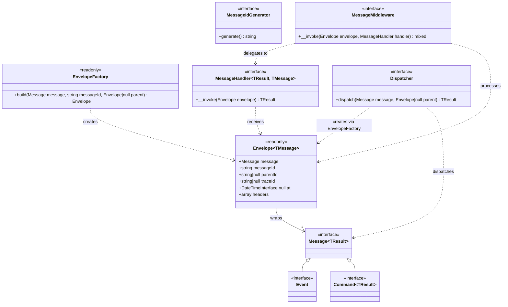
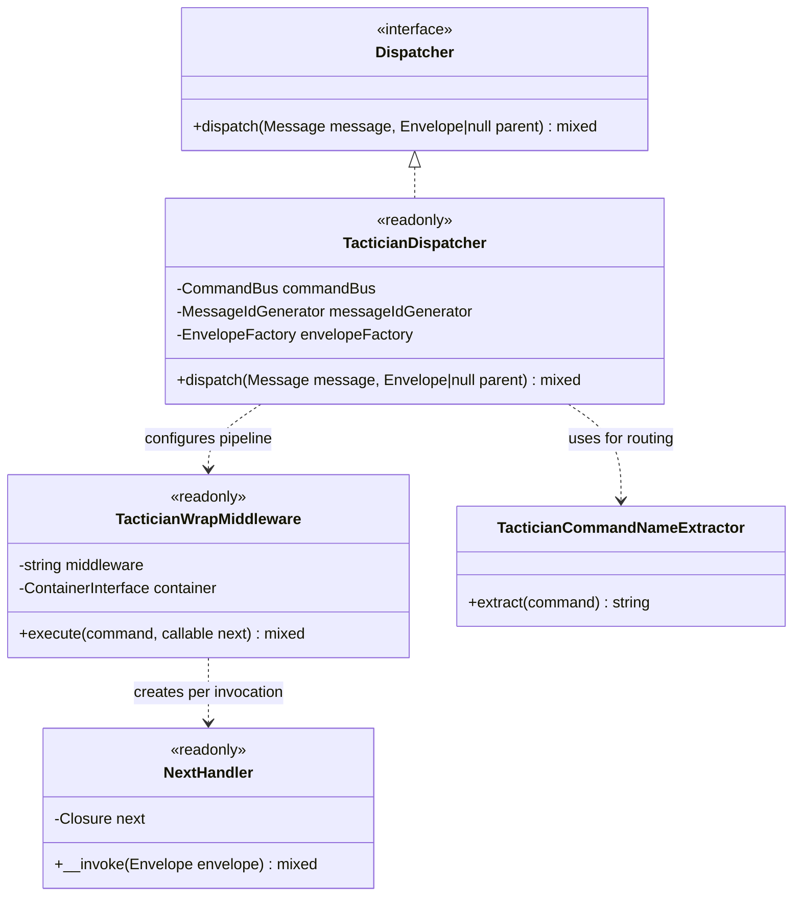
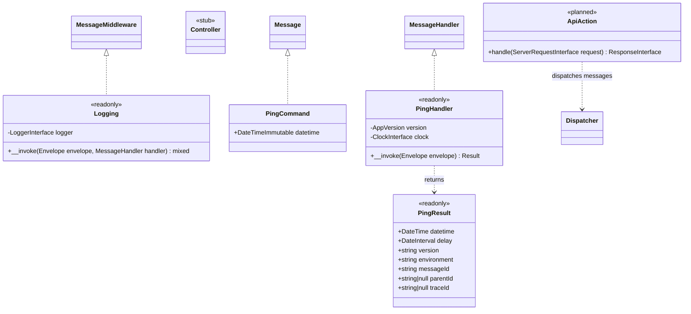
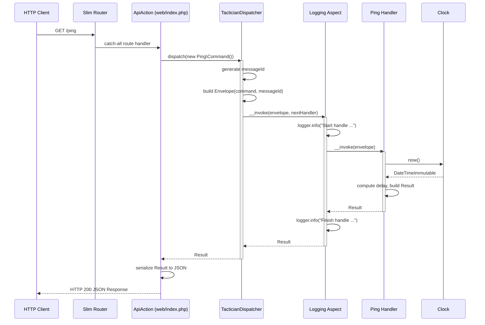
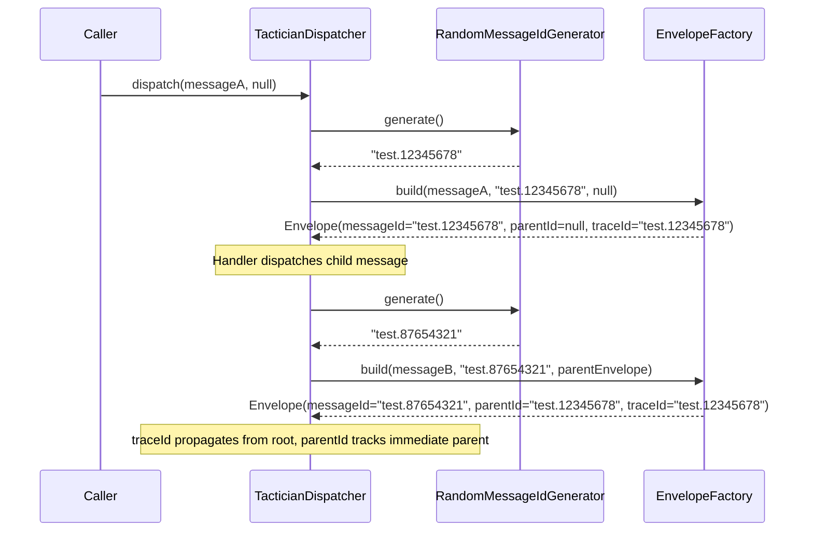
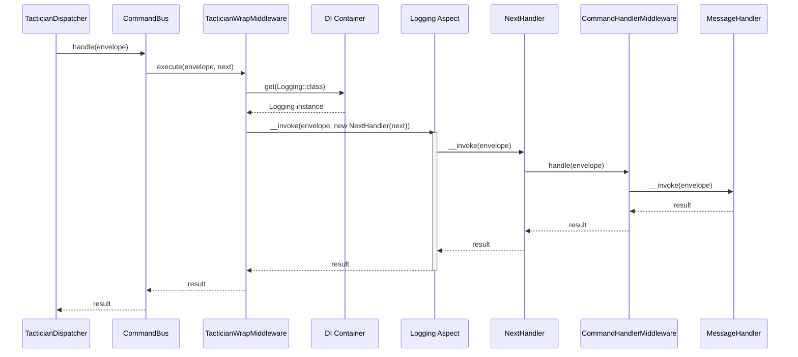

# Feature Request: Mediator Pattern and Unified API Entry Point

**Document Version:** 1.0
**Date:** 2026-01-05
**Status:** Completed
**Priority:** High

---

## 1. Feature Overview

### 1.1 Description

This feature implements the Mediator Pattern as the central communication mechanism between Presentation and Application
layers. It provides a unified `ApiAction` entry point for all HTTP API requests, a `Dispatcher` (MessageBus) that routes
typed `Message` objects to their corresponding `MessageHandler` implementations, and a two-level middleware architecture:
Interceptors at the Presentation layer (HTTP concerns) and Aspects at the Application layer (cross-cutting business
concerns).

The implementation uses League Tactician as the underlying command bus, wrapped behind project-owned interfaces to
maintain infrastructure independence. An `Envelope` wrapping layer provides message tracing with unique IDs, parent
references, and trace correlation. OpenAPI-style route configuration serves as a single source of truth for endpoint
definitions per ADR-011.

### 1.2 Business Value and User Benefit

- **Single Entry Point**: All API requests flow through one `ApiAction` controller, reducing duplication and ensuring
  consistent request/response handling
- **Decoupled Layers**: Presentation sends `Message` objects without knowing about specific `Handler` implementations
- **Two-Level Middleware**: HTTP-level concerns (auth, rate limiting) are separated from business-level concerns
  (logging, transactions) for clear responsibility boundaries
- **Traceability**: Every dispatched message gets a unique `messageId`, `parentId`, and `traceId` enabling full
  request tracing across nested dispatches
- **Extensibility**: Adding new endpoints requires only a new Message/Handler pair and a route configuration entry
- **Testability**: The `Dispatcher` interface can be mocked in tests; handlers are tested via `Envelope` injection

### 1.3 Target Audience

- **Backend Developers**: Building new API endpoints and use case handlers
- **DevOps/SRE**: Leveraging tracing IDs for distributed logging and monitoring
- **QA Engineers**: Writing integration and functional tests against handlers and aspects

---

## 2. Technical Architecture

### 2.1 High-Level Architectural Approach

The implementation follows the Mediator Pattern (ADR-003) with Middleware Pipeline for Aspects (ADR-004) and Unified
Route Configuration (ADR-011). The architecture has two distinct middleware layers:

**Interceptors** (Presentation layer) handle HTTP-specific concerns before the message reaches the bus. They operate on
PSR-7 `ServerRequestInterface` and can modify requests, abort processing, or enrich responses.

**Aspects** (Application layer) are `MessageMiddleware` implementations that wrap handler execution inside the bus
pipeline. They operate on `Envelope` objects and handle cross-cutting concerns like logging and transactions.

The `ApiAction` class serves as the single Slim route handler. It receives all HTTP requests via a catch-all route,
resolves the appropriate `Message` class from route configuration, dispatches through the bus, and serializes the result.

### 2.2 Integration with Existing Codebase

The Mediator Pattern integrates at the following points:

1. **`web/index.php`** registers a single catch-all Slim route that delegates to `ApiAction`
2. **`config/common/bus.php`** configures the `Dispatcher` with handler mappings and middleware pipeline
3. **`config/common/openapi/`** defines route metadata per ADR-011 (paths, descriptions)
4. **`Bgl\Core\Messages\Dispatcher`** interface is the primary contract consumed by Presentation layer
5. **`Bgl\Core\Messages\MessageMiddleware`** interface is implemented by all Aspects in Application layer
6. **`Bgl\Infrastructure\MessageBus\Tactician\TacticianDispatcher`** is the concrete bus implementation

### 2.3 Technology Stack and Dependencies

| Component       | Technology                | Purpose                      |
|-----------------|---------------------------|------------------------------|
| PHP             | 8.4                       | Runtime environment          |
| Slim Framework  | 4                         | HTTP routing and middleware  |
| League Tactician| ^1.0                      | Command bus implementation   |
| PHP-DI          | ^7.0                      | Dependency injection         |
| cebe/php-openapi| ^1.0                      | OpenAPI spec parsing         |
| PSR-7           | psr/http-message          | HTTP message interfaces      |
| PSR-11          | psr/container             | Container interface          |
| PSR-3           | psr/log                   | Logger interface             |
| PSR-20          | psr/clock                 | Clock interface              |

**Existing Dependencies Used:**

- `league/tactician` -- CommandBus, CommandHandlerMiddleware, InvokeInflector
- `php-di/php-di` -- Container with definitions merging
- `slim/slim` -- AppFactory, routing

---

## 3. Class Diagrams

### 3.1 Core Message Contracts



### 3.2 Infrastructure: Tactician Adapter



### 3.3 Presentation and Application Layers



---

## 4. Sequence Diagrams

### 4.1 Full Request Flow (Current State)



### 4.2 Envelope Tracing (Parent/Child Dispatches)



### 4.3 Middleware Pipeline Execution (Tactician Adapter)



---

## 5. Public API / Interfaces

### 5.1 Core Contracts

**`Bgl\Core\Messages\Message`** -- base message interface with covariant result type:

```php
/**
 * @template-covariant TResult = mixed
 */
interface Message
{
}
```

**`Bgl\Core\Messages\Command`** -- state-changing message:

```php
/**
 * @template TResult of void = mixed
 * @extends Message<TResult>
 */
interface Command extends Message
{
}
```

**`Bgl\Core\Messages\Event`** -- notification message (no return value):

```php
/**
 * @extends Message<null>
 */
interface Event extends Message
{
}
```

**`Bgl\Core\Messages\Dispatcher`** -- message bus interface:

```php
interface Dispatcher
{
    /**
     * @template TResult of mixed
     * @param Message<TResult> $message
     * @param Envelope|null $parent
     * @return TResult
     */
    public function dispatch(Message $message, ?Envelope $parent = null): mixed;
}
```

**`Bgl\Core\Messages\MessageHandler`** -- handler interface with generic typing:

```php
/**
 * @template-covariant TResult of mixed = mixed
 * @template-covariant TMessage of Message<TResult>
 */
interface MessageHandler
{
    /**
     * @template TEnvelope of Envelope<TMessage>
     * @param TEnvelope $envelope
     * @return TResult
     */
    public function __invoke(Envelope $envelope): mixed;
}
```

**`Bgl\Core\Messages\MessageMiddleware`** -- aspect interface:

```php
interface MessageMiddleware
{
    /**
     * @template TResult
     * @template TMessage of Message<TResult>
     * @template TEnvelope of Envelope<TMessage>
     * @template THandler of MessageHandler<TResult, TMessage>
     * @param TEnvelope $envelope
     * @param THandler $handler
     * @return TResult
     */
    public function __invoke(Envelope $envelope, MessageHandler $handler): mixed;
}
```

**`Bgl\Core\Messages\MessageIdGenerator`** -- ID generation contract:

```php
interface MessageIdGenerator
{
    /** @return non-empty-string */
    public function generate(): string;
}
```

### 5.2 Envelope and EnvelopeFactory

**`Bgl\Core\Messages\Envelope`** -- immutable message wrapper:

```php
/**
 * @template-covariant TMessage of Message<mixed> = Message<mixed>
 */
final readonly class Envelope
{
    /**
     * @param TMessage $message
     * @param non-empty-string $messageId
     * @param non-empty-string|null $parentId
     * @param non-empty-string|null $traceId
     * @param DateTimeInterface|null $at
     * @param mixed[] $headers
     */
    public function __construct(
        public Message $message,
        public string $messageId,
        public ?string $parentId = null,
        public ?string $traceId = null,
        public ?\DateTimeInterface $at = null,
        public array $headers = []
    );
}
```

**`Bgl\Core\Messages\EnvelopeFactory`** -- creates envelopes with trace propagation:

```php
final readonly class EnvelopeFactory
{
    /**
     * @template TResult
     * @template TMessage of Message<TResult>
     * @param TMessage $message
     * @param non-empty-string $messageId
     * @param Envelope|null $parent
     * @return Envelope<TMessage>
     */
    public function build(Message $message, string $messageId, ?Envelope $parent = null): Envelope;
}
```

Trace propagation logic:
- `parentId` = parent envelope's `messageId` (direct parent)
- `traceId` = parent's `traceId` if exists, otherwise own `messageId` (root trace)

### 5.3 Tactician Adapter

**`Bgl\Infrastructure\MessageBus\Tactician\TacticianDispatcher`**:

```php
final readonly class TacticianDispatcher implements Dispatcher
{
    /**
     * @param list<array{0: class-string<Message>, 1: class-string<MessageHandler>, 2: MessageMiddleware[]}> $handlers
     * @param list<class-string<MessageMiddleware>> $middleware
     */
    public function __construct(
        array $handlers,
        array $middleware,
        MessageIdGenerator $messageIdGenerator,
        EnvelopeFactory $envelopeFactory,
        ContainerInterface $container,
    );

    public function dispatch(Message $message, ?Envelope $parent = null): mixed;
}
```

Constructor creates a child `DI\Container` with handler-to-message mappings and wraps Tactician's `CommandBus` with
project middleware via `TacticianWrapMiddleware`.

**`Bgl\Infrastructure\MessageBus\Tactician\TacticianWrapMiddleware`** -- adapts project `MessageMiddleware` to
Tactician's `Middleware` interface:

```php
final readonly class TacticianWrapMiddleware implements League\Tactician\Middleware
{
    public function __construct(
        private string $middleware,       // class-string<MessageMiddleware>
        private ContainerInterface $container
    );

    public function execute($command, callable $next): mixed;
}
```

Handles both `Envelope`-wrapped messages (project pattern) and raw Tactician commands for backward compatibility.

**`Bgl\Infrastructure\MessageBus\Tactician\TacticianCommandNameExtractor`** -- extracts message class name from
Envelope:

```php
final class TacticianCommandNameExtractor implements CommandNameExtractor
{
    public function extract($command): string;
}
```

Returns `$command->message::class` for `Envelope` instances, `$command::class` otherwise.

**`Bgl\Infrastructure\MessageBus\Tactician\NextHandler`** -- wraps Tactician's `callable $next` as `MessageHandler`:

```php
final readonly class NextHandler implements MessageHandler
{
    public function __construct(private Closure $next);
    public function __invoke(Envelope $envelope): mixed;
}
```

**`Bgl\Infrastructure\MessageId\RandomMessageIdGenerator`**:

```php
final readonly class RandomMessageIdGenerator implements MessageIdGenerator
{
    public function __construct(
        private string $prefix = '',
        private string $separate = '.',
        private int $min = 10000000,
        private int $max = 99999999
    );

    public function generate(): string;
}
```

Generates IDs in format `{prefix}.{random_int}` (e.g., `test.45678901` in test environment).

### 5.4 Logging Aspect

**`Bgl\Application\Aspects\Logging`**:

```php
final readonly class Logging implements MessageMiddleware
{
    public function __construct(private LoggerInterface $logger);

    public function __invoke(Envelope $envelope, MessageHandler $handler): mixed;
}
```

Logs three events:
1. `info("Start handle {message_class}")` with envelope context
2. `error("Error handle {message_class}")` with exception context on failure (then re-throws)
3. `info("Finish handle {message_class}")` with envelope context on success

### 5.5 Ping Handler (Reference Implementation)

**`Bgl\Application\Handlers\Ping\Command`**:

```php
/**
 * @implements Message<Result>
 */
final class Command implements Message
{
    public function __construct(
        public DateTimeImmutable $datetime = new DateTimeImmutable()
    );
}
```

**`Bgl\Application\Handlers\Ping\Handler`**:

```php
/**
 * @implements MessageHandler<Result, Command>
 */
final readonly class Handler implements MessageHandler
{
    public function __construct(
        private AppVersion $version,
        private ClockInterface $clock,
    );

    public function __invoke(Envelope $envelope): Result;
}
```

**`Bgl\Application\Handlers\Ping\Result`**:

```php
final readonly class Result
{
    public function __construct(
        public DateTime $datetime,
        public DateInterval $delay,
        public string $version,
        public string $environment,
        public string $messageId,
        public ?string $parentId,
        public ?string $traceId,
    );
}
```

The Ping handler serves as a health check and reference implementation demonstrating the full dispatch cycle including
envelope tracing, clock usage, and structured result objects.

---

## 6. Directory Structure

### 6.1 Files Created/Modified

```
src/
├── Core/
│   ├── AppVersion.php                                        # Application version VO
│   └── Messages/
│       ├── Command.php                                       # Command interface
│       ├── Dispatcher.php                                    # Message bus contract
│       ├── Envelope.php                                      # Immutable message wrapper
│       ├── EnvelopeFactory.php                               # Envelope creation with trace propagation
│       ├── Event.php                                         # Event interface
│       ├── Message.php                                       # Base message interface
│       ├── MessageHandler.php                                # Handler contract
│       ├── MessageIdGenerator.php                            # ID generator contract
│       └── MessageMiddleware.php                             # Aspect/middleware contract
│
├── Application/
│   ├── Aspects/
│   │   └── Logging.php                                       # Logging aspect (entry/exit/error)
│   └── Handlers/
│       ├── Ping/
│       │   ├── Command.php                                   # Ping message
│       │   ├── Handler.php                                   # Ping handler
│       │   └── Result.php                                    # Ping result VO
│       └── Auth/
│           └── LoginByCredentials/
│               ├── Command.php                               # Login interface-based message
│               └── Handler.php                               # Login handler
│
├── Infrastructure/
│   ├── MessageBus/
│   │   └── Tactician/
│   │       ├── TacticianDispatcher.php                       # Dispatcher implementation
│   │       ├── TacticianWrapMiddleware.php                   # MessageMiddleware -> Tactician adapter
│   │       ├── TacticianCommandNameExtractor.php             # Envelope-aware name extractor
│   │       └── NextHandler.php                               # Callable-to-MessageHandler adapter
│   └── MessageId/
│       └── RandomMessageIdGenerator.php                      # Random ID generator with prefix
│
├── Presentation/
│   └── Api/
│       ├── Controller.php                                    # Stub (placeholder)
│       ├── Interceptors/                                     # Empty directory (placeholder)
│       └── V1/
│           ├── Requests/
│           │   └── Auth/
│           │       └── LoginRequest.php                      # Request implementing Command
│           └── Responses/
│               ├── SuccessResponse.php                       # Success response with pagination
│               ├── ErrorResponse.php                         # Error response with validation
│               └── PingResponse.php                          # Stub (placeholder)

config/
├── common/
│   ├── bus.php                                               # Dispatcher DI + handler/middleware config
│   ├── message-id-generator.php                              # MessageIdGenerator DI
│   └── openapi/
│       ├── v1.php                                            # OpenAPI base configuration
│       └── ping.php                                          # Ping route metadata

web/
└── index.php                                                 # Application entry point (catch-all route)
```

### 6.2 Test Files

```
tests/
├── Unit/
│   └── Messages/
│       └── EnvelopeFactoryCest.php                           # Envelope trace propagation tests
├── Functional/
│   ├── LoggingAspectCest.php                                 # Logging aspect success/error tests
│   └── PingHandlerCest.php                                   # Ping handler result verification
├── Integration/
│   └── MessageBus/
│       ├── BaseDispatcher.php                                # Abstract dispatcher contract tests
│       └── TacticianDispatcherCest.php                       # Tactician-specific + native bus tests
├── Web/
│   └── AccessCest.php                                        # HTTP /ping endpoint smoke test
└── Support/
    └── Messages/
        ├── Ping.php                                          # Test command
        ├── PingHandler.php                                   # Test command handler
        ├── PingTacticianHandler.php                          # Native Tactician handler
        ├── Logging.php                                       # Test middleware (project pattern)
        └── LoggingTactician.php                              # Test middleware (Tactician native)
```

---

## 7. Code References

### 7.1 Core Contracts

| File                                                   | Relevance                                              |
|--------------------------------------------------------|--------------------------------------------------------|
| `src/Core/Messages/Message.php`                        | Base message interface with generic result type         |
| `src/Core/Messages/Command.php`                        | State-changing message subtype                         |
| `src/Core/Messages/Event.php`                          | Notification message subtype (null result)             |
| `src/Core/Messages/Dispatcher.php`                     | Primary bus contract, consumed by Presentation layer   |
| `src/Core/Messages/Envelope.php`                       | Immutable wrapper with tracing fields                  |
| `src/Core/Messages/EnvelopeFactory.php`                | Trace-aware envelope creation                          |
| `src/Core/Messages/MessageHandler.php`                 | Handler contract with generic message/result typing    |
| `src/Core/Messages/MessageIdGenerator.php`             | ID generation contract                                 |
| `src/Core/Messages/MessageMiddleware.php`              | Aspect/middleware contract                             |

### 7.2 Infrastructure Implementation

| File                                                                | Relevance                                     |
|---------------------------------------------------------------------|-----------------------------------------------|
| `src/Infrastructure/MessageBus/Tactician/TacticianDispatcher.php`   | Primary Dispatcher implementation             |
| `src/Infrastructure/MessageBus/Tactician/TacticianWrapMiddleware.php`| Adapter: project middleware to Tactician      |
| `src/Infrastructure/MessageBus/Tactician/TacticianCommandNameExtractor.php` | Envelope-aware message class extraction |
| `src/Infrastructure/MessageBus/Tactician/NextHandler.php`           | Callable-to-MessageHandler bridge             |
| `src/Infrastructure/MessageId/RandomMessageIdGenerator.php`         | Environment-prefixed random ID generator      |

### 7.3 Application Layer

| File                                                              | Relevance                                    |
|-------------------------------------------------------------------|----------------------------------------------|
| `src/Application/Aspects/Logging.php`                             | First aspect, reference for future aspects    |
| `src/Application/Handlers/Ping/Command.php`                       | Reference message implementation              |
| `src/Application/Handlers/Ping/Handler.php`                       | Reference handler with envelope access        |
| `src/Application/Handlers/Ping/Result.php`                        | Reference result VO with trace fields         |

### 7.4 Configuration

| File                                               | Relevance                                          |
|----------------------------------------------------|----------------------------------------------------|
| `config/common/bus.php`                            | Handler mapping + middleware pipeline configuration|
| `config/common/message-id-generator.php`           | MessageIdGenerator DI binding                      |
| `config/common/openapi/ping.php`                   | OpenAPI route config for /ping                     |
| `config/common/openapi/v1.php`                     | OpenAPI v1 base specification                      |
| `web/index.php`                                    | Catch-all route -> ApiAction delegation            |

### 7.5 Tests

| File                                                              | Relevance                                     |
|-------------------------------------------------------------------|-----------------------------------------------|
| `tests/Unit/Messages/EnvelopeFactoryCest.php`                     | Trace propagation unit tests                  |
| `tests/Functional/LoggingAspectCest.php`                          | Aspect success/error logging tests            |
| `tests/Functional/PingHandlerCest.php`                            | Handler result verification                   |
| `tests/Integration/MessageBus/BaseDispatcher.php`                 | Contract tests for all dispatcher impls       |
| `tests/Integration/MessageBus/TacticianDispatcherCest.php`        | Tactician-specific integration tests          |
| `tests/Web/AccessCest.php`                                        | HTTP /ping smoke test                         |

---

## 8. Implementation Considerations

### 8.1 Potential Challenges

| Challenge                                   | Solution                                                            |
|---------------------------------------------|---------------------------------------------------------------------|
| Envelope vs raw command in Tactician        | `TacticianWrapMiddleware` checks `instanceof Envelope` and branches |
| Message-to-Handler mapping at runtime       | Child DI Container with explicit handler definitions                |
| Middleware execution order                  | Configured as ordered list in `config/common/bus.php`               |
| Generic type safety across bus boundary     | Psalm template annotations on Message, Handler, Envelope            |
| Tactician Middleware vs project Middleware   | `TacticianWrapMiddleware` adapts; `NextHandler` bridges             |

### 8.2 Edge Cases

1. **Nested dispatch** -- Handler dispatches child message; `EnvelopeFactory.build()` propagates `traceId` from parent,
   sets `parentId` to parent's `messageId`
2. **Root message** -- First dispatch with `$parent = null`; `traceId` equals own `messageId`
3. **Exception in middleware** -- Logging aspect catches, logs error, and re-throws; no silent swallowing
4. **Empty middleware list** -- Tactician pipeline contains only `CommandHandlerMiddleware`; works correctly
5. **Unknown message class** -- Tactician throws at handler resolution; no special handling needed

### 8.3 Performance Considerations

| Concern                          | Mitigation                                                    |
|----------------------------------|---------------------------------------------------------------|
| DI container overhead            | Child container only for handler resolution; cached in parent |
| Random ID generation             | `random_int()` uses CSPRNG, minimal overhead                  |
| Middleware pipeline depth        | Currently 1 aspect (Logging); scales O(n) with middleware     |
| Envelope allocation per dispatch | Immutable readonly objects, minimal GC pressure               |

### 8.4 Security Concerns

| Concern                 | Mitigation                                                  |
|-------------------------|-------------------------------------------------------------|
| Message type injection  | Handler mapping is server-side config, not client-controlled|
| Log data exposure       | Logging aspect logs class names, not message payloads       |
| Trace ID predictability | Random IDs are not security tokens; used for correlation    |

---

## 9. Testing Strategy

### 9.1 Unit Tests

**`EnvelopeFactoryCest`** -- verifies trace propagation across 3 levels:

| Test Scenario     | Assertion                                                             |
|-------------------|-----------------------------------------------------------------------|
| Root envelope     | `messageId = "01"`, `parentId = null`, `traceId = "01"`              |
| Child envelope    | `messageId = "02"`, `parentId = "01"`, `traceId = "01"`             |
| Grandchild        | `messageId = "03"`, `parentId = "02"`, `traceId = "01"`             |

### 9.2 Functional Tests

**`LoggingAspectCest`** -- tests Logging aspect in isolation:

| Test Method     | Scenario                           | Assertion                                |
|-----------------|------------------------------------|------------------------------------------|
| `testSuccess`   | Normal handler execution           | Info logs for start and finish           |
| `testError`     | Handler throws exception           | Info log for start, error log for error  |

**`PingHandlerCest`** -- tests Ping handler with mocked dependencies:

| Test Method    | Scenario              | Assertion                                            |
|----------------|-----------------------|------------------------------------------------------|
| `testSuccess`  | Normal ping execution | Correct messageId, parentId, traceId, version, delay |

### 9.3 Integration Tests

**`BaseDispatcher`** -- abstract contract tests (shared across all dispatcher implementations):

| Test Method        | Scenario                 | Assertion                            |
|--------------------|--------------------------|--------------------------------------|
| `testCommand`      | Dispatch Command message | Returns handler result               |
| `testEvent`        | Dispatch Event message   | Returns null, side effect logged     |
| `testQuery`        | Dispatch Query message   | Returns typed query result           |
| `testMiddleware`   | Dispatch with middleware | Middleware logs contain message ID   |

**`TacticianDispatcherCest`** extends `BaseDispatcher` and adds:

| Test Method             | Scenario                      | Assertion                          |
|-------------------------|-------------------------------|------------------------------------|
| `testTacticianHandler`  | Native Tactician handler flow | Logs message ID and handler result |

### 9.4 Acceptance Tests (Web)

**`AccessCest`** -- HTTP smoke test:

| Test Method | Scenario        | Assertion                                                |
|-------------|-----------------|----------------------------------------------------------|
| `testPing`  | `GET /ping`     | HTTP 200, JSON with datetime, delay, version, messageId  |

---

## 10. Acceptance Criteria

### 10.1 Definition of Done

- [x] `Message`, `Command`, `Event` contracts defined in `Core/Messages/`
- [x] `Dispatcher` contract with `dispatch(Message, ?Envelope)` signature
- [x] `MessageHandler` and `MessageMiddleware` contracts with generic typing
- [x] `Envelope` with `messageId`, `parentId`, `traceId` fields
- [x] `EnvelopeFactory` with trace propagation logic
- [x] `MessageIdGenerator` contract and `RandomMessageIdGenerator` implementation
- [x] `TacticianDispatcher` implementing `Dispatcher` with handler mapping and middleware pipeline
- [x] `TacticianWrapMiddleware` adapting project middleware to Tactician
- [x] `Logging` aspect as first `MessageMiddleware` implementation
- [x] `Ping` handler as reference implementation with `/ping` endpoint
- [x] `web/index.php` with catch-all route delegating to `ApiAction`
- [x] `config/common/bus.php` with handler and middleware configuration
- [x] OpenAPI route configuration for `/ping` in `config/common/openapi/`
- [x] Interceptors directory created as placeholder
- [x] Unit, Functional, Integration, and Web tests pass
- [x] Code passes `composer scan:all`

### 10.2 Planned but Not Yet Implemented

The following items are described in BACKLOG as part of CORE-003 scope but will be implemented in subsequent tasks as
their dependencies are resolved:

- `ApiAction` class (referenced in `web/index.php` but not yet created)
- `RouteMessageMap` (OpenAPI-based route matching)
- `InterceptorPipeline` (HTTP middleware orchestration)
- Concrete interceptors: `AuthInterceptor`, `DenormalizationInterceptor`, `ValidationInterceptor`
- `Transactional` aspect
- Additional aspects: `Metrics`, `Caching`

### 10.3 Verification Commands

```bash
# Run unit tests
composer test:unit

# Run functional tests (aspects, handlers)
composer test:func

# Run integration tests (dispatcher)
composer test:intg

# Run web tests (HTTP /ping)
composer test:web

# Full validation
composer scan:all
```

---

## Appendix A: Bus Configuration Reference

```php
// config/common/bus.php
return [
    Dispatcher::class => static function (ContainerInterface $container): Dispatcher {
        $config = $container->get('bus');
        $generator = $container->get(MessageIdGenerator::class);

        return new TacticianDispatcher(
            handlers: $config['handlers'],
            middleware: $config['middleware'],
            messageIdGenerator: $generator,
            envelopeFactory: new EnvelopeFactory(),
            container: $container
        );
    },

    'bus' => [
        'handlers' => [
            [Handlers\Ping\Command::class, Handlers\Ping\Handler::class],
        ],
        'middleware' => [
            Aspects\Logging::class,
        ],
    ],
];
```

## Appendix B: Web Entry Point

```php
// web/index.php
$app->any('/{path:.*}', function (
    ServerRequestInterface $request,
    ResponseInterface $response,
) use ($container): ResponseInterface {
    $action = $container->get(ApiAction::class);
    return $action->handle($request);
});
```

## Appendix C: Related ADRs

- [ADR-003: Mediator Pattern](../../03-decisions/003-mediator-pattern.md) -- Decision to use Mediator/MessageBus
- [ADR-004: Aspects (Middleware Pipeline)](../../03-decisions/004-aspects.md) -- Decision for middleware-based AOP
- [ADR-011: Unified Route Configuration](../../03-decisions/011-unified-route-configuration.md) -- OpenAPI as single
  source of truth
