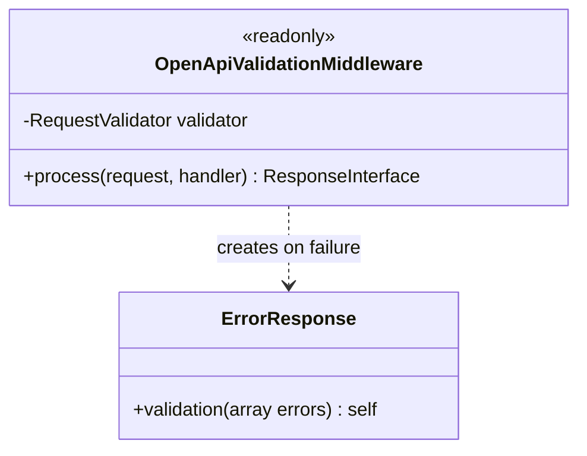
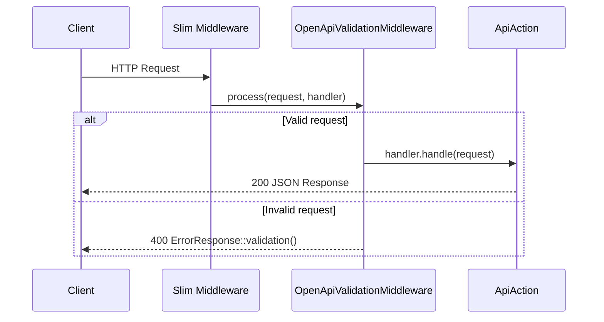

# Feature Request: OpenAPI Request Validation Middleware

**Document Version:** 1.0
**Date:** 2026-02-22
**Status:** Completed
**Priority:** P1 (Foundation, Sprint 0)

---

## 1. Feature Overview

### Description

PSR-15 middleware that automatically validates incoming HTTP requests against the OpenAPI schema. This is Level 1
validation: format, type, required fields, minLength, maxLength, enum, pattern -- everything that can be expressed
in the OpenAPI specification. Business rules (Level 2) are handled separately by CORE-007 custom attributes.

### Business Value

- Automatic input validation without hand-written checks for every endpoint
- Single source of truth: OpenAPI schema defines both documentation and validation rules
- Consistent error responses via `ErrorResponse::validation()`
- Reduced attack surface: malformed requests rejected before reaching business logic

### Target Users

- Backend Developers: zero-effort validation for new endpoints
- API Consumers: clear, structured validation error messages

---

## 2. Technical Architecture

### Approach

Install `league/openapi-psr7-validator` and wrap it in a PSR-15 middleware. The middleware loads the OpenAPI spec
from `config/common/openapi/v1.php`, validates request body, query params, and path params against the schema, and
maps validation errors to the existing `ErrorResponse::validation()` format.

Per ADR-011 "Two-Level Validation":
- Level 1 (this task): OpenAPI schema validation -- format, type, required, constraints
- Level 2 (CORE-007): Custom PHP attributes -- business rules (UniqueEmail, UserExists, etc.)

### Integration Points

- Slim 4 middleware pipeline (before ApiAction)
- OpenAPI spec from `config/common/openapi/v1.php`
- `ErrorResponse::validation()` from CORE-004
- Works in tandem with InterceptorPipeline from CORE-003

### Dependencies

- CORE-003: ApiAction must exist for middleware to be meaningful
- `league/openapi-psr7-validator`: new composer dependency

---

## 3. Class Diagram



---

## 4. Sequence Diagram



---

## 5. API Specification

No new endpoints. This middleware applies globally to all API routes defined in the OpenAPI spec.

### Error Response (400)

```json
{
    "error": {
        "code": 400,
        "message": "Validation failed",
        "errors": {
            "email": ["The email field is required"],
            "password": ["Must be at least 8 characters"]
        }
    }
}
```

---

## 6. Directory Structure

```
src/Infrastructure/Http/
    OpenApiValidationMiddleware.php

config/common/
    openapi-validator.php          # DI config for validator
```

---

## 7. Code References

| File                                            | Relevance                        |
|-------------------------------------------------|----------------------------------|
| `src/Presentation/Api/V1/Responses/ErrorResponse.php` | Validation error format    |
| `config/common/openapi/v1.php`                  | OpenAPI spec to validate against |
| `web/index.php`                                 | Middleware registration point    |

---

## 8. Implementation Considerations

### Challenges

- OpenAPI spec must be complete for all endpoints before validation works
- Performance: spec parsing should be cached in production

### Edge Cases

- Routes not in OpenAPI spec should pass through without validation
- File uploads and multipart forms need special handling
- Empty request body on POST should fail if body is required

### Security

- Prevents malformed input from reaching business logic
- Type coercion attacks blocked by strict type validation

---

## 9. Testing Strategy

### Functional Tests

- Valid request passes through to handler
- Missing required field returns 400 with field-specific error
- Wrong type returns 400
- Extra fields (additionalProperties) handling
- Path parameter validation

### Integration Tests

- Full HTTP stack: request -> middleware -> validation -> error response

---

## 10. Acceptance Criteria

- [ ] `league/openapi-psr7-validator` installed via composer
- [ ] PSR-15 middleware validates requests against OpenAPI schema
- [ ] Validation errors mapped to `ErrorResponse::validation()` format
- [ ] Middleware registered in Slim pipeline before ApiAction
- [ ] DI configuration in `config/common/`
- [ ] Routes not in spec pass through without validation
- [ ] Functional tests pass
- [ ] `composer scan:all` passes

---

## Next Steps

Run `/fr:plan` to generate implementation stages.
