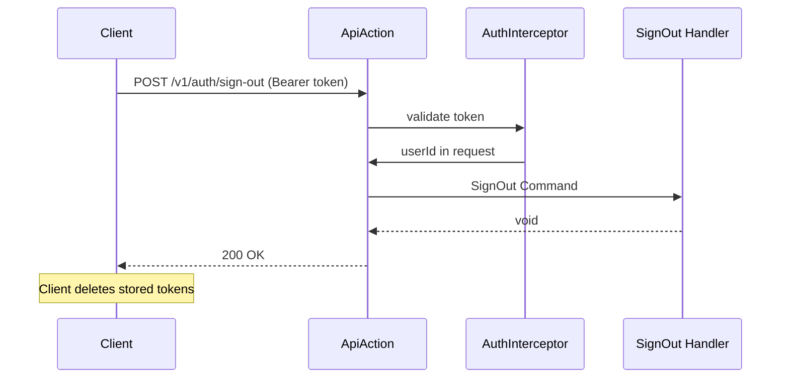

# Feature Request: Sign Out (AUTH-005)

**Document Version:** 1.0
**Date:** 2026-02-22
**Status:** Completed
**Priority:** P2 (Auth, Sprint 1)

---

## 1. Feature Overview

### Description

Sign out endpoint for authenticated users. For MVP, this is client-side only: the server returns 200, and the client
deletes the stored tokens. No server-side token blacklist or revocation (JWT is stateless per ADR-013).

### Business Value

- Complete auth flow: register -> login -> refresh -> sign-out
- API contract for client applications to call on logout
- Foundation for future token revocation if needed

### Target Users

- Mobile/Web app developers integrating the auth flow

---

## 2. Technical Architecture

### Approach

Minimal handler: receive authenticated request, return success. No database operations needed for MVP. The endpoint
exists to provide a clean API contract and allow future server-side cleanup (e.g., token blacklist, session cleanup).

### Integration Points

- AuthInterceptor (AUTH-004): validates Bearer token
- MessageBus: dispatches SignOut Command
- OpenAPI config: defines the endpoint

### Dependencies

- AUTH-004: AuthInterceptor must exist (protected endpoint)

---

## 3. Sequence Diagram



---

## 4. API Specification

| Method | Path                 | Auth     | Description     |
|--------|----------------------|----------|-----------------|
| POST   | `/v1/auth/sign-out`  | Required | Sign out user   |

### Response (200)

```json
{
    "data": {
        "message": "Signed out successfully"
    }
}
```

### Errors

- 401 Unauthorized -- missing or invalid Bearer token

---

## 5. Directory Structure

```
src/Application/Handlers/Auth/SignOut/
    Command.php
    Handler.php

config/common/openapi/
    auth.php       # Add sign-out endpoint definition
```

---

## 6. Testing Strategy

### Functional Tests

- Handler returns void without errors
- Handler works with valid envelope

### Acceptance Tests (Web)

- POST /v1/auth/sign-out with valid token returns 200
- POST /v1/auth/sign-out without token returns 401

---

## 7. Acceptance Criteria

- [ ] `Command.php` and `Handler.php` created in `Application/Handlers/Auth/SignOut/`
- [ ] OpenAPI config for POST `/v1/auth/sign-out` with `x-interceptors: [auth]`
- [ ] Handler registered in bus config
- [ ] Functional test passes
- [ ] Web acceptance test passes
- [ ] `composer scan:all` passes

---

## Next Steps

Create implementation plan (master-checklist.md + stage files).
