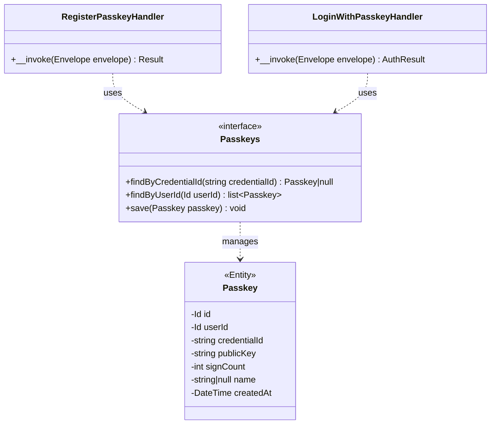

# Feature Request: Passkey Authentication (AUTH-006)

**Document Version:** 1.0
**Date:** 2026-02-22
**Status:** Open
**Priority:** P2 (Auth, Sprint 1)

---

## 1. Feature Overview

### Description

WebAuthn/FIDO2 passkey authentication as an alternative to email+password. Two endpoints: register a passkey
(for authenticated users) and login with a passkey (public). Uses the `web-auth/webauthn-lib` package. Requires
ADR-014 before implementation.

### Business Value

- Passwordless authentication option for users
- Enhanced security: phishing-resistant, no password to steal
- Modern UX: biometric/device-based login
- Fallback: email+password always available

### Target Users

- End users with WebAuthn-compatible devices (phones, laptops with biometrics)

---

## 2. Technical Architecture

### Approach

FIDO2 WebAuthn flow:
1. **Registration**: Server generates challenge -> Client creates credential -> Server stores public key
2. **Login**: Server generates challenge -> Client signs challenge -> Server verifies signature

Passkey entity stores: credentialId, publicKey, signCount, optional name. Linked to authenticated user.

### Integration Points

- AuthInterceptor: register passkey requires authentication
- TokenGenerator (CORE-008): issue JWT after successful passkey login
- Doctrine ORM: Passkey entity with PhpMappingDriver mapping
- Database: `profile_passkey` table via migration

### Dependencies

- AUTH-004: AuthInterceptor for register endpoint
- DB-MIGRATIONS: migration infrastructure for passkey table
- CORE-008: TokenGenerator for issuing JWT after passkey login

---

## 3. Class Diagram



---

## 4. API Specification

| Method | Path                          | Auth     | Description           |
|--------|-------------------------------|----------|-----------------------|
| POST   | `/v1/auth/register/passkey`   | Required | Register a new passkey|
| POST   | `/v1/auth/login/passkey`      | Public   | Login with passkey    |

### Register Passkey -- Request

```json
{
    "credential": {
        "id": "base64url-encoded-credential-id",
        "rawId": "base64url-encoded-raw-id",
        "response": {
            "attestationObject": "base64url-encoded",
            "clientDataJSON": "base64url-encoded"
        },
        "type": "public-key"
    },
    "name": "My MacBook"
}
```

### Login with Passkey -- Request

```json
{
    "credential": {
        "id": "base64url-encoded-credential-id",
        "response": {
            "authenticatorData": "base64url-encoded",
            "clientDataJSON": "base64url-encoded",
            "signature": "base64url-encoded"
        },
        "type": "public-key"
    }
}
```

### Login Response (200)

```json
{
    "data": {
        "access_token": "jwt-token",
        "refresh_token": "jwt-token",
        "expires_in": 3600
    }
}
```

---

## 5. Directory Structure

```
src/
    Domain/Profile/
        Entities/Passkey.php
        Repositories/Passkeys.php

    Application/Handlers/Profile/
        RegisterPasskey/
            Command.php
            Handler.php
        LoginWithPasskey/
            Command.php
            Handler.php

    Infrastructure/
        Persistence/Doctrine/Profile/DoctrinePasskeys.php
        Persistence/InMemory/Profile/InMemoryPasskeys.php
        Persistence/Doctrine/Mapping/Profile/PasskeyMapping.php
        Database/Migrations/VersionXXX_CreateProfilePasskey.php
```

---

## 6. Implementation Considerations

### Challenges

- WebAuthn challenge generation and verification is complex
- Need to handle attestation formats correctly
- Sign count validation for cloned authenticator detection

### Security

- Credential IDs must be unique across all users
- Public keys stored as binary (BYTEA in PostgreSQL)
- Challenge must be ephemeral (stored in session or cache, not DB)
- Origin validation critical for security

---

## 7. Testing Strategy

### Unit Tests

- Passkey entity creation and validation
- Challenge generation

### Functional Tests

- RegisterPasskey handler with mocked WebAuthn verifier
- LoginWithPasskey handler with mocked WebAuthn verifier

### Integration Tests

- Passkey repository CRUD operations
- Full registration + login flow with test credentials

---

## 8. Acceptance Criteria

- [ ] `web-auth/webauthn-lib` installed via composer
- [ ] Passkey entity with repository contract
- [ ] Doctrine mapping and migration for `profile_passkey` table
- [ ] RegisterPasskey handler (authenticated endpoint)
- [ ] LoginWithPasskey handler (public endpoint, returns JWT)
- [ ] OpenAPI config for both endpoints
- [ ] InMemory repository for tests
- [ ] Functional and integration tests pass
- [ ] ADR-014 created before implementation
- [ ] `composer scan:all` passes

---

## Next Steps

Run `/fr:plan` to generate implementation stages.
