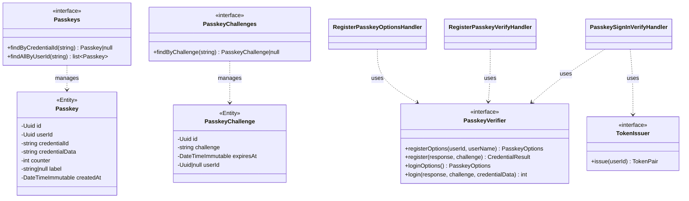

# Feature Request: Passkey Authentication (AUTH-006)

**Document Version:** 2.0
**Date:** 2026-02-25
**Status:** Implemented
**Priority:** P2 (Auth, Sprint 1)

---

## 1. Feature Overview

### Description

WebAuthn/FIDO2 passkey authentication as an alternative to email+password. Four endpoints: register options, register verify (authenticated), sign-in options, sign-in verify (public). Uses the `lbuchs/webauthn` package. ADR-013 documents the architecture decision.

### Business Value

- Passwordless authentication option for users
- Enhanced security: phishing-resistant, no password to steal
- Modern UX: biometric/device-based login
- Fallback: email+password always available

### Target Users

- End users with WebAuthn-compatible devices (phones, laptops with biometrics)

---

## 2. Technical Architecture

### Approach

FIDO2 WebAuthn challenge-response flow:
1. **Registration**: Server generates challenge -> Client creates credential -> Server verifies and stores public key
2. **Login**: Server generates challenge -> Client signs challenge -> Server verifies signature -> Issues JWT tokens

TokenIssuer extracted from JwtAuthenticator to share token issuance between credential-based and passkey auth.

### Integration Points

- AuthInterceptor: register passkey requires authentication
- TokenIssuer: issue JWT after successful passkey login
- Doctrine ORM: Passkey + PasskeyChallenge entities with PhpMappingDriver
- Database: `auth_passkey` and `auth_passkey_challenge` tables

### Dependencies

- AUTH-004: AuthInterceptor for register endpoint
- DB-MIGRATIONS: migration infrastructure
- TokenIssuer: extracted from JwtAuthenticator (ADR-013)

---

## 3. Class Diagram



---

## 4. API Specification

| Method | Path                               | Auth     | Description                     |
|--------|-------------------------------------|----------|---------------------------------|
| POST   | `/v1/auth/passkey/register`         | Required | Get passkey registration options |
| POST   | `/v1/auth/passkey/register/verify`  | Required | Verify passkey registration      |
| POST   | `/v1/auth/passkey/sign-in`          | Public   | Get passkey sign-in options      |
| POST   | `/v1/auth/passkey/sign-in/verify`   | Public   | Verify passkey and get tokens    |

### Register Options -- Response (200)

```json
{
    "data": {
        "options": "{\"publicKey\": {\"challenge\": \"...\", \"rp\": {...}, \"user\": {...}}}"
    }
}
```

### Register Verify -- Request

```json
{
    "response": "{WebAuthn credential JSON from browser}",
    "label": "My MacBook"
}
```

### Sign-In Verify -- Response (200)

```json
{
    "data": {
        "accessToken": "jwt-token",
        "refreshToken": "jwt-token",
        "expiresIn": 3600
    }
}
```

---

## 5. Directory Structure

```
src/
    Core/Auth/
        PasskeyVerifier.php
        PasskeyOptions.php
        CredentialResult.php
        TokenIssuer.php

    Domain/Profile/Entities/
        Passkey.php
        PasskeyChallenge.php
        Passkeys.php
        PasskeyChallenges.php

    Application/Handlers/Auth/
        RegisterPasskeyOptions/   (Command, Handler, Result)
        RegisterPasskeyVerify/    (Command, Handler)
        PasskeySignInOptions/     (Command, Handler, Result)
        PasskeySignInVerify/      (Command, Handler, Result)

    Infrastructure/
        Auth/WebAuthnPasskeyVerifier.php
        Auth/JwtTokenIssuer.php
        Persistence/Doctrine/Passkeys.php
        Persistence/Doctrine/PasskeyChallenges.php
        Persistence/Doctrine/Mapping/Auth/PasskeyMapping.php
        Persistence/Doctrine/Mapping/Auth/PasskeyChallengeMapping.php
        Persistence/InMemory/Passkeys.php
        Persistence/InMemory/PasskeyChallenges.php
        Database/Migrations/Version20260225114838.php
```

---

## 6. Environment Variables

- `WEBAUTHN_RP_ID` -- Relying Party ID (domain, e.g. `example.com`)
- `WEBAUTHN_RP_NAME` -- Relying Party display name (e.g. `BoardGameLog`)

---

## 7. Testing Strategy

### Unit Tests (9 tests)

- Passkey entity: create, update counter, label defaults
- PasskeyChallenge entity: forRegistration, forLogin, isExpired

### Functional Tests (9 tests)

- RegisterPasskeyOptions: returns JSON, user not found, saves challenge
- PasskeySignIn: options JSON, saves challenge, verify returns tokens, passkey not found, counter update, challenge removed

All tests use InMemory repositories + fake PasskeyVerifier/TokenIssuer.

---

## 8. Acceptance Criteria

- [x] `lbuchs/webauthn` installed via composer
- [x] Passkey + PasskeyChallenge entities with repository contracts
- [x] Doctrine mappings and migration for `auth_passkey`, `auth_passkey_challenge`
- [x] 4 handlers for passkey registration and sign-in flows
- [x] OpenAPI config for all 4 endpoints
- [x] InMemory repositories for tests
- [x] Unit and functional tests pass (20 tests total)
- [x] ADR-013 created
- [x] `composer scan:all` passes (cd, lp, ps green)
