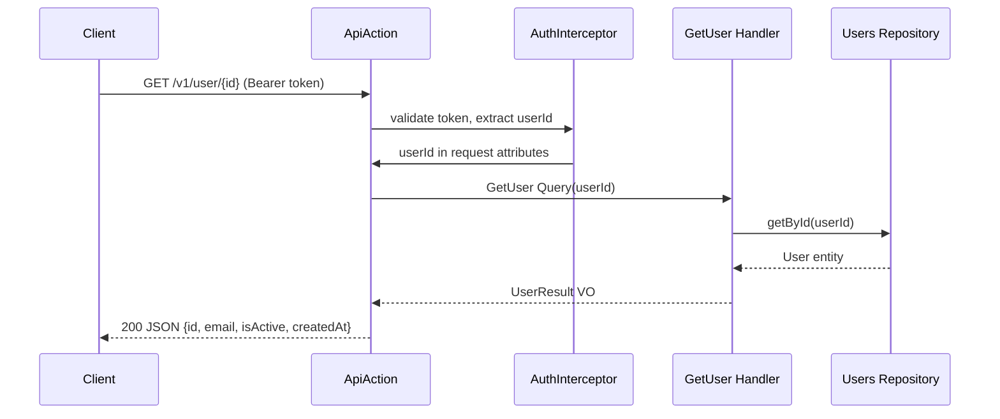

# Feature Request: User Info (USER-001)

**Document Version:** 1.0
**Date:** 2026-02-22
**Status:** Completed
**Priority:** P2 (User, Sprint 2)

---

## 1. Feature Overview

### Description

Endpoint to retrieve authenticated user information. Returns basic profile data: id, email, active status,
registration date. Protected endpoint requiring valid Bearer token.

### Business Value

- Users can view their profile information
- Foundation for future profile management features
- Required by client apps to display user context after login

### Target Users

- Authenticated end users viewing their profile

---

## 2. Technical Architecture

### Approach

Query + Handler pattern (read-only, no state change). Handler receives userId from the authenticated request context,
fetches user from repository, returns a Result VO with profile data. Uses existing Users repository from Auth context.

### Integration Points

- AuthInterceptor (AUTH-004): extracts userId from JWT
- Users repository (AUTH-001): `getById()` to fetch user
- SchemaResponseSerializer: serialize Result to JSON via x-source

### Dependencies

- AUTH-004: AuthInterceptor for protected endpoint
- AUTH-001: Users repository and User entity

---

## 3. Sequence Diagram



---

## 4. API Specification

| Method | Path             | Auth     | Description          |
|--------|------------------|----------|----------------------|
| GET    | `/v1/user/{id}`  | Required | Get user information |

### Response (200)

```json
{
    "data": {
        "id": "550e8400-e29b-41d4-a716-446655440000",
        "email": "user@example.com",
        "is_active": true,
        "created_at": {
            "timestamp": "1708617600",
            "datetime": "2026-02-22T12:00:00+00:00"
        }
    }
}
```

### Errors

- 401 Unauthorized -- missing or invalid token
- 404 Not Found -- user does not exist

---

## 5. Directory Structure

```
src/Application/Handlers/User/GetUser/
    Query.php
    Handler.php
    Result.php

config/common/openapi/
    user.php       # User endpoint definition
```

---

## 6. Testing Strategy

### Functional Tests

- Handler returns correct Result for existing user
- Handler throws exception for non-existent user

### Acceptance Tests (Web)

- GET /v1/user/{id} with valid token returns 200 with user data
- GET /v1/user/{id} without token returns 401
- GET /v1/user/{nonexistent-id} returns 404

---

## 7. Acceptance Criteria

- [ ] `Query.php`, `Handler.php`, `Result.php` in `Application/Handlers/User/GetUser/`
- [ ] OpenAPI config for GET `/v1/user/{id}` with `x-interceptors: [auth]`
- [ ] Handler uses existing Users repository
- [ ] Response serialized via SchemaResponseSerializer
- [ ] Functional test passes
- [ ] Web acceptance test passes
- [ ] `composer scan:all` passes

---

## Next Steps

Create implementation plan (master-checklist.md + stage files).
