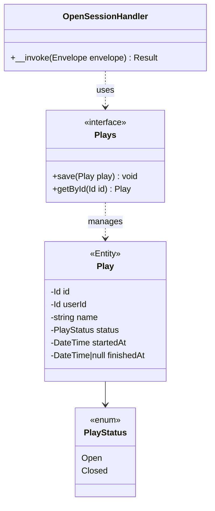

# Feature Request: Open Game Session (PLAYS-001)

**Document Version:** 1.0
**Date:** 2026-02-22
**Status:** Completed
**Priority:** P1 (Plays, Sprint 2)

---

## 1. Feature Overview

### Description

Simplified version of PLAYS-001: create a new game session for the authenticated user. Accepts optional `name` and
`started_at` fields. Returns the created session ID. This is the minimal session creation needed for parity with
the main branch.

### Business Value

- Core feature: users can start tracking board game sessions
- Foundation for session management (close, list, view)
- Feature parity with main branch implementation

### Target Users

- Board game enthusiasts tracking their play sessions

---

## 2. Technical Architecture

### Approach

Domain entity `Play` with repository contract. Command + Handler pattern. Doctrine mapping via PhpMappingDriver,
database migration for `plays_session` table. Protected endpoint.

### Integration Points

- AuthInterceptor: userId from JWT
- Doctrine ORM: persistence via DoctrineRepository
- Database: new `records_session` table
- SchemaRequestMapper: hydrate Command from request body via x-target

### Dependencies

- AUTH-004: AuthInterceptor for protected endpoint
- DB-MIGRATIONS: migration infrastructure

---

## 3. Class Diagram



---

## 4. API Specification

| Method | Path                   | Auth     | Description         |
|--------|------------------------|----------|---------------------|
| POST   | `/v1/plays/sessions`   | Required | Create new session  |

### Request

```json
{
    "name": "Friday Game Night",
    "started_at": "2026-02-22T19:00:00+00:00"
}
```

All fields optional. Default: empty name, current timestamp for started_at.

### Response (201)

```json
{
    "data": {
        "id": "550e8400-e29b-41d4-a716-446655440000"
    }
}
```

### Errors

- 401 Unauthorized -- missing or invalid token
- 400 Bad Request -- invalid started_at format

---

## 5. Directory Structure

```
src/
    Domain/Plays/
        Entities/Play.php
        ValueObjects/PlayStatus.php
        Repositories/Plays.php

    Application/Handlers/Plays/OpenSession/
        Command.php
        Handler.php
        Result.php

    Infrastructure/
        Persistence/Doctrine/Plays/DoctrinePlays.php
        Persistence/InMemory/Plays/InMemoryPlays.php
        Persistence/Doctrine/Mapping/Plays/PlayMapping.php
        Database/Migrations/VersionXXX_CreateRecordsSession.php
```

---

## 6. Implementation Considerations

### Edge Cases

- Missing started_at: use current server time
- Missing name: default to empty string
- Duplicate session creation: no uniqueness constraint, each POST creates new session

### Database Schema

```sql
CREATE TABLE records_session (
    id UUID NOT NULL PRIMARY KEY,
    user_id UUID NOT NULL REFERENCES auth_user(id) ON DELETE CASCADE,
    name VARCHAR(255) NOT NULL DEFAULT '',
    status INT NOT NULL DEFAULT 0,
    started_at TIMESTAMP(0) WITH TIME ZONE DEFAULT CURRENT_TIMESTAMP NOT NULL,
    finished_at TIMESTAMP(0) WITH TIME ZONE DEFAULT NULL
);
CREATE INDEX idx_session_user ON records_session (user_id);
CREATE INDEX idx_session_started ON records_session (started_at DESC);
```

---

## 7. Testing Strategy

### Unit Tests

- Session entity creation with defaults
- SessionStatus enum values

### Functional Tests

- Handler creates session with provided data
- Handler creates session with defaults when fields missing

### Integration Tests

- Repository save and getById
- Full persistence round-trip

### Acceptance Tests (Web)

- POST /v1/plays/sessions with valid token returns 201
- POST /v1/plays/sessions without token returns 401

---

## 8. Acceptance Criteria

- [ ] Play entity with PlayStatus enum
- [ ] Plays repository contract in Domain
- [ ] Doctrine and InMemory repository implementations
- [ ] PhpMappingDriver mapping for Play
- [ ] Database migration for `plays_session` table
- [ ] OpenSession Command + Handler + Result
- [ ] OpenAPI config for POST `/v1/plays/sessions`
- [ ] Functional and integration tests pass
- [ ] Web acceptance test passes
- [ ] `composer scan:all` passes

---

## Next Steps

Create implementation plan (master-checklist.md + stage files).
