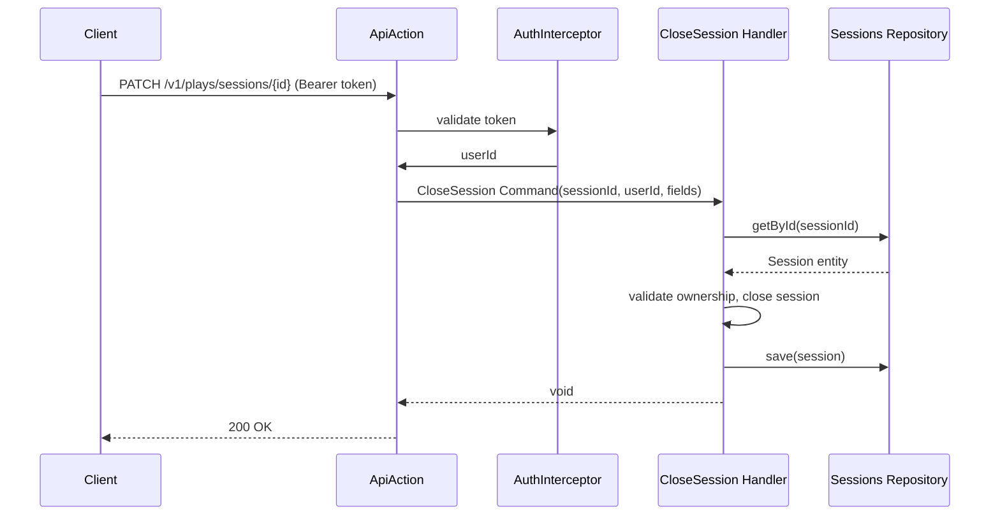

# Feature Request: Close Game Session (PLAYS-002)

**Document Version:** 1.0
**Date:** 2026-02-22
**Status:** Open
**Priority:** P1 (Plays, Sprint 2)

---

## 1. Feature Overview

### Description

Close an open game session by setting the finish time and updating the status. Accepts optional `started_at`,
`finished_at`, and `interval` fields. Protected endpoint. The session must belong to the authenticated user.

### Business Value

- Complete session lifecycle: open -> close
- Users can record session duration
- Feature parity with main branch

### Target Users

- Board game enthusiasts finishing their play sessions

---

## 2. Technical Architecture

### Approach

Command + Handler pattern. Handler loads existing Session entity, validates ownership, updates fields, and saves.
Uses existing Sessions repository from PLAYS-001.

### Integration Points

- AuthInterceptor: userId from JWT
- Sessions repository: load and save session
- Session entity: close() method changes status and sets finishedAt

### Dependencies

- PLAYS-001: Session entity, repository, and migration must exist

---

## 3. Sequence Diagram



---

## 4. API Specification

| Method | Path                          | Auth     | Description     |
|--------|-------------------------------|----------|-----------------|
| PATCH  | `/v1/plays/sessions/{id}`     | Required | Close session   |

### Request

```json
{
    "started_at": "2026-02-22T19:00:00+00:00",
    "finished_at": "2026-02-22T22:30:00+00:00"
}
```

All fields optional. If `finished_at` not provided, use current server time.

### Response (200)

```json
{
    "data": {
        "id": "550e8400-e29b-41d4-a716-446655440000",
        "status": "closed"
    }
}
```

### Errors

- 401 Unauthorized -- missing or invalid token
- 403 Forbidden -- session belongs to another user
- 404 Not Found -- session does not exist
- 409 Conflict -- session already closed

---

## 5. Directory Structure

```
src/Application/Handlers/Plays/CloseSession/
    Command.php
    Handler.php
    Result.php

config/common/openapi/
    plays.php       # Add close session endpoint
```

---

## 6. Implementation Considerations

### Edge Cases

- Session already closed: return 409 Conflict
- Session belongs to different user: return 403 Forbidden
- Missing finished_at: default to current server time
- started_at update: allow correcting the start time
- finished_at before started_at: validation error

### Security

- Must validate that authenticated user owns the session

---

## 7. Testing Strategy

### Functional Tests

- Handler closes open session successfully
- Handler rejects already closed session
- Handler rejects session owned by different user
- Handler uses default finished_at when not provided

### Integration Tests

- Full persistence: open session, then close it

### Acceptance Tests (Web)

- PATCH /v1/plays/sessions/{id} with valid token returns 200
- PATCH with wrong user returns 403
- PATCH already closed session returns 409
- PATCH without token returns 401

---

## 8. Acceptance Criteria

- [ ] CloseSession Command + Handler + Result
- [ ] Session entity has `close()` method that validates state
- [ ] Ownership validation in handler
- [ ] OpenAPI config for PATCH `/v1/plays/sessions/{id}`
- [ ] Functional tests pass for all scenarios
- [ ] Integration test for full open->close cycle
- [ ] Web acceptance tests pass
- [ ] `composer scan:all` passes

---

## Next Steps

Run `/fr:plan` to generate implementation stages.
