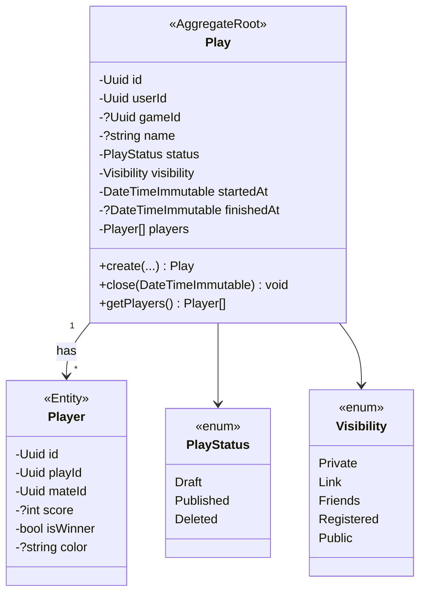
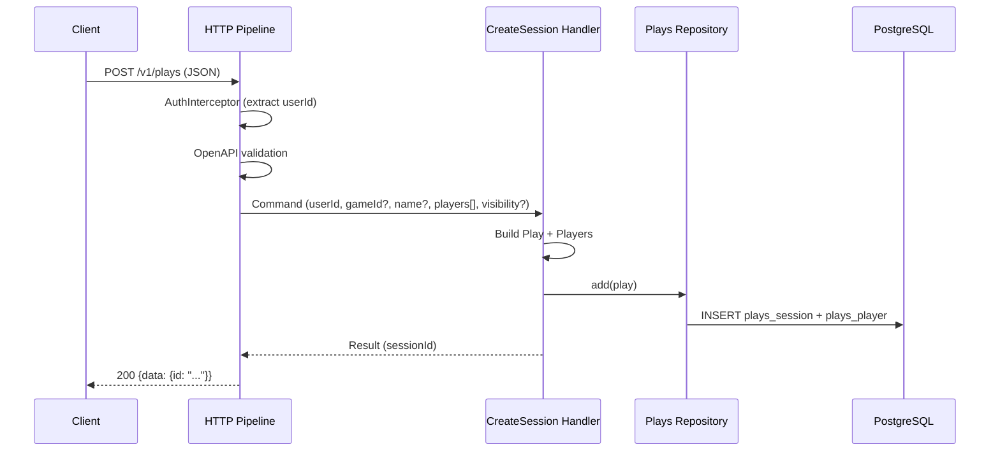

# Feature Request: Create Game Session (PLAYS-001)

**Document Version:** 1.0
**Date:** 2026-02-28
**Status:** In Progress
**Priority:** P0

---

## 1. Feature Overview

### Description

Full game session creation: POST /v1/plays with participants, scores, and game reference.
Extends existing simplified Play entity (from 0014-plays-simple-001) with Player child entities,
game binding, visibility control, and domain events.

### Business Value

- Core MVP feature: users record complete game sessions with participants and results
- Foundation for session listing, statistics, and social features
- Unblocks 5 downstream tasks (PLAYS-002/003, STATS-001, SYNC-001, SOCIAL-001)

### Target Users

- Board game enthusiasts tracking play sessions with friends

---

## 2. Technical Architecture

### Approach

Extend Play aggregate root with Player collection (child entity). Add optional Game reference.
Add Visibility enum. Emit PlayCreated domain event. New CreateSession handler replaces simplified
OpenSession for full creation flow.

### Integration Points

- AuthInterceptor: userId from JWT
- Mates context: mateId references for players
- Games context: optional gameId reference
- Doctrine ORM: Play + Player persistence with OneToMany mapping
- Domain Events: PlayCreated (in-memory, per ADR-006)

### Dependencies

- MATES-001: Co-Players Directory (completed)
- AUTH-004: Authentication Interceptors (completed)
- PLAYS-SIMPLE-001: Open Session (completed, base to extend)

---

## 3. Class Diagram



---

## 4. Sequence Diagram



---

## 5. API Specification

| Method | Path        | Auth     | Description          |
|--------|-------------|----------|----------------------|
| POST   | `/v1/plays` | Required | Create game session  |

### Request

```json
{
    "game_id": "550e8400-...",
    "name": "Friday Game Night",
    "started_at": "2026-02-28T19:00:00+00:00",
    "finished_at": "2026-02-28T22:00:00+00:00",
    "visibility": "private",
    "players": [
        {
            "mate_id": "660e8400-...",
            "score": 42,
            "is_winner": true,
            "color": "blue"
        },
        {
            "mate_id": "770e8400-...",
            "score": 35,
            "is_winner": false,
            "color": "red"
        }
    ]
}
```

- `game_id`: optional UUID, reference to Game entity
- `name`: optional string, session label
- `started_at`: optional ISO 8601, defaults to now
- `finished_at`: optional ISO 8601
- `visibility`: optional enum, defaults to "private"
- `players`: required array, min 1 item
  - `mate_id`: required UUID, reference to Mate entity
  - `score`: optional integer
  - `is_winner`: optional boolean, defaults to false
  - `color`: optional string, max 50 chars

### Response (200)

```json
{
    "code": 0,
    "data": {
        "id": "550e8400-e29b-41d4-a716-446655440000"
    }
}
```

### Errors

- 400 Bad Request: invalid date format, empty players array
- 401 Unauthorized: missing/invalid token
- 422 Validation Error: invalid mate_id, invalid game_id

---

## 6. Directory Structure

```
src/
    Domain/Plays/
        Entities/Play.php              # MODIFY: add gameId, visibility, players
        Entities/Player.php            # CREATE: participant child entity
        Entities/PlayStatus.php        # EXISTS: no changes
        Entities/Plays.php             # EXISTS: no changes
        Entities/Visibility.php        # CREATE: visibility enum
        Events/PlayCreated.php         # CREATE: domain event

    Application/Handlers/Plays/CreateSession/
        Command.php                    # CREATE
        Handler.php                    # CREATE
        Result.php                     # CREATE

    Infrastructure/
        Persistence/Doctrine/Mapping/Plays/
            PlayMapping.php            # MODIFY: add gameId, visibility, players relation
            PlayerMapping.php          # CREATE: player mapping
        Persistence/InMemory/
            InMemoryPlays.php          # EXISTS: no changes
        Database/Migrations/
            VersionXXX.php             # AUTO-GENERATE via make migrate-gen

    config/
        common/openapi/plays.php       # MODIFY: add POST /v1/plays
        common/bus.php                 # MODIFY: register CreateSession handler
        _serialise-mapping.php         # MODIFY: add CreateSession Result
        _deserialise-mapping.php       # NO CHANGES (Player created in handler)
```

---

## 7. Code References

| File | Relevance |
|------|-----------|
| `src/Domain/Plays/Entities/Play.php` | Entity to extend |
| `src/Domain/Mates/Entities/Mate.php` | Similar entity pattern |
| `src/Application/Handlers/Plays/OpenSession/` | Existing handler to reference |
| `src/Application/Handlers/Mates/CreateMate/` | Similar create handler pattern |
| `config/common/openapi/mates.php` | OpenAPI config pattern |
| `src/Infrastructure/Persistence/Doctrine/Mapping/Plays/PlayMapping.php` | Mapping to extend |

---

## 8. Implementation Considerations

### Edge Cases

- Empty players array: reject with 400
- Duplicate mateId in players: reject with 422
- Non-existent mateId: reject with 422 (validate in handler)
- Non-existent gameId: reject with 422 (validate in handler)
- Mate belongs to different user: reject with 422
- startedAt after finishedAt: reject with 400

### Performance

- Single INSERT for Play + batch INSERT for Players (Doctrine handles via cascade)

### Security

- userId from JWT only (AuthInterceptor)
- Validate mateId ownership (mates belong to current user)

---

## 9. Testing Strategy

### Unit Tests

- Play entity: create with players, visibility defaults
- Player entity: creation, getters
- Visibility enum values
- Validation: duplicate mateId, startedAt > finishedAt

### Functional Tests (Main Focus)

- Handler: create session with all fields
- Handler: create session with minimal fields (defaults)
- Handler: reject empty players
- Handler: reject non-existent mateId
- Handler: reject mate belonging to another user

### Acceptance Tests (Web)

- POST /v1/plays with valid data returns 200
- POST /v1/plays without token returns 401
- POST /v1/plays with empty players returns 400/422

---

## 10. Acceptance Criteria

- [ ] Player child entity with id, playId, mateId, score, isWinner, color
- [ ] Visibility enum (Private, Link, Friends, Registered, Public)
- [ ] Play entity extended with gameId, visibility, players collection
- [ ] PlayCreated domain event emitted on creation
- [ ] CreateSession Command + Handler + Result
- [ ] Doctrine mapping for Player (OneToMany from Play)
- [ ] Database migration for plays_player table + Play columns
- [ ] OpenAPI config for POST /v1/plays with full schema
- [ ] Serialization mapping for CreateSession Result
- [ ] Bus registration for CreateSession handler
- [ ] Functional tests for handler (success + error cases)
- [ ] Unit tests for entity logic
- [ ] Acceptance tests for HTTP endpoint
- [ ] `composer scan:all` passes
