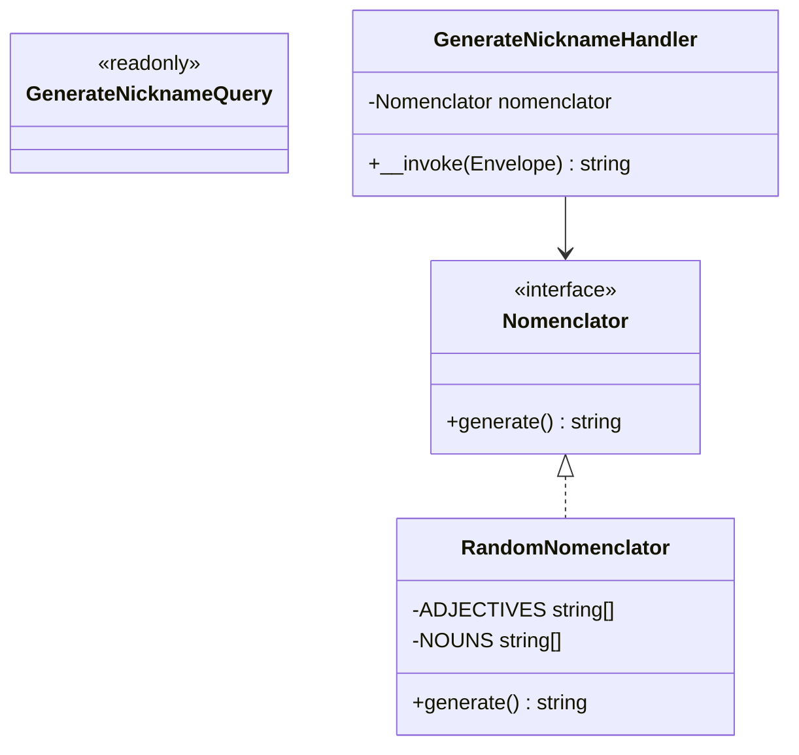
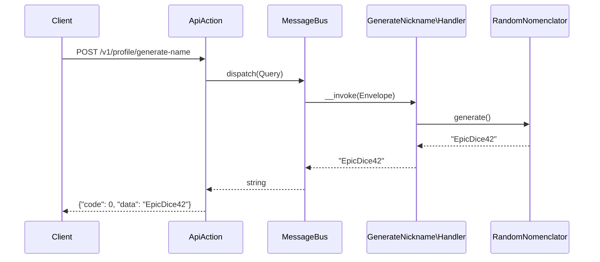
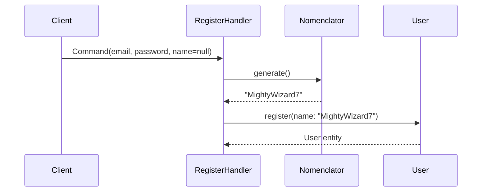

# PROFILE-001: Nickname Generator API

**Beads:** bgl-q77
**Status:** In Progress
**Priority:** P2

## Feature Overview

Provide a board-game-themed nickname generator for user registration flow:

1. **API endpoint** `POST /v1/profile/generate-name` -- client calls before registration to preview a suggested nickname
2. **Improved default names** -- when user registers without a name, generate a thematic nickname instead of `User#NNNN`
3. **Bug fix** -- `User::getName()` currently generates a new random name on every call when `name` is null

### Nickname Format

`{Adjective}{Noun}[{Number}]` -- board-game themed.

Examples: `EpicDice42`, `MightyWizard`, `CleverMeeple7`, `SwiftKnight`, `BoldDragon99`

## Technical Architecture

### Bounded Context

Profile -- user identity and settings. The generator is a Core utility (like `UuidGenerator`).

### Layer Placement

```
Core/Identity/Nomenclator.php                -- interface (contract)
Infrastructure/Identity/RandomNomenclator.php -- implementation (word lists + random selection)
Application/Handlers/Profile/GenerateNickname/  -- Query + Handler for API endpoint
```

## Class Diagram



## Sequence Diagram

### API Endpoint Flow



### Registration Flow (with generator)



## API Endpoint

### `POST /v1/profile/generate-name`

- **Method:** POST (non-idempotent -- generates new value each call)
- **Auth:** None (used before registration)
- **Request body:** None
- **Response:** `StringSuccess` -- `{"code": 0, "data": "EpicDice42"}`
- **Errors:** `500 InternalError`

## Directory Structure

```
src/
  Core/Identity/
    Nomenclator.php               # NEW -- interface
    UuidGenerator.php             # existing (same pattern)
  Infrastructure/Identity/
    RandomNomenclator.php         # NEW -- implementation
    RamseyUuidGenerator.php       # existing (same pattern)
  Application/Handlers/Profile/
    GenerateNickname/
      Query.php                   # NEW -- empty query
      Handler.php                 # NEW -- calls Nomenclator
  Domain/Profile/Entities/
    User.php                      # MODIFY -- fix getName(), remove generateDefaultName()
  Application/Handlers/Auth/Register/
    Handler.php                   # MODIFY -- inject Nomenclator

config/common/
  openapi/profile.php            # NEW -- route definition
  bus.php                        # MODIFY -- register handler
  persistence.php                # MODIFY -- register DI binding
```

## Code References

| File | Action | Reason |
|------|--------|--------|
| `src/Core/Identity/UuidGenerator.php` | Reference | Same pattern for interface |
| `src/Infrastructure/Identity/RamseyUuidGenerator.php` | Reference | Same pattern for implementation |
| `src/Domain/Profile/Entities/User.php:40-43` | Modify | Remove `generateDefaultName()` |
| `src/Domain/Profile/Entities/User.php:79-82` | Modify | Fix `getName()` bug |
| `src/Application/Handlers/Auth/Register/Handler.php:23-29` | Modify | Add Nomenclator dependency |
| `config/common/bus.php:42-65` | Modify | Register new handler |
| `config/common/persistence.php:26` | Modify | Register Nomenclator binding |
| `config/common/openapi/user.php` | Reference | Pattern for new profile.php |

## Implementation Considerations

- **No uniqueness check** -- ~22,500 combinations (15 adj x 15 nouns x 100 numbers) sufficient for MVP
- **Stateless** -- no DB interaction, pure generation
- **Deterministic at creation** -- name is set once in `register()`, never regenerated
- **Legacy fallback** -- existing DB rows with `name = null` get fallback `'Player'` from `getName()`

## Testing Strategy (Testing Trophy)

1. **Unit tests** -- `RandomNomenclator`: format validation, non-empty, variety
2. **Functional tests** -- `GenerateNickname\Handler`: returns string with valid name
3. **Web tests** -- `POST /v1/profile/generate-name`: HTTP 200, correct JSON structure
4. **Unit tests** -- `User::getName()`: bug regression test (same value on repeated calls)

## Acceptance Criteria

- [ ] `POST /v1/profile/generate-name` returns a board-game-themed nickname without authentication
- [ ] Registration without name generates a thematic nickname (not `User#NNNN`)
- [ ] `User::getName()` returns the same value on repeated calls
- [ ] Nickname format: `{Adjective}{Noun}[{Number}]` (e.g., `EpicDice42`)
- [ ] All quality gates pass (`make scan`)

## Clarifications

### Session 2026-02-28

**Q1: Rate limiting on `/v1/profile/generate-name`?**
A: Not needed for MVP. Add later if necessary.

**Q2: Word list language?**
A: English only. Examples: Epic, Mighty, Dice, Meeple.

**Q3: HTTP method for generate-name endpoint?**
A: POST (not GET). GET must be idempotent; generating a new name each call is non-idempotent by nature.

**Q4: Naming convention?**
A: Interface: `Nomenclator`, implementation: `RandomNomenclator`. Latin-derived real word meaning "one who assigns names".
