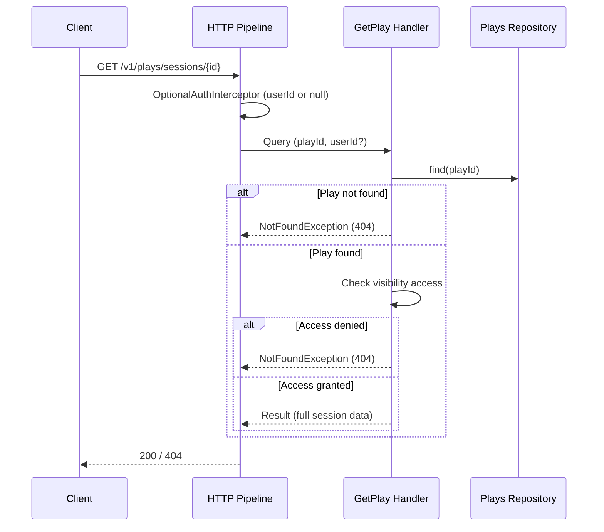

# Feature Request: View Session (PLAYS-003)

**Document Version:** 1.0
**Date:** 2026-03-01
**Status:** Done
**Priority:** P1

---

## 1. Feature Overview

### Description

GET /v1/plays/sessions/{id}: full session details with game, players, and visibility-based access control.
Access rules depend on Visibility enum: private=owner only, link=anyone with URL,
friends=owner+players, registered=any authenticated user, public=anyone.

### Business Value

- Core MVP: users view session details
- Enables sharing sessions via link or publicly
- Foundation for session editing (PLAYS-004) and deletion (PLAYS-005)

### Target Users

- Session owner viewing their own sessions
- Other users viewing shared/public sessions

---

## 2. Technical Architecture

### Approach

Follow GetGame pattern with added visibility-based access control.
Need OptionalAuthInterceptor: extracts userId if token present, null otherwise.
Handler checks visibility rules and returns 403/404 accordingly.

### Key Decision: OptionalAuthInterceptor

Current AuthInterceptor always requires Bearer token. For public/link sessions,
anonymous access must be allowed. Solution: new `OptionalAuthInterceptor` that:
1. If Bearer token present: verifies and sets userId
2. If no token: sets userId = null (anonymous)
3. Handler decides access based on visibility + userId

### Integration Points

- OptionalAuthInterceptor: userId from JWT or null
- Plays repository: find by ID
- Games context: optional game name resolution
- Mates context: player mate names (future, not MVP)

### Dependencies

- PLAYS-001: Create Game Session (completed)

---

## 3. API Specification

| Method | Path                       | Auth     | Description          |
|--------|----------------------------|----------|----------------------|
| GET    | `/v1/plays/sessions/{id}`  | Optional | View session details |

### Access Control Matrix

| Visibility | No Token   | Token (owner)  | Token (other) |
|------------|------------|----------------|---------------|
| private    | 404        | 200            | 404           |
| link       | 200        | 200            | 200           |
| friends    | 404        | 200            | 200 if player, else 404 |
| registered | 401        | 200            | 200           |
| public     | 200        | 200            | 200           |

Note: 404 instead of 403 to avoid session existence leaks.

### Response (200)

```json
{
    "code": 0,
    "data": {
        "id": "550e8400-...",
        "name": "Friday Game Night",
        "status": "published",
        "visibility": "private",
        "started_at": "2026-02-28T19:00:00+00:00",
        "finished_at": "2026-02-28T22:00:00+00:00",
        "game_id": "660e8400-...",
        "players": [
            {
                "id": "770e8400-...",
                "mate_id": "880e8400-...",
                "score": 42,
                "is_winner": true,
                "color": "blue"
            }
        ]
    }
}
```

### Errors

- 401 Unauthorized: registered visibility without token
- 404 Not Found: session not found or access denied

---

## 4. Sequence Diagram



---

## 5. Directory Structure

```
src/
    Application/Handlers/Plays/GetPlay/
        Query.php               # CREATE
        Handler.php             # CREATE
        Result.php              # CREATE

    Presentation/Api/Interceptors/
        OptionalAuthInterceptor.php  # CREATE

config/
    common/openapi/plays.php    # MODIFY: add GET /v1/plays/sessions/{id}
    common/bus.php              # MODIFY: register GetPlay handler
    _serialise-mapping.php      # MODIFY: add GetPlay Result mapping
```

---

## 6. Code References

| File | Relevance |
|------|-----------|
| `src/Application/Handlers/Games/GetGame/` | Pattern: get single resource |
| `src/Presentation/Api/Interceptors/AuthInterceptor.php` | Base for OptionalAuthInterceptor |
| `src/Domain/Plays/Entities/Visibility.php` | Access control rules |
| `src/Domain/Plays/Entities/Player.php` | Players in response |

---

## 7. Edge Cases

- Non-existent session: 404
- Private session, not owner: 404 (not 403)
- Friends visibility: check if requesting user's mate is among players
- Registered visibility without token: 401
- Draft session: visible to owner only regardless of visibility

---

## 8. Testing Strategy

### Unit Tests

- OptionalAuthInterceptor: with token, without token, invalid token

### Functional Tests (Main Focus)

- Handler: owner views private session
- Handler: non-owner denied private session (NotFoundException)
- Handler: anonymous views public session
- Handler: anonymous views link session
- Handler: anonymous denied registered session (AuthenticationException)
- Handler: authenticated non-owner views registered session
- Handler: friends visibility with player access
- Handler: friends visibility without player access (denied)
- Handler: non-existent session

### Acceptance Tests (Web)

- GET /v1/plays/sessions/{id} returns 200 for owner
- GET /v1/plays/sessions/{id} returns 404 for non-existent
- GET /v1/plays/sessions/{id} public access without token

---

## 9. Acceptance Criteria

- [ ] OptionalAuthInterceptor: extracts userId or null
- [ ] GetPlay Query + Handler + Result
- [ ] Visibility-based access control in handler
- [ ] 404 for access denied (not 403)
- [ ] Draft sessions visible only to owner
- [ ] OpenAPI config for GET /v1/plays/sessions/{id}
- [ ] Serialization mapping for GetPlay Result
- [ ] Bus registration
- [ ] Unit tests for OptionalAuthInterceptor
- [ ] Functional tests for handler with all visibility scenarios
- [ ] Web acceptance tests
- [ ] `composer scan:all` passes
