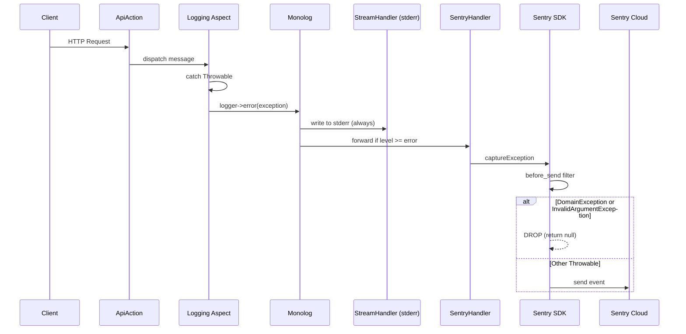

# INFRA: Sentry Error Monitoring Integration

**Beads:** bgl-bqx
**Priority:** P2
**Type:** Feature (Infrastructure)

## Feature Overview

Integrate Sentry PHP SDK into the application for production error monitoring. Only unexpected errors (500s,
infrastructure failures, unhandled exceptions) are reported to Sentry. Business exceptions (`DomainException`) and
validation errors (`InvalidArgumentException`) are filtered out.

## Technical Architecture

### Approach: Monolog SentryHandler with before_send Filtering

The existing Monolog logger is the single logging entry point (injected into `Logging` aspect). Adding a
`Sentry\Monolog\Handler` to the Monolog handler stack means all errors logged at `error` level automatically go to
Sentry -- zero changes to application code.

Filtering is done at the Sentry SDK level via `before_send` callback, which drops events originating from:

- `\DomainException` and all subclasses (business rule violations)
- `\InvalidArgumentException` (validation errors)

### Sequence Diagram



## Directory Structure

```
config/
  common/
    sentry.php          # NEW: Sentry init + DI handler registration
    logger.php          # MODIFY: add SentryHandler to Monolog stack
.env                    # MODIFY: uncomment SENTRY_DSN
```

## Code References

| File                                  | Action | Purpose                                                   |
|---------------------------------------|--------|-----------------------------------------------------------|
| `config/common/logger.php`            | Modify | Add Sentry handler to Monolog                             |
| `config/common/sentry.php`            | Create | Sentry SDK init + before_send filter + DI                 |
| `src/Application/Aspects/Logging.php` | None   | Already logs errors at `error` level -- no changes needed |
| `src/Presentation/Api/ApiAction.php`  | None   | Catch-all unchanged -- Sentry captures via Monolog        |
| `.env`                                | Modify | Uncomment SENTRY_DSN                                      |
| `composer.json`                       | Auto   | Via `composer require sentry/sentry`                      |

## Implementation Considerations

- Sentry init is conditional: no DSN = no Sentry (safe for dev/test)
- `before_send` callback is the cleanest filtering mechanism -- no custom Monolog processors needed
- Environment name (`APP_ENV`) should be passed to Sentry for environment tagging
- App version from `composer.json` can be passed as release tag

## Testing Strategy

- **Static analysis:** Psalm + lint must pass on new config files
- **Functional:** no new test classes needed (config wiring only, no application logic changes)
- **Manual verification:** set DSN, trigger a 500 error, confirm it appears in Sentry; trigger a DomainException,
  confirm it does NOT appear

## Acceptance Criteria

1. `sentry/sentry` package installed
2. Sentry initializes when `SENTRY_DSN` env var is set
3. Sentry does NOT initialize when `SENTRY_DSN` is empty/missing
4. Errors logged at `error` level by Monolog are sent to Sentry
5. `DomainException` (and subclasses) are NOT sent to Sentry
6. `InvalidArgumentException` is NOT sent to Sentry
7. Environment and release tags are set in Sentry events
8. All quality gates pass (`composer ps:run`, `composer lp:run`)

## Clarifications

### Session 2026-03-21

**Q: Sample rate for Sentry?**
A: 100% -- send all errors, no sampling. Project has low traffic, every error matters.
